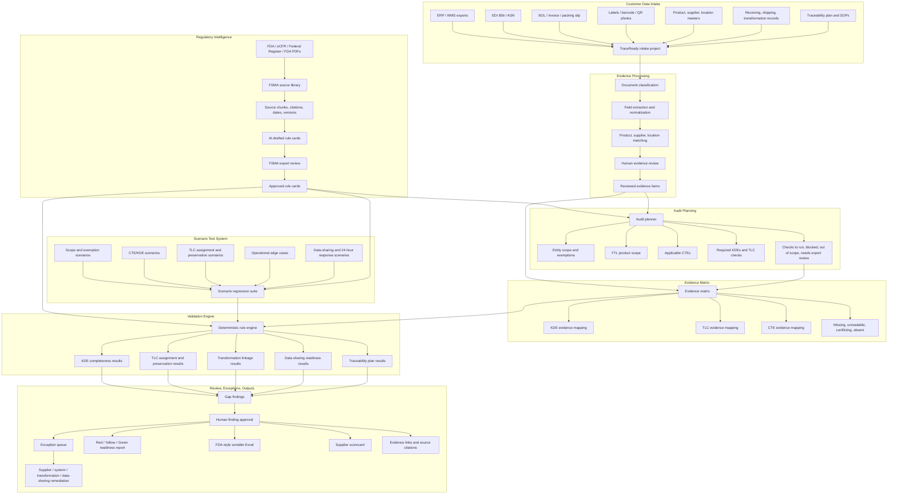
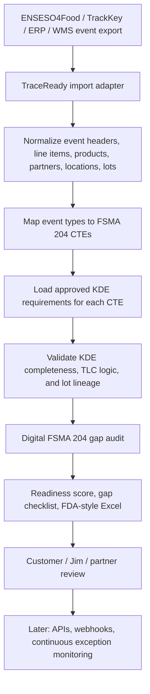
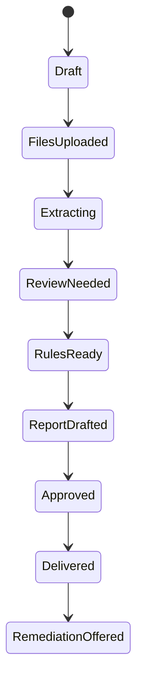

# System Architecture

## Architecture Principle

Start as a service-led product with software leverage.

The first version should make founders/operators faster. It does not need to be fully self-serve.

The product must not treat FSMA 204 as a simple checklist. It is a regulation-change problem with ambiguity, exemptions, evolving FDA flexibilities, and physical warehouse constraints. TraceReady must therefore separate:

- source-of-law management,
- expert interpretation,
- customer evidence collection,
- deterministic checks,
- human-reviewed findings,
- remediation workflow.

The system should never let extracted customer records or AI summaries directly become compliance conclusions.

## Recommended Low-Budget Stack

Frontend:

- Next.js or React
- Tailwind CSS
- simple authenticated admin UI

Backend:

- Node.js/TypeScript or Python/FastAPI
- PostgreSQL
- object storage for files
- background jobs for extraction/report generation

AI:

- LLM for document understanding, product classification support, explanations, and report drafting
- deterministic rules for compliance checks
- human review before final report

Storage:

- local filesystem for prototype
- later S3-compatible storage

Auth:

- start with internal-only login
- later customer portal

Reports:

- Markdown to PDF
- Excel/CSV exports

## High-Level Flow



## Jim-Aligned Product Flow

The market-facing flow should stay aligned with Jim's problem statement:



Do not shift this into a generic FSMA compliance platform, ERP/WMS, or event-entry system. TraceReady's first MVP assumes CTE-style event records already exist in ENSESO4Food, TrackKey, ERP/WMS, EDI/ASN, or an exported workbook. TraceReady validates whether those existing records are FSMA 204 audit-ready.

Messy paper/PDF/BOL/invoice reconstruction is a later expansion. It should not be required for the first Jim-aligned MVP.

## MVP Import Contract

The first demo input should mirror the event-first system observed in the ENSESO4Food/TrackKey demo:

1. Event header: event type, date/time, actor location, from/to partner, reference document type/number, invoice/BOL/ASN/PO/SO numbers, source system, source export ID.
2. Event line items: product, FTL category, lot/TLC, quantity, unit, originator location, TLC generator contact, source lot, output lot.
3. KDE values: event-specific key-value rows such as `harvest_date`, `farm_location_description`, `field_or_growing_area_name`, `ship_from_location_description`, `traceability_lot_code`, or `new_traceability_lot_code`.
4. Lot/TLC lineage: source event/line/lot to target event/line/lot links.
5. Evidence index: system export, invoice, BOL, ASN, label, transformation log, or other proof.
6. Product, partner, and location master tables.

The workbook is a bridge for demo and pilot review. The same shape should become API payloads later.

## KDE Requirement Dictionary

TraceReady must not rely on one generic KDE checklist for every event. Each CTE has its own required or conditional KDEs.

The system must store an approved `KDERequirement` dictionary sourced from FDA/eCFR materials. Each requirement includes:

- CTE type,
- KDE name,
- field key,
- required status: required / conditional / not applicable,
- applies-when logic,
- source citation and source chunk,
- example value,
- severity if missing,
- whether expert review is required.

Examples:

- Harvesting requires fields such as commodity/variety, quantity/unit, farm location, field or growing-area identity for produce, harvest date, immediate subsequent recipient, reference document type/number, and harvester business/phone information provided to the initial packer.
- Shipping requires traceability lot code, quantity/unit, product description, immediate subsequent recipient, ship-from location, ship date, TLC source or source reference, and reference document type/number.
- Receiving requires traceability lot code, quantity/unit, product description, immediate previous source, received location, received date, TLC source or source reference, and reference document type/number.
- Transformation requires input TLC/product/quantity for each FTL ingredient lot and new output TLC, transformation location/date, product description, quantity/unit, and reference document type/number.

Customer-facing validation is blocked until the relevant CTE's KDE requirements are approved and scenario-tested.

## Regulatory Intelligence Layer

This layer is required because FSMA 204 has:

- scope questions: Food Traceability List, exemptions, partial exemptions, kill steps, changed-form products,
- event questions: harvesting, cooling, initial packing, first land-based receiving, shipping, receiving, transformation,
- lot-code questions: when TLCs must be assigned, preserved, linked, or not reassigned,
- operational ambiguity: mixed pallets, pick slots, inferred TLCs, unlabeled cases, returns, reclamations, intracompany shipments,
- output questions: sortable spreadsheet, customer-specific formats, EDI/ASN/API, traceability plan evidence,
- evolving FDA discussion papers and implementation flexibilities.

Responsibilities:

1. Store authoritative source references:
   - eCFR current CFR section,
   - Federal Register final rule or proposed rule,
   - FDA page,
   - FDA guidance or FAQ,
   - FDA discussion paper,
   - effective date,
   - compliance date,
   - finalization status,
   - authority rank,
   - source status: codified rule / final rule / proposed rule / guidance / FAQ / discussion paper / internal interpretation.
2. Convert source material into rule cards.
3. Link every rule card to one or more audit questions.
4. Track uncertainty and whether expert review is required.
5. Maintain scenario test cases that reflect real industry flows.
6. Version every interpretation so old reports can be reproduced.

Source authority order:

1. Current eCFR / CFR text.
2. Official Federal Register final rule or technical amendment.
3. FDA guidance and small entity compliance guide.
4. FDA Food Traceability List and FDA explanatory pages.
5. FDA FAQ.
6. Federal Register proposed rule.
7. FDA discussion paper, public meeting material, or implementation flexibility discussion.
8. Internal TraceReady note.

Rule behavior:

- A lower-authority source can explain or flag ambiguity, but cannot override a higher-authority source.
- A proposed rule can create a `proposed_change` or `needs_expert_review` note, but cannot create a final customer-facing compliance conclusion.
- The August 7, 2025 Federal Register compliance-date extension must be treated as `proposed_rule` unless and until a final rule is added to the source registry. The product must not hardcode July 20, 2028 as final.
- Findings must support `cannot_determine` / `not_determined` when business role, product scope, exemption status, CTE applicability, or evidence is insufficient.

AI role boundaries:

| Layer | Purpose | AI Role |
|---|---|---|
| Regulatory truth | Source registry, source chunks, citations, hashes, versions, authority rank | None except summarization assistance |
| Operational interpretation | Rule cards, CTE/KDE mapping, evidence matrix, scenarios | Drafting assistant only |
| Execution | Deterministic checks, missing KDEs, TLC logic, scenario pass/fail | No free-form judgment |
| Human control | Approve rule cards, source changes, high-risk findings | Final authority |

Required rule card fields:

```text
Rule ID:
Source citation:
Source status:
Authority rank:
Is finalized:
Effective date:
Compliance date:
Plain-English interpretation:
Applies to:
Does not apply to:
Evidence required:
Customer question:
System check:
Possible outcomes:
Severity mapping:
Confidence:
Requires expert review:
Allowed finding states:
Last reviewed:
Reviewed by:
Change history:
```

Rule card examples:

- Business/entity scope rule.
- FTL product scope rule.
- Exemption and partial-exemption rule.
- Harvesting KDE completeness rule.
- Cooling before initial packing KDE completeness rule.
- Initial packing KDE completeness rule.
- First land-based receiving KDE completeness rule.
- Receiving KDE completeness rule.
- Shipping KDE completeness rule.
- Transformation linkage rule.
- TLC preservation rule when no transformation occurs.
- TLC assignment rule for transformation.
- Traceability plan completeness rule.
- Sortable spreadsheet readiness rule.
- 24-hour response readiness rule.
- EDI/ASN/API/manual record data-sharing rule.
- Mixed-pallet/inferred-TLC risk flag.

## Scenario Library

The system must be tested against scenarios before being trusted with customer audits. Scenarios are more important than abstract rule text because customers operate in messy workflows.

Scenario tests must be derived from source requirements, Jim/customer discovery, and FDA implementation discussion papers. They are not guesses.

Required scenario groups:

1. Business scope: covered entity, exemption, partial exemption, small entity, farm, restaurant, retail, distributor, packer, processor.
2. Product scope: FTL food, not FTL, same-form ingredient, changed-form product, uncertain product description.
3. Harvesting: harvest KDEs, field/growing-area identity, quantity, date, immediate subsequent recipient.
4. Cooling before initial packing: cooling KDEs, farm link, cooling location, cooling date.
5. Initial packing: TLC assignment, initial packing KDEs, sprout-specific KDEs, exempt supplier case.
6. First land-based receiving: seafood from fishing vessel, TLC assignment, harvest date range and location.
7. Shipping: shipping KDEs, immediate subsequent recipient, product/TLC/source information, reference document.
8. Receiving: receiving KDEs, immediate previous source, TLC/TLC source, received location/date, reference document.
9. Transformation: input TLCs, output new TLC, transformation location/date, input-output linkage.
10. TLC preservation: incoming TLC must not be replaced unless transformation or another allowed condition applies.
11. Supplier missing data: invoice/BOL/ASN/label exists but TLC, source, harvest, quantity, or reference fields are missing.
12. Mixed pallets and mixed lots: one pallet or pick slot contains multiple TLCs from one or more TLC sources.
13. Inferred TLCs: WMS/FEFO/pick-slot logic infers outbound TLCs instead of scanning each case.
14. Eaches and broken cases: cases are split and individual items lack visible TLC labels.
15. Returns and reclamations: product moves backward or is reclaimed with incomplete KDE continuity.
16. Food waste recovery and donations: distinguish donation from shipping and flag unclear cases.
17. Intracompany shipments: same-company site transfer with no transformation and potential duplicate-record ambiguity.
18. Retail/restaurant transformation and off-site shipment: retail kitchen transforms food and ships to another retail/restaurant location.
19. Data sharing: EDI 856, ASN, API, Excel, BOL, invoice, label, or manual document can or cannot carry required KDEs.
20. Traceability plan: recordkeeping procedures, FTL identification, TLC assignment process, point of contact, farm/aquaculture maps where applicable.
21. FDA 24-hour response: can produce sortable spreadsheet and supporting evidence quickly enough.
22. Evidence quality: missing data versus unreadable data versus conflicting data versus absent data.

Each scenario must include:

- source assumptions,
- customer role,
- product scope,
- required CTEs,
- required KDEs,
- TLC assignment/preservation rule,
- operational failure mode,
- expected records,
- likely customer evidence,
- known ambiguity,
- expected finding outcome,
- interpretation status,
- expert review requirement.

## Audit Planner

The audit planner decides which checks apply before running the rule engine.

Inputs:

- customer role: distributor, packer, repacker, processor, commissary, retail, restaurant, farm,
- product list,
- supplier list,
- customer/shipping destinations,
- transformation activities,
- document set provided,
- known systems: ERP, WMS, DProduce Man, QuickBooks, Excel, EDI, ASN, traceability platform,
- physical workflow notes: case labeling, pallet labeling, scanning, pick slots, receiving process.

Outputs:

- in-scope products,
- uncertain products,
- relevant CTEs,
- expected KDEs,
- required evidence,
- checks to run,
- checks blocked by missing evidence,
- expert-review flags.

The audit planner should explain why a check was or was not run.

## Core Services

### 0. Regulatory Source Service

Responsibilities:

- store FDA/eCFR/Federal Register source references,
- track source status and effective dates,
- manage rule-card versions,
- expose source citations to findings and reports.

### 1. Intake Service

Responsibilities:

- create audit project,
- store customer/site metadata,
- attach files,
- track processing status.

### 2. Document Service

Responsibilities:

- store file metadata,
- classify document type,
- extract text,
- route to extraction pipeline.

### 3. Extraction Service

Responsibilities:

- parse CSV/XLSX directly,
- OCR/image extraction later,
- LLM extraction for PDF/text,
- normalize fields into structured records.

### 4. Review Service

Responsibilities:

- show extracted data to internal operator,
- allow correction,
- record confidence and evidence.

### 5. Rules Service

Responsibilities:

- consume expert-reviewed rule cards,
- product coverage checks,
- KDE completeness checks,
- lot-code lineage checks,
- transformation linkage checks,
- data-sharing readiness checks.

Rules service boundary:

- It can say "gap found," "evidence missing," "cannot determine," or "needs expert review."
- It cannot say "certified compliant."

### 5a. Scenario Test Service

Responsibilities:

- store scenario cases,
- run rule cards against synthetic/fixture evidence,
- catch regressions when interpretation changes,
- prove that the system handles ambiguous operational cases.

### 6. Report Service

Responsibilities:

- generate audit summary,
- generate findings table,
- generate supplier scorecard,
- export PDF/Markdown/XLSX.

### 7. Exception Service

Responsibilities:

- convert audit findings into backlog items,
- assign owner,
- track status,
- draft supplier emails.

## MVP Deployment

Stage 0:

- local admin app,
- manual file upload,
- local Postgres or SQLite,
- report generated as Markdown/PDF.

Stage 1:

- hosted internal app,
- authenticated founder/operator access,
- customer upload link,
- cloud storage.

Stage 2:

- customer portal,
- recurring audits,
- exception queue,
- supplier follow-up.

## Build Boundary

The MVP is not a system of record.

It reads samples and produces a report.

Do not write back to customer ERP/WMS in v1.

## Human-In-The-Loop

Human review is mandatory for:

- product coverage classification,
- uncertain FTL interpretation,
- lot-code lineage risk,
- transformation findings,
- exemption/partial exemption decisions,
- discussion-paper/flexibility interpretations,
- any "cannot determine" finding before customer delivery,
- final report approval.

This protects credibility.

## Audit State Machine



## Technical Risks

1. PDF/OCR extraction may be messy.
2. Product classification can be legally/compliance-sensitive.
3. Lot-code lineage may be impossible if source data never existed.
4. Customers may provide inconsistent document sets.
5. Fully automated compliance claims are risky.

## Technical Strategy

Start with structured and semi-structured records:

- CSV/XLSX exports,
- item masters,
- supplier lists,
- simple invoices,
- labels/photos only when needed.

Then expand extraction sophistication after pilots reveal common formats.
