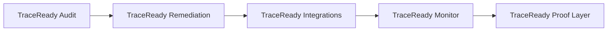

# Roadmap And Build Plan

## Product Sequence

Long-term interpretation after FDA docket-comment analysis:

> TraceReady should become the proof layer for food traceability: the system that shows whether records from suppliers, Excel, EDI/ASN, ERP, WMS, documents, and traceability platforms are complete, linked, and audit-ready.

## Phase 0: No-Code / Manual Prototype

Timeline:

> 3-7 days

Goal:

Create a sample audit report that looks real.

Tasks:

- build fake but realistic sample dataset,
- create TraceReady Audit report template,
- create supplier scorecard template,
- create red/yellow/green scoring logic,
- show report to Jim and 3 operators.

Tools:

- Google Sheets / Excel
- Markdown / PDF
- manual review
- LLM assistance for draft explanations

Success:

- Jim says report is useful,
- at least one operator says "run this on my records",
- one person asks about price or next step.

## Phase 1: Internal Audit Workbench

Timeline:

> 2-4 weeks

Goal:

Build an internal app that makes founders faster.

Features:

- create audit project,
- upload files,
- classify documents,
- import structured CSV/XLSX/event exports,
- register supporting PDFs/images/documents as evidence,
- extract fields from CSV/XLSX/PDF text where useful,
- review extracted records,
- run rules-first FSMA 204 checks,
- generate source-system readiness matrix,
- generate supplier data quality flags,
- flag imported/multilingual records for review,
- generate report.

Do not build:

- customer self-serve portal,
- supplier portal,
- integrations,
- full compliance automation.

Success:

- produce an audit in under 4 hours of internal work,
- support 3 real customer record sets,
- identify repeatable gap patterns.

## Phase 2: Paid Pilot

Timeline:

> 4-8 weeks

Goal:

Get first paid audit.

Offer:

- $500 pilot audit for one redacted workbook/export covering 5-20 record sets,
- credit toward remediation if they continue.

Deliverables:

- PDF audit report,
- Excel findings,
- supplier scorecard,
- remediation call.

Success:

- 1 paid audit,
- 3 unpaid/discounted pilots,
- 1 customer asks for remediation.

## Phase 3: Remediation Workflow

Timeline:

> 2-3 months

Goal:

Convert audit findings into recurring workflow.

Features:

- exception backlog,
- supplier follow-up drafts,
- task ownership,
- status tracking,
- recurring supplier scorecard,
- monthly readiness report.

Pricing:

- $1,000-$5,000/month depending on scope.

Success:

- 1-3 recurring customers,
- measurable reduction in repeated missing fields,
- supplier response workflow proven.

## Phase 4: Lightweight Integrations

Timeline:

> after paid remediation demand

Goal:

Export clean data into existing systems.

Start with:

- CSV/XLSX exports,
- FDA-style sortable spreadsheet,
- partner-ready JSON,
- EDI 856 / ASN import/export mapping,
- ERP/WMS export mapping,
- GS1/EPCIS field mapping,
- no direct ERP writeback.

Later:

- ENSESO4Food API,
- Starfish,
- ReposiTrak,
- TagOne,
- ERP/WMS adapters.

## Phase 5: TraceReady Monitor

Timeline:

> after repeatable remediation demand

Goal:

Continuously check whether incoming and outgoing traceability data remains ready.

Features:

- source-system readiness monitoring,
- supplier data-quality trends,
- repeated missing KDE/TLC alerts,
- broken lineage alerts,
- live readiness score by site/product/supplier,
- recall-readiness simulation.

## Phase 6: TraceReady Proof Layer

Timeline:

> after integrations and monitoring are proven

Goal:

Become the trusted traceability proof layer across food compliance workflows.

Expansion:

- seafood traceability,
- imported food documentation,
- organic/certification records,
- allergen traceability,
- recall readiness,
- supplier compliance,
- sustainability/origin claims,
- retail customer traceability requirements,
- private-label supplier audits.

## Technical Build Order

1. Report template
2. Sample dataset
3. Manual scoring spreadsheet
4. Internal upload/review app
5. Structured workbook/export parser
6. Rule engine
7. Source-system readiness matrix
8. Supplier data quality flags
9. Report generator
10. Exception backlog
11. Supplier follow-up drafts
12. Customer portal
13. Integrations

## Budget Discipline

Spend money only on:

- domain,
- basic hosting,
- email,
- minimal design,
- customer travel if needed,
- legal review only after pilot signal.

Do not spend early on:

- expensive logo/branding,
- custom enterprise security,
- deep integrations,
- patent attorney before concrete implementation,
- paid ads,
- large frontend polish.

## Key Milestones

Milestone 1:

> Sample TraceReady Audit exists.

Milestone 2:

> Jim or another expert reviews it.

Milestone 3:

> One operator shares real/redacted records.

Milestone 4:

> First paid pilot.

Milestone 5:

> First recurring remediation customer.

Milestone 6:

> Repeatable software workflow.

## YC Readiness Milestone

Before YC application, aim to say:

> We ran TraceReady Audit on X customer record sets, found Y FSMA 204 readiness gaps, identified Z supplier issues, and converted one audit into paid remediation.

That is much stronger than:

> We have an idea and expert validation.
