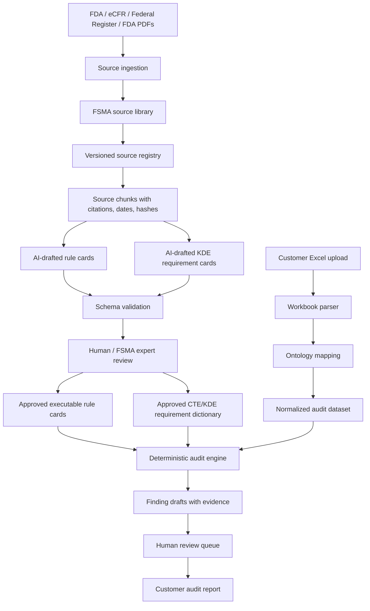
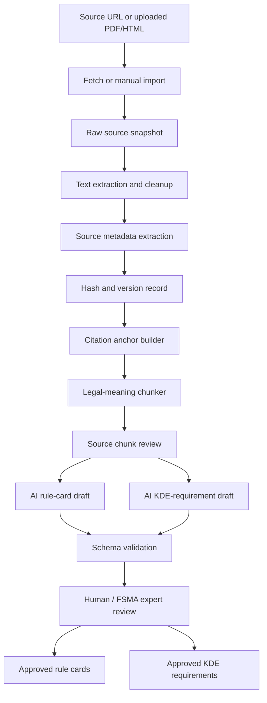

# MVP Task List: Full FSMA 204 Regulatory Intelligence Audit

Date: 2026-06-14  
Product: TraceReady Audit  
MVP goal: customer can upload an Excel workbook and receive a full FSMA 204 readiness audit report covering product scope, entity scope, exemptions, CTEs, KDEs, TLC handling, traceability plan, lineage, and 24-hour sortable-record readiness.

## 0. 2026-06-15 FDA Docket Alignment

The FDA-2014-N-0053 docket-comment analysis does **not** require a major MVP pivot.

It confirms the current direction:

> TraceReady should be the readiness, validation, and proof layer for existing traceability records, not another ERP, WMS, supplier portal, or full traceability event-entry platform.

The MVP must stay full-FSMA in rule coverage, but the first pilot workflow should be sharper:

1. **Structured export first**
   - Customer uploads TraceReady workbook or mapped export from Excel, ERP, WMS, EDI/ASN, ENSESO4Food/TrackKey, DProduce Man, ReposiTrak, Trustwell/FoodLogiQ, Wholechain, or internal spreadsheets.
   - PDF/image/document extraction supports evidence review; it is not the main wedge.

2. **Evidence quality, not record presence**
   - The product must distinguish "record exists" from "record proves required KDE/TLC/CTE facts."
   - Findings must explain whether the evidence is complete, linked, conflicting, uncertain, or not determined.

3. **Interoperability readiness**
   - The report must show whether Excel, EDI 856/ASN, ERP, WMS, GS1/EPCIS, supplier documents, and manual records can carry the required fields.
   - Do not merely say "integration later"; the MVP report should include a source-system readiness matrix.

4. **TLC and lot-level ambiguity**
   - The MVP must model exact TLC, missing TLC, inferred TLC, TLC range, commingled pallet, mixed lot, eaches/broken case, and case-vs-pallet ambiguity as first-class review states.

5. **Supplier data quality**
   - Supplier pass-forward quality must be visible in the report.
   - Supplier gaps should become remediation tasks after MVP, but the audit should already score/flag repeated missing KDE/TLC patterns.

6. **Imported / multilingual record flag**
   - The MVP does not need certified translation automation.
   - It must flag imported/non-English records, translation needs, and human-review status because this appeared as a real operator pain.

7. **Public-health and recall-readiness framing**
   - The report should not sound like paperwork only.
   - It should explain how gaps affect recall readiness, source traceability, and response speed.

Do not change:

- rules-first architecture.
- human approval for rule cards.
- deterministic checks for customer-facing findings.
- full CTE/KDE coverage requirement.
- Excel-first pilot.
- no legal certification promise.

## 1. Correct MVP Scope

This MVP is not a tiny receiving-only demo.

The MVP must implement the full FSMA 204 audit logic needed to review a customer's traceability records across the regulation's major objects:

- business/entity scope.
- food/FTL scope.
- exemptions and partial exemptions.
- traceability plan.
- traceability lot code assignment and preservation.
- harvest and cooling records.
- initial packing records.
- first land-based receiving records for food obtained from fishing vessels.
- shipping records.
- receiving records.
- transformation records.
- TLC lineage across CTEs.
- records maintenance, availability, and sortable spreadsheet readiness.

The MVP does not need to become the customer's ERP, WMS, or traceability event-entry system. It audits the records exported from those systems or assembled into TraceReady's Excel template.

## 2. Customer-Facing Promise

Customer uploads:

> One TraceReady workbook, or one mapped Excel export from ENSESO4Food, TrackKey, ERP/WMS, EDI/ASN, or internal spreadsheets.

TraceReady returns:

> A full FSMA 204 readiness audit report showing what is covered, what is missing, what is conflicting, what cannot be determined, what evidence supports each finding, and what the customer should fix first.

The report must be useful for a real pilot customer. It must not be a school-style checklist or a vague AI summary.

## 3. Hard Product Boundaries

In scope for MVP:

- full FSMA 204 regulatory intelligence module.
- full CTE/KDE requirement dictionary for the rule sections that apply to covered foods.
- Excel upload and validation.
- deterministic audit engine.
- source-backed findings.
- human review workflow.
- downloadable audit report.
- deployable web app for pilots.

Out of scope for MVP:

- full ERP replacement.
- full WMS replacement.
- full traceability event-entry platform.
- automatic legal/compliance certification.
- supplier portal.
- deep real-time integrations.
- label printing, QR execution, warehouse scanning, or physical lot-control operations.
- unsupervised AI compliance judgment.

Important distinction:

> TraceReady must audit all FSMA 204 CTE/KDE areas, but it does not need to operate all customer workflows that create those records.

## 4. Regulatory Source Authority

Official source hierarchy:

1. Current eCFR 21 CFR Part 1 Subpart S.
2. Official Federal Register final rule and corrections.
3. FDA official guidance, small-entity guide, and CTE/KDE resources.
4. FDA Food Traceability List page.
5. FDA FSMA 204 FAQ.
6. Federal Register proposed rules.
7. FDA discussion papers, public meeting materials, and flexibility discussions.
8. Internal TraceReady notes.

Rules:

- eCFR/current CFR and final Federal Register rule text control final MVP rule interpretation.
- FDA guidance and FAQ can explain but cannot override codified rule text.
- proposed rules cannot produce final compliance findings.
- discussion papers cannot produce final compliance findings.
- the August 7, 2025 compliance-date extension must remain `proposed_rule` and `isFinalized = false` unless a later official final rule source is added.

Primary sources to seed:

- eCFR 21 CFR Part 1 Subpart S.
- Federal Register 2022 final rule, 87 FR 70910.
- Federal Register correction where applicable.
- FDA Food Traceability List.
- FDA Food Traceability Rule FAQ.
- FDA FSMA final rule page.
- FDA CTE/KDE resources and guidance pages.
- Federal Register 2025 compliance-date extension proposal.

## 5. Required Regulatory Coverage Checklist

The MVP must explicitly model, test, and report against the current eCFR Subpart S structure. "Full FSMA 204 audit" means the product has rule-card coverage for these areas, even when a customer workbook lacks enough evidence and the result is `not_determined`.

Required source sections:

| Area | eCFR section | MVP responsibility |
|---|---:|---|
| Subject/entity scope | 21 CFR 1.1300 | Determine whether the business appears in scope, out of scope, exempt, partially exempt, or not determined. |
| Exempt foods/persons | 21 CFR 1.1305 | Evaluate exemption and partial-exemption claims using supplied evidence. |
| Definitions | 21 CFR 1.1310 | Maintain controlled definitions for CTE, KDE, TLC, transformation, shipping, receiving, etc. |
| Traceability plan | 21 CFR 1.1315 | Check whether a traceability plan exists and whether required plan evidence is present. |
| TLC assignment | 21 CFR 1.1320 | Check whether TLC assignment/source-reference handling is represented where required. |
| Harvest/cooling CTE | 21 CFR 1.1325 | Check harvest and cooling KDE completeness where these CTEs appear. |
| Initial packing CTE | 21 CFR 1.1330 | Check initial packing KDE completeness and TLC source evidence. |
| First land-based receiving CTE | 21 CFR 1.1335 | Check KDEs for covered seafood/fishing-vessel pathway when present. |
| Shipping CTE | 21 CFR 1.1340 | Check shipping KDE completeness and immediate subsequent recipient data. |
| Receiving CTE | 21 CFR 1.1345 | Check receiving KDE completeness and immediate previous source data. |
| Transformation CTE | 21 CFR 1.1350 | Check transformation input/output linkage and new TLC handling where required. |
| Modified requirements/exemptions process | 21 CFR 1.1360-1.1400 | Represent as reviewable context; do not auto-grant without evidence. |
| Waivers | 21 CFR 1.1405-1.1450 | Represent waiver claims as `not_determined` unless official evidence is supplied. |
| Records maintenance/availability | 21 CFR 1.1455 | Check record availability and sortable export readiness. |
| Consequences | 21 CFR 1.1460 | Use for risk context only, not legal threat language. |
| Food Traceability List updates | 21 CFR 1.1465 | Version FTL source data and avoid hardcoding forever-static product scope. |

Coverage rules:

- each row above must have at least one rule card or documented `not_automated_in_mvp` decision approved by the founder.
- CTE rows must have KDE requirement dictionaries and scenario tests before customer-facing report output is enabled.
- process-oriented areas, such as waivers and modified-requirement petitions, can be represented as review states, evidence requests, and citations instead of deeply automated legal workflows.
- the report must show which regulatory areas were evaluated, which were not applicable, which were not determined, and why.

## 6. Rules-First AI Architecture



Required pipeline:

```text
FDA/eCFR/FSMA source -> source ingestion -> FSMA source library -> source registry -> source chunk -> AI-drafted rule card/KDE card -> schema validation -> FSMA expert review -> approved rule card/KDE requirement -> Excel import -> ontology mapping -> deterministic audit -> finding -> human review -> full audit report
```

## 7. Regulatory Ingestion Workflow

This is the workflow that turns FDA/eCFR/FSMA rule sources into approved executable rules. It must be implemented before customer-facing audit findings are trusted.



### Ingestion Algorithms

Use these algorithms in this order:

1. **Source fetch/import**
   - Fetch official HTML where possible.
   - Allow manual PDF upload for FDA PDFs and guidance.
   - Store immutable raw snapshot before cleanup.

2. **Source metadata extraction**
   - Extract title, URL, issuing agency, publication date, effective date, compliance date, legal status, source type, source status, and authority rank.
   - Proposed-rule status must be explicit.

3. **Hashing and versioning**
   - Compute `rawTextHash` and `normalizedTextHash`.
   - If a source changes, create a new source version rather than overwriting the old one.

4. **Text extraction and normalization**
   - HTML: section-aware extraction using headings, anchors, tables, and CFR section markers.
   - PDF: text extraction with page number and paragraph anchoring.
   - Tables: preserve rows as structured objects where possible, not plain paragraphs only.

5. **Citation anchoring**
   - Each chunk must keep source ID, section, paragraph/table label, page number when applicable, URL, retrieved date, and hash.
   - Findings must cite chunks, not free-floating summaries.

6. **Legal-meaning chunking**
   - Chunk by legal concept, not token count.
   - Good chunks: one CFR section, one KDE table, one exemption pathway, one traceability plan requirement, one CTE requirement group.
   - Bad chunks: arbitrary 1,000-token slices that split conditions from obligations.

7. **AI-assisted rule extraction**
   - AI drafts structured rule cards and KDE requirement cards from chunks.
   - AI output must include cited chunk IDs, extracted conditions, required fields, applies-when logic, and uncertainty notes.

8. **Schema validation**
   - Reject AI drafts if required fields, source links, authority status, applies-when logic, or allowed finding states are missing.

9. **Human / FSMA expert approval**
   - Draft cards become executable only after approval.
   - Reviewer must approve source interpretation, conditions, KDE mapping, and finding states.

10. **Versioned publication**
   - Approved rule cards and KDE requirements are versioned.
   - Customer audit output records exact versions used.

## 8. Regulatory Admin Access Model

TraceReady needs two separate workflows with different access, even if they live in the same deployed application.

### Workflow A: Customer Audit Workflow

Users:

- pilot customer.
- TraceReady operator.

Purpose:

- upload customer Excel workbook.
- view parse errors.
- run draft audit.
- review findings.
- download readiness report.

Routes:

- `/app/audits`
- `/app/audits/new`
- `/app/audits/[auditId]`
- `/app/audits/[auditId]/review`
- `/app/audits/[auditId]/report`

Permissions:

- customer can see only their audits and reports.
- customer cannot see source ingestion, AI rule drafts, rule-card approval, or internal source-library operations.
- customer cannot modify approved rule cards or KDE requirements.

### Workflow B: Regulatory Admin Workflow

Users:

- founder.
- FSMA expert reviewer.
- internal regulatory operator.

Purpose:

- ingest FDA/eCFR/Federal Register/FDA PDF sources.
- inspect raw and normalized source snapshots.
- view source chunks and citations.
- generate AI-drafted rule cards and KDE cards.
- approve, edit, reject, or version rule cards.
- publish approved rule versions used by customer audits.

Routes:

- `/admin/regulatory/sources`
- `/admin/regulatory/sources/[sourceId]`
- `/admin/regulatory/chunks`
- `/admin/regulatory/drafts`
- `/admin/regulatory/rule-cards`
- `/admin/regulatory/kde-requirements`
- `/admin/regulatory/review`
- `/admin/regulatory/versions`

Permissions:

- only `founder_admin` and `fsma_reviewer` roles can approve regulatory cards.
- AI can write only to draft tables.
- AI cannot write directly to approved rule-card or approved KDE-requirement tables.
- every approval requires reviewer, timestamp, reason, source chunk references, and version.
- every customer audit stores the exact approved rule-version snapshot used.

### First-Time Source Generation Mode

For the first version, run regulatory ingestion as a controlled internal process, not as a customer-facing feature.

Recommended first-run path:

```text
local/admin ingestion command
-> raw source snapshots
-> normalized source records
-> source chunks
-> AI draft cards
-> database draft tables
-> regulatory admin UI
-> human approval
-> approved rule tables
-> customer audit engine
```

This can run locally first because source ingestion is not a high-frequency customer action. After the workflow is trusted, expose it through the regulatory admin UI.

### Technology Recommendation

Recommended MVP architecture:

- one Next.js app deployed on Vercel.
- role-based route separation for customer workflow and regulatory admin workflow.
- Supabase Postgres for shared database.
- Supabase Storage or equivalent object storage for raw source snapshots, uploaded workbooks, and reports.
- TypeScript for the app, rules engine, schemas, and audit flow.
- Python CLI/worker for regulatory source ingestion, PDF/HTML extraction, chunking, hashing, and AI draft generation.
- shared database contract between Python ingestion and TypeScript admin/audit application.

Technology ownership:

```text
Python = regulatory ingestion brain
TypeScript / Next.js = product app, admin UI, audit engine, deployment
Postgres = shared source of truth
Storage = raw sources, normalized sources, uploaded workbooks, generated reports
```

Python ingestion worker responsibilities:

- read FDA/eCFR/Federal Register/FDA PDF sources.
- extract text, sections, tables, page anchors, and citation anchors.
- create source versions, chunks, hashes, and artifacts.
- call AI to draft rule cards and KDE requirement cards.
- validate drafts with Pydantic schemas.
- write only draft records and source/chunk records to the database.

TypeScript/Next.js responsibilities:

- customer workbook upload.
- regulatory admin UI.
- rule-card and KDE approval workflow.
- deterministic audit engine.
- findings review.
- report generation and deployment.

Avoid for MVP:

- separate Vercel app for regulatory admin unless security or operational complexity forces it.
- letting AI update approved tables directly.
- deploying heavy PDF/source-ingestion jobs as fragile request/response endpoints.

Why:

- one app means less deployment overhead.
- separate routes and roles still create clean access boundaries.
- local/admin ingestion is enough for first-time source generation.
- approved rules live in the database, so deployed customer audits use the same trusted rule set.

## 9. Enterprise Accuracy Patterns To Adopt

The MVP should copy the serious RegTech pattern: source truth, obligation extraction, expert review, evidence mapping, versioning, and audit trails. It should not behave like a generic regulatory chatbot.

Add these controls before pilot launch:

1. **Obligation inventory**
   - Store extracted obligations separately from source chunks and rule cards.
   - Example: `obligation = receiving event must maintain required KDEs`.
   - Each obligation links to source chunks, CTE/KDE cards, and audit checks.

2. **Two-layer validation**
   - Layer 1: schema validation for AI drafts.
   - Layer 2: semantic review by founder/FSMA reviewer.
   - No AI draft becomes executable without both layers.

3. **Golden scenario benchmark**
   - Create a fixed set of known scenarios with expected findings.
   - Every rule-card update must run against this benchmark before publication.

4. **Regression lock**
   - If a rule-card change alters prior expected findings, require reviewer approval and reason.
   - Store before/after diff for the rule card and affected scenarios.

5. **Citation coverage score**
   - Every rule card, KDE requirement, and finding must have citation coverage.
   - Block publication if citation coverage is below 100% for customer-facing rules.

6. **Evidence coverage score**
   - Every finding must identify the customer row/document that triggered it.
   - Report should show which findings are blocked by missing evidence, not just missing data.

7. **Confidence gates**
   - AI extraction confidence is not compliance confidence.
   - Low-confidence product, entity, exemption, and lineage mappings route to review.

8. **Regulatory change monitor**
   - Compare source hashes over time.
   - New or changed official source creates a draft change package, not an automatic rule update.

9. **Rule explainability view**
   - For each finding, admin can inspect:
     - customer evidence,
     - normalized object,
     - triggered deterministic check,
     - KDE requirement,
     - approved rule card,
     - source chunk and citation.

10. **Enterprise audit trail**
    - Store every ingestion run, AI draft, reviewer action, rule publication, audit run, finding edit, and report download.
    - Audit trail is append-only.

These controls make the product credible for real operators and partners: TraceReady can say not just "we found a gap," but "here is the source, rule version, customer evidence, deterministic check, reviewer action, and report artifact."

## 10. Non-Negotiable Engineering Rules

1. AI may classify, extract, normalize, summarize, and suggest mappings.
2. AI must not make final compliance decisions.
3. Rule interpretation must be deterministic, source-backed, versioned, and reviewable.
4. Every customer-facing finding must reference:
   - source record,
   - source chunk,
   - approved rule card,
   - approved KDE requirement where applicable,
   - customer evidence row or document,
   - finding status,
   - reviewer state.
5. No finding can be produced from an unapproved rule card.
6. No finding can be produced from an unapproved KDE requirement.
7. Proposed rules can only create `proposed_change`, `monitor`, or `needs_expert_review`.
8. If scope or evidence is unclear, output `not_determined` or `cannot_determine`, not fake pass/fail confidence.
9. Customer report must say "readiness audit" and must not say "legal certification."
10. Every task must include acceptance criteria and test evidence before it is complete.

## 11. MVP Excel Workbook Contract

The MVP starts with Excel because it is fast to pilot, easy for customers, and easy to inspect.

Required input sheets:

1. `00_Business_Profile`
2. `01_Product_Master`
3. `02_Location_Master`
4. `03_Partner_Master`
5. `04_Traceability_Plan`
6. `05_CTE_Events`
7. `06_Event_Line_Items`
8. `07_KDE_Values`
9. `08_TLC_Lineage`
10. `09_Source_Documents`
11. `10_Exemptions_Claims`

TraceReady-generated sheets:

12. `11_TraceReady_Findings`
13. `12_Readiness_Summary`
14. `13_FDA_Sortable_Export_Check`
15. `14_Source_System_Readiness`
16. `15_Supplier_Data_Quality`
17. `16_Imported_Multilingual_Review`

Minimum MVP behavior:

- reject workbook if required sheets are missing.
- validate required columns per sheet.
- map customer rows to ontology objects.
- support all major CTE types.
- produce row-level errors for missing or malformed data.
- preserve uploaded values separately from normalized values.
- create a full audit report even when some areas are `not_determined`.
- distinguish "field absent" from "field present but not usable as evidence."
- produce source-system readiness output for Excel, EDI/ASN, ERP/WMS, traceability platform exports, and manual documents where evidence exists.
- produce supplier data quality output, even if the first version is rule-count based rather than automated SLA tracking.
- flag imported or non-English records for human review.

## 12. Traceability Ontology Tasks

### P0.1 Define Core Ontology Types

Files:

- `src/lib/ontology/types.ts`
- `src/lib/ontology/entity-scope.ts`
- `src/lib/ontology/product-scope.ts`
- `src/lib/ontology/cte-types.ts`
- `src/lib/ontology/kde-types.ts`
- `src/lib/ontology/tlc-types.ts`
- `src/lib/ontology/exemption-types.ts`
- `src/lib/ontology/traceability-plan-types.ts`
- `src/lib/ontology/traceability-ontology.test.ts`

Objects:

- `BusinessProfile`
- `EntityScope`
- `CoveredEntityStatus`
- `ExemptionClaim`
- `FTLItem`
- `ProductScopeDecision`
- `CTEType`
- `KDE`
- `KDERequirement`
- `TraceabilityLot`
- `TraceabilityLotCode`
- `TraceabilityLotCodeSource`
- `TraceabilityLotCodeSourceReference`
- `TraceabilityPlan`
- `HarvestEvent`
- `CoolingEvent`
- `InitialPackingEvent`
- `FirstLandBasedReceivingEvent`
- `ShippingEvent`
- `ReceivingEvent`
- `TransformationEvent`
- `EventLineItem`
- `SourceDocument`
- `EvidenceRef`
- `Finding`

Acceptance:

- all FSMA 204 CTE categories are represented.
- TLC concepts are first-class objects, not string fields hidden in events.
- exemptions and partial exemptions are represented as decision objects with evidence.
- product scope supports covered, not covered, exempt, partially exempt, and not determined.
- ontology tests cover one complete event chain from harvest to transformation.

## 13. Regulatory Source Registry Tasks

### P1.0 Build Source Ingestion Pipeline

Files:

- `ingestion/pyproject.toml`
- `ingestion/ingest.py`
- `ingestion/traceready_backend/fetchers/ecfr_fetcher.py`
- `ingestion/traceready_backend/fetchers/fda_fetcher.py`
- `ingestion/traceready_backend/fetchers/federal_register_fetcher.py`
- `ingestion/traceready_backend/fetchers/pdf_importer.py`
- `ingestion/traceready_backend/extractors/html_extractor.py`
- `ingestion/traceready_backend/extractors/pdf_extractor.py`
- `ingestion/traceready_backend/extractors/table_extractor.py`
- `ingestion/traceready_backend/chunking/legal_chunker.py`
- `ingestion/traceready_backend/chunking/citation_anchor.py`
- `ingestion/traceready_backend/drafting/rule_card_drafter.py`
- `ingestion/traceready_backend/drafting/kde_drafter.py`
- `ingestion/traceready_backend/drafting/schemas.py`
- `ingestion/traceready_backend/storage/db.py`
- `ingestion/traceready_backend/storage/artifacts.py`
- `ingestion/traceready_backend/versioning/hashing.py`
- `ingestion/traceready_backend/versioning/source_versioning.py`
- `ingestion/tests/test_source_ingestion.py`
- `ingestion/tests/test_legal_chunker.py`
- `ingestion/tests/test_rule_card_drafter.py`
- `data/regulatory/raw/.gitkeep`
- `data/regulatory/normalized/.gitkeep`

Python libraries:

- `PyMuPDF` for PDF text, page blocks, words, page anchors, and table detection.
- `pdfplumber` as fallback for detailed PDF layout/table extraction.
- `beautifulsoup4` or `selectolax` for FDA/eCFR/Federal Register HTML.
- `pydantic` for draft rule-card and KDE-card validation.
- `httpx` for source fetching.
- `supabase-py` or `psycopg` for database writes.

Process:

```text
1. Start ingestion run
2. Fetch official source or import PDF/HTML
3. Save raw snapshot
4. Extract text, tables, and page/section anchors
5. Normalize sections
6. Compute raw and normalized hashes
7. Create citation anchors
8. Chunk by legal meaning
9. Store source chunks
10. AI drafts rule cards and KDE cards
11. Validate drafts with Pydantic schemas
12. Store drafts in database
13. Admin reviews in Next.js UI
14. Approved cards become executable for the audit engine
```

Database tables created or written by ingestion:

- `ingestion_runs`
- `regulatory_sources`
- `source_versions`
- `source_artifacts`
- `source_chunks`
- `obligations`
- `rule_card_drafts`
- `kde_requirement_drafts`

Database tables ingestion must not write directly:

- `approved_rule_cards`
- `approved_kde_requirements`

Acceptance:

- official URL sources and manually supplied PDF/HTML files can be ingested.
- raw source snapshots are preserved before cleanup.
- normalized text is produced with section/page/table anchors.
- source metadata includes legal status, authority rank, finalization status, dates, and citation.
- source hashes are stable.
- source changes create a new version instead of overwriting prior source records.
- proposed rules are marked `isFinalized = false`.
- AI-generated rule/KDE drafts pass Pydantic validation before database insert.
- ingestion can run locally against the same Supabase/Postgres database used by the deployed admin app.
- ingestion writes only draft regulatory artifacts, never approved executable cards.

### P1.1 Seed Official Source Registry

Files:

- `data/regulatory/fsma204-sources.json`
- `src/lib/regulatory/source-authority.ts`
- `src/lib/regulatory/source-authority.test.ts`

Each source must include:

- `sourceId`
- `title`
- `sourceType`
- `sourceStatus`
- `authorityRank`
- `url`
- `citation`
- `publishedDate`
- `effectiveDate`
- `complianceDate`
- `isFinalized`
- `retrievedAt`
- `textHash`
- `supersedes`
- `supersededBy`
- `notes`

Acceptance:

- source authority order is deterministic.
- proposed compliance-date extension is not treated as final.
- tests prove lower-authority sources cannot override higher-authority sources.
- source records are immutable after approval; new versions create new records.

### P1.2 Create Legal-Meaning Source Chunks

Files:

- `data/regulatory/fsma204-source-chunks.json`
- `src/lib/regulatory/source-chunk.ts`
- `src/lib/regulatory/source-chunker.ts`
- `src/lib/regulatory/citation-anchor.ts`
- `src/lib/regulatory/source-chunk.test.ts`

Required chunk groups:

- scope and covered entities.
- exemptions and partial exemptions.
- definitions.
- traceability plan.
- TLC assignment.
- harvest/cooling.
- initial packing.
- first land-based receiving.
- shipping.
- receiving.
- transformation.
- records maintenance and availability.
- sortable spreadsheet requirement.
- FTL update process.

Acceptance:

- chunks are by legal meaning, not arbitrary token length.
- each chunk links to a source and exact citation.
- each chunk has authority rank and finalization status.
- every CTE has at least one chunk for rule-card generation.
- chunks preserve citation anchors such as CFR section, paragraph, table, page number, URL, retrieved date, and source hash.
- chunker rejects chunks that split an obligation from its conditions.

### P1.3 Build AI Drafting Pipeline For Rule Cards

Files:

- `src/lib/regulatory/ai-rule-draft/rule-card-drafter.ts`
- `src/lib/regulatory/ai-rule-draft/kde-requirement-drafter.ts`
- `src/lib/regulatory/ai-rule-draft/draft-prompts.ts`
- `src/lib/regulatory/ai-rule-draft/draft-schemas.ts`
- `src/lib/regulatory/ai-rule-draft/rule-card-drafter.test.ts`
- `data/regulatory/drafts/.gitkeep`

Inputs:

- approved or review-ready source chunks.
- source authority metadata.
- current ontology definitions.

Outputs:

- draft rule cards.
- draft KDE requirement cards.
- uncertainty notes.
- cited chunk references.

Acceptance:

- AI drafts are schema-validated before storage.
- each draft references source chunk IDs.
- each draft includes conditions and `appliesWhen` logic where applicable.
- AI drafts cannot be used by the deterministic audit engine until human-approved.
- drafts from proposed-rule-only sources are blocked from final compliance finding states.

### P1.4 Build FSMA Expert Review Workflow For Regulatory Cards

Files:

- `src/lib/regulatory/review/regulatory-review-queue.ts`
- `src/lib/regulatory/review/regulatory-review-actions.ts`
- `src/lib/regulatory/review/regulatory-review.test.ts`

Review actions:

- approve rule card.
- edit and approve rule card.
- reject draft.
- request more source evidence.
- deprecate approved card.
- publish new version.

Acceptance:

- executable rule cards require reviewer, timestamp, source chunks, version, and approval status.
- approved cards preserve original AI draft and reviewer edits.
- deprecated cards cannot be used for new customer audits.
- changing an approved card creates a new version.

## 14. Rule Card And KDE Dictionary Tasks

### P2.1 Build Rule Card Schema

Files:

- `src/lib/regulatory/rule-card.ts`
- `src/lib/regulatory/validate-rule-card.ts`
- `src/lib/regulatory/validate-rule-card.test.ts`
- `data/regulatory/rule-cards/*.json`

Rule card fields:

- `ruleCardId`
- `ruleArea`
- `cteType`
- `decisionQuestion`
- `sourceChunkIds`
- `authorityRank`
- `isFinalizedSource`
- `effectiveDate`
- `complianceDate`
- `conditions`
- `deterministicLogic`
- `allowedFindingStates`
- `status`
- `reviewedBy`
- `reviewedAt`
- `version`

Acceptance:

- draft, in-review, approved, deprecated statuses are enforced.
- customer-facing checks can only use approved rule cards.
- proposed-rule-only cards cannot become final compliance checks.

### P2.2 Build Full CTE/KDE Requirement Dictionary

Files:

- `data/regulatory/kde-requirements/harvest-cooling.json`
- `data/regulatory/kde-requirements/initial-packing.json`
- `data/regulatory/kde-requirements/first-land-based-receiving.json`
- `data/regulatory/kde-requirements/shipping.json`
- `data/regulatory/kde-requirements/receiving.json`
- `data/regulatory/kde-requirements/transformation.json`
- `src/lib/regulatory/kde-requirement.ts`
- `src/lib/regulatory/validate-kde-requirement.ts`
- `src/lib/regulatory/validate-kde-requirement.test.ts`

Each KDE requirement must include:

- `kdeRequirementId`
- `cteType`
- `kdeName`
- `fieldKey`
- `requiredStatus`
- `appliesWhen`
- `sourceChunkId`
- `ruleCardId`
- `exampleValue`
- `severityIfMissing`
- `status`
- `reviewedBy`
- `reviewedAt`
- `version`

Required CTE coverage:

- harvest and cooling KDEs.
- initial packing KDEs.
- first land-based receiving KDEs.
- shipping KDEs.
- receiving KDEs.
- transformation input KDEs.
- transformation output/new TLC KDEs.
- TLC source/source-reference KDEs.
- reference document and reference document number KDEs.
- immediate previous source and immediate subsequent recipient concepts where applicable.

Acceptance:

- every CTE type has approved KDE requirements before report generation is enabled.
- conditional requirements have explicit `appliesWhen`.
- missing-KDE findings cannot be generated from draft KDE requirements.
- tests verify that each CTE has at least one complete passing scenario and one missing-KDE scenario.

### P2.3 Build Exemption And Partial Exemption Rule Cards

Files:

- `data/regulatory/rule-cards/exemptions.json`
- `src/lib/regulatory/exemption-evaluator.ts`
- `src/lib/regulatory/exemption-evaluator.test.ts`

Coverage:

- small producer exemptions.
- direct-to-consumer farm exemption.
- food produced and packaged on farm where applicable.
- kill-step and food-changed-so-no-longer-on-FTL pathways.
- rarely consumed raw produce exemption.
- USDA-regulated food exemption.
- transporter exemption.
- nonprofit food establishment exemption.
- retail food establishment/restaurant partial exemption areas.
- waiver and modified requirement status as `not_determined` unless evidence is supplied.

Acceptance:

- exemption findings show evidence required, evidence provided, and decision state.
- missing evidence creates `not_determined`, not `not_exempt`.
- partial exemptions do not incorrectly remove unrelated CTE/KDE obligations.

## 15. Excel Import And Mapping Tasks

### P3.1 Build Workbook Parser

Files:

- `src/lib/import/workbook-parser.ts`
- `src/lib/import/workbook-schema.ts`
- `src/lib/import/workbook-parser.test.ts`

Acceptance:

- parser validates all required sheets and columns.
- parser returns row-level errors with sheet, row, column, and reason.
- parser preserves raw values and normalized values.
- parser supports multi-CTE event chains.

### P3.2 Build Ontology Mapper

Files:

- `src/lib/mapping/workbook-to-ontology.ts`
- `src/lib/mapping/product-scope-mapper.ts`
- `src/lib/mapping/event-mapper.ts`
- `src/lib/mapping/kde-mapper.ts`
- `src/lib/mapping/tlc-lineage-mapper.ts`
- `src/lib/mapping/workbook-to-ontology.test.ts`

Acceptance:

- maps each workbook sheet to ontology objects.
- maps all CTE event rows to typed event objects.
- maps KDE rows to event-level and line-level KDE values.
- maps TLC lineage rows across CTEs.
- unknown or ambiguous rows are not dropped; they become review items.

### P3.3 Build Normalization Layer

Files:

- `src/lib/normalize/date-normalizer.ts`
- `src/lib/normalize/quantity-normalizer.ts`
- `src/lib/normalize/unit-normalizer.ts`
- `src/lib/normalize/product-normalizer.ts`
- `src/lib/normalize/location-normalizer.ts`
- `src/lib/normalize/partner-normalizer.ts`
- `src/lib/normalize/tlc-normalizer.ts`
- `src/lib/normalize/normalization.test.ts`

Algorithms:

- deterministic parsing for dates, quantities, units, and TLC format.
- fuzzy matching for product, partner, and location aliases.
- confidence scoring for ambiguous mappings.
- AI-assisted suggestions only after deterministic parsing fails.

Acceptance:

- low-confidence mappings route to human review.
- AI suggestions are stored separately from approved normalized values.
- normalization never silently changes audit-critical values.

## 16. Deterministic Audit Engine Tasks

### P4.1 Build Audit Orchestrator

Files:

- `src/lib/audit/audit-orchestrator.ts`
- `src/lib/audit/audit-context.ts`
- `src/lib/audit/audit-orchestrator.test.ts`

Audit sequence:

1. source registry validation.
2. rule-card approval validation.
3. KDE dictionary approval validation.
4. workbook parse.
5. ontology mapping.
6. business/entity scope evaluation.
7. product/FTL scope evaluation.
8. exemption/partial exemption evaluation.
9. traceability plan evaluation.
10. CTE/KDE completeness evaluation.
11. TLC assignment and preservation evaluation.
12. CTE chain/lineage evaluation.
13. records availability/sortable export evaluation.
14. finding generation.
15. human review staging.
16. report generation.

Acceptance:

- audit cannot run customer-facing mode if rule cards or KDE requirements are unapproved.
- audit can run internal draft mode with explicit draft watermark.
- audit output is deterministic for the same input and same rule versions.

### P4.2 Build Scope Evaluators

Files:

- `src/lib/rules/entity-scope-evaluator.ts`
- `src/lib/rules/product-scope-evaluator.ts`
- `src/lib/rules/scope-evaluators.test.ts`

Acceptance:

- determines whether entity appears covered, exempt, partially exempt, or not determined.
- determines whether product appears on FTL, not on FTL, exempt, or not determined.
- links scope decisions to source citations and customer evidence.

### P4.3 Build CTE/KDE Completeness Evaluators

Files:

- `src/lib/rules/cte-kde-completeness.ts`
- `src/lib/rules/kde-requirement-resolver.ts`
- `src/lib/rules/cte-kde-completeness.test.ts`

Coverage:

- harvest/cooling.
- initial packing.
- first land-based receiving.
- shipping.
- receiving.
- transformation.

Acceptance:

- loads approved KDE requirements by CTE.
- applies conditional requirements correctly.
- creates missing-KDE findings with rule, KDE, source, and evidence references.
- does not use one generic checklist for all CTEs.

### P4.4 Build TLC And Lineage Evaluators

Files:

- `src/lib/rules/tlc-assignment.ts`
- `src/lib/rules/tlc-preservation.ts`
- `src/lib/rules/tlc-lineage.ts`
- `src/lib/rules/tlc-rules.test.ts`

Checks:

- TLC assigned where required.
- TLC preserved through shipping/receiving where applicable.
- new TLC assigned after transformation where applicable.
- transformed output links to input lots.
- broken or missing lineage is reported.
- same TLC does not conflict across product, quantity, or location evidence.

Acceptance:

- lineage report can show upstream and downstream chain for each lot.
- missing TLC creates a rule-backed finding, not a vague warning.
- transformation linkage failures are distinct from missing-KDE failures.

### P4.5 Build Records Availability And Sortable Export Evaluator

Files:

- `src/lib/rules/records-availability.ts`
- `src/lib/rules/sortable-export-readiness.ts`
- `src/lib/rules/records-availability.test.ts`

Checks:

- records needed to understand traceability data are present.
- source documents are linked to events.
- sortable export can be generated from workbook data.
- report can identify which rows block a 24-hour response package.

Acceptance:

- generates `13_FDA_Sortable_Export_Check`.
- distinguishes missing record, missing link, malformed field, and not determined.
- cites source requirements for records availability and sortable export.

### P4.6 Build Anomaly And Consistency Checks

Files:

- `src/lib/rules/anomaly-checks.ts`
- `src/lib/rules/consistency-checks.ts`
- `src/lib/rules/anomaly-checks.test.ts`

Checks:

- impossible dates.
- event date sequence conflicts.
- duplicate reference documents.
- quantity/unit conflicts.
- same TLC tied to conflicting products.
- shipping without matching receiving where expected.
- transformation output without input linkage.
- receiving before shipping.

Acceptance:

- anomaly findings do not claim legal noncompliance by themselves.
- anomalies are prioritized as operational risk.
- ambiguous anomalies route to human review.

## 17. Finding And Human Review Tasks

### P5.1 Build Finding Model

Files:

- `src/lib/findings/finding.ts`
- `src/lib/findings/finding-status.ts`
- `src/lib/findings/finding-severity.ts`
- `src/lib/findings/finding.test.ts`

Finding states:

- `pass`
- `gap`
- `conflict`
- `missing_evidence`
- `not_applicable`
- `not_determined`
- `cannot_determine`
- `needs_expert_review`
- `proposed_change`
- `operational_anomaly`

Acceptance:

- every non-pass finding has source, rule, evidence, and recommendation.
- every finding stores rule and KDE requirement version.
- source authority and finalization status are visible.

### P5.2 Build Human Review Queue

Files:

- `src/lib/review/review-queue.ts`
- `src/lib/review/review-actions.ts`
- `src/lib/review/review-queue.test.ts`

Review states:

- `pending`
- `approved`
- `edited`
- `dismissed`
- `needs_more_evidence`

Acceptance:

- customer report excludes pending findings unless explicitly marked draft.
- reviewer edits preserve original generated finding.
- review actions record reviewer, timestamp, reason, and before/after snapshot.

## 18. Audit Report Tasks

### P6.1 Generate Full FSMA 204 Audit Report

Files:

- `src/lib/report/audit-report.ts`
- `src/lib/report/report-sections.ts`
- `src/lib/report/audit-report.test.ts`

Report sections:

- executive readiness summary.
- scope and limitations.
- source registry and rule versions used.
- business/entity scope.
- product/FTL scope.
- exemption/partial exemption review.
- traceability plan review.
- CTE/KDE completeness by event type.
- TLC assignment and preservation.
- transformation linkage and lot lineage.
- source document/evidence coverage.
- records availability and sortable export readiness.
- high-priority gaps.
- not-determined items.
- recommended remediation plan.
- disclaimer: readiness review, not legal certification.

Acceptance:

- report covers all major FSMA 204 areas.
- report never says "certified compliant."
- report distinguishes pass, gap, conflict, not applicable, not determined, and anomaly.
- report includes citations and rule-card versions.
- report can be generated from a multi-CTE sample workbook.

### P6.2 Generate Customer Download Artifacts

Files:

- `src/lib/report/export-audit-xlsx.ts`
- `src/lib/report/export-audit-pdf.ts`
- `src/lib/report/export-package.test.ts`

Artifacts:

- reviewed workbook with `11_TraceReady_Findings`.
- readiness summary sheet.
- sortable export readiness sheet.
- PDF or HTML report.

Acceptance:

- artifacts are generated from the same audit result object.
- each finding ID is stable across workbook and report.
- downloads are blocked if report is not reviewed or clearly marked draft.

## 19. Sample Data And Scenario Tests

### P7.1 Create Full Multi-CTE Sample Workbook

Files:

- `data/samples/fsma204-full-audit-sample.xlsx`
- `data/samples/fsma204-full-audit-expected-findings.json`

Sample must include:

- business profile with scope fields.
- product master with covered and uncertain products.
- traceability plan information.
- harvest/cooling event.
- initial packing event.
- shipping event.
- receiving event.
- transformation event.
- TLC lineage from input to output.
- source documents.
- exemption claim with insufficient evidence.
- at least one complete event chain.
- at least one missing-KDE issue.
- at least one TLC lineage break.
- at least one transformation linkage issue.
- at least one not-determined product/scope issue.

Acceptance:

- sample data covers all major finding states.
- expected findings are committed and tested.
- sample can produce a complete report.

### P7.2 Build Scenario Test Suite

Files:

- `data/regulatory/scenarios/*.json`
- `src/lib/regulatory/run-scenario.test.ts`

Minimum scenarios:

- covered FTL product complete chain.
- covered FTL product missing TLC.
- covered FTL product missing shipping KDE.
- covered FTL product missing receiving KDE.
- transformation with missing input-output linkage.
- transformation with new TLC assigned.
- uncertain product scope.
- possible exemption with missing evidence.
- kill-step/written agreement pathway marked conditional.
- proposed compliance-date extension does not alter final-rule KDE requirements.

Acceptance:

- every scenario has source citations.
- every scenario has expected findings.
- scenario runner fails if rule cards or KDE requirements are unapproved.

## 20. Web App And Deployment Tasks

### P8.0 Build Enterprise Main Website And Role Entry

Files:

- `src/app/page.tsx`
- `src/app/login/[role]/page.tsx`
- `src/app/login/[role]/actions.ts`
- `src/app/logout/route.ts`
- `src/app/globals.css`
- `src/components/TraceReadyLogo.tsx`
- `src/components/AppShell.tsx`
- `middleware.ts`
- `src/lib/auth/session-cookie.ts`

Purpose:

- communicate TraceReady as an enterprise FSMA 204 readiness-audit product.
- clearly separate partner/customer workflow from consultant/regulatory-review workflow.
- route partners to workbook upload and audit results.
- route consultants/FSMA reviewers to source chunks, AI drafts, rule-card approval, KDE approval, scenarios, and coverage gates.

Required homepage entry points:

- `Partner Login` / `Partner Portal` routes to `/login/partner`, then authenticated partners continue to `/upload`.
- `Consultant Login` / `Consultant Console` routes to `/login/consultant`, then authenticated reviewers continue to `/admin/regulatory/review`.

Required messaging:

- Hero hook: "Traceability records, ready for review."
- Subheading: TraceReady checks Excel or mapped event data across CTEs, KDEs, TLC lineage, exemptions, and sortable export readiness against approved FSMA rules.
- TraceReady audits records operators already have.
- TraceReady covers CTEs, KDEs, TLC lineage, exemptions, traceability plans, and sortable-record readiness.
- AI drafts and maps; humans approve; deterministic rules execute.
- reports are readiness audits, not legal certifications.
- product boundary is clear: audit layer, not ERP, WMS, event-entry platform, or law firm.

Required brand/design:

- TraceReady logo mark with trace path, source nodes, and review/approval motion.
- palette must include distinct enterprise colors, not a one-note dark blue/slate or text-only page.
- first viewport must include a product visual/status board, not only paragraphs.
- copy must be short and scannable; avoid long explanatory blocks on the homepage.
- homepage should attract food operators and consultants to click into the product.

Required page sections:

- enterprise top navigation with platform/workflow/access anchors.
- first-viewport hero with hook, subheading, partner login, consultant login, logo, and product preview/status board.
- proof strip covering source truth, decision model, audit output, and product boundary.
- platform section explaining ingest records, apply approved rules, and return audit proof.
- regulatory workflow section showing FDA/eCFR sources -> chunks -> AI drafts -> expert approval -> deterministic audit -> evidence report.
- role section for Partner Portal and Consultant Console.
- trust section for versioned sources, reviewer-controlled publication, and enterprise audit trail.

Acceptance:

- homepage looks enterprise-grade, not like a school project or raw demo page.
- role entry is clear within the first viewport.
- page communicates the category and value without requiring the user to already understand the internal architecture.
- partner and consultant entry points are visually distinct.
- partner path connects to role-aware login and then workbook upload.
- consultant path connects to role-aware login and then regulatory review/approval.
- middleware protects `/upload`, `/audits`, and `/admin` routes.
- partner sessions cannot access regulatory admin routes.
- consultant/reviewer sessions cannot upload customer workbooks unless granted operator/admin role.
- copy is understandable to food operators, implementation partners, and FSMA consultants.
- mobile layout has no overlapping text or broken buttons.

### P8.1 Build Pilot Web App

Files:

- `src/app/page.tsx`
- `src/app/(pilot)/upload/page.tsx`
- `src/app/(pilot)/audits/[auditId]/page.tsx`
- `src/app/(pilot)/audits/[auditId]/review/page.tsx`
- `src/app/(pilot)/audits/[auditId]/report/page.tsx`
- `src/app/(admin)/admin/regulatory/sources/page.tsx`
- `src/app/(admin)/admin/regulatory/chunks/page.tsx`
- `src/app/(admin)/admin/regulatory/drafts/page.tsx`
- `src/app/(admin)/admin/regulatory/rule-cards/page.tsx`
- `src/app/(admin)/admin/regulatory/kde-requirements/page.tsx`
- `src/app/(admin)/admin/regulatory/review/page.tsx`

Views:

- main website with partner and consultant login entry points.
- upload workbook.
- parse/validation status.
- findings review.
- final report.
- artifact downloads.
- regulatory source library.
- source chunk inspection.
- AI draft card review.
- rule-card approval.
- KDE requirement approval.
- version history.

Acceptance:

- customer can upload workbook.
- system shows sheet/row/column validation errors.
- audit can be run in draft mode.
- findings can be reviewed.
- report can be downloaded.
- regulatory admin can review source chunks and AI-drafted cards separately from customer audits.
- approved regulatory cards cannot be edited by customer users.
- UI looks enterprise-grade, not like a school project.

### P8.2 Add Pilot Authentication And Data Protection

Files:

- `src/lib/auth/*`
- `src/lib/security/upload-security.ts`
- `src/lib/security/audit-access.ts`
- `src/lib/security/security.test.ts`

Acceptance:

- pilot users must authenticate.
- role-based access supports `customer_user`, `trace_ready_operator`, `fsma_reviewer`, and `founder_admin`.
- uploaded workbooks are scoped to the customer/account.
- regulatory admin routes are blocked for customer users.
- AI draft tables are separate from approved rule tables.
- only `founder_admin` or `fsma_reviewer` can approve executable rule cards and KDE requirements.
- sensitive uploaded files are not publicly accessible.
- logs do not leak full customer records.
- file size and file type checks are enforced.

### P8.3 Deploy Pilot Environment

Files:

- `README.md`
- `.env.example`
- `docs/deployment/pilot-deployment.md`
- deployment configuration files used by the selected platform.

Recommended initial deployment:

- Vercel or Render for the web app.
- managed Postgres for persistent audit metadata.
- object storage for uploaded workbooks and generated reports.
- background job path for long audits if needed.

Acceptance:

- deployed pilot URL exists.
- environment variables are documented.
- upload, audit, review, and report flow works in production environment.
- error monitoring/logging is configured.
- basic backup/export plan exists for pilot data.

## 21. MVP Gates

### Gate A: Source And Rule Gate

Pass only if:

- source ingestion pipeline exists.
- official source registry exists.
- raw and normalized source snapshots exist for seeded sources.
- source authority order is implemented.
- legal-meaning chunks cover every major rule area.
- source chunks preserve citations, dates, versions, and hashes.
- AI-drafted rule cards are schema-validated.
- FSMA expert review workflow approves executable cards.
- regulatory admin UI can show sources, chunks, drafts, approved cards, and versions.
- AI can write to draft tables only.
- approved cards require human reviewer metadata.
- obligation inventory exists and links sources, chunks, rule cards, KDE requirements, and checks.
- golden scenario benchmark passes.
- citation coverage is 100% for customer-facing rules.
- proposed compliance-date extension is not final.
- rule cards and KDE requirements are approved or explicitly draft.

### Gate B: Full FSMA Coverage Gate

Pass only if:

- business/entity scope is evaluated.
- product/FTL scope is evaluated.
- exemptions/partial exemptions are evaluated.
- traceability plan is evaluated.
- all major CTE/KDE areas are evaluated.
- TLC assignment/preservation is evaluated.
- transformation linkage is evaluated.
- records availability/sortable export readiness is evaluated.

### Gate C: Upload And Parsing Gate

Pass only if:

- full sample workbook uploads.
- row-level validation errors are visible.
- all required sheets map to ontology objects.
- no ambiguous rows are silently dropped.

### Gate D: Deterministic Audit Gate

Pass only if:

- no free-form AI judgment creates findings.
- every finding references source/rule/KDE/evidence.
- rule output is deterministic.
- unapproved rule cards cannot produce customer-facing findings.
- each finding has an explainability view linking evidence, normalized object, deterministic check, KDE requirement, rule card, and source citation.
- regression lock flags changed findings caused by rule-card changes.

### Gate E: Report And Deployment Gate

Pass only if:

- full audit report downloads.
- draft and reviewed reports are clearly distinguished.
- deployed pilot URL works.
- customer and regulatory-admin routes are access-separated.
- append-only audit trail captures ingestion runs, review actions, rule publications, audit runs, finding edits, and report downloads.
- report is credible enough to send to Jim or a real pilot customer.

## 22. Agent Completion Rules

Agents must not mark a task complete unless:

- the listed files exist,
- tests exist and pass,
- acceptance criteria are verified,
- all major FSMA 204 CTE/KDE areas remain represented,
- no customer-facing finding bypasses source/rule/KDE/evidence/human-review references,
- no AI output is trusted without schema validation,
- no AI output writes directly to approved regulatory tables,
- no proposed rule is treated as final,
- no unsupported certification language appears.

If a task is partially done, mark it `in_progress` or `blocked`, not complete.

## 23. Correct Build Order

1. Source ingestion pipeline.
2. Source registry and source authority.
3. Legal-meaning source chunks for all FSMA 204 areas.
4. AI drafting pipeline for rule cards and KDE cards.
5. FSMA expert review workflow for regulatory cards.
6. Obligation inventory and rule explainability model.
7. Golden scenario benchmark and regression lock.
8. Regulatory admin access and approval UI.
9. Core ontology.
10. Rule card schema.
11. Full CTE/KDE requirement dictionary.
12. Exemption and partial exemption evaluator.
13. Full multi-CTE sample workbook.
14. Workbook parser.
15. Ontology mapper.
16. Normalization layer.
17. Audit orchestrator.
18. Scope evaluators.
19. CTE/KDE completeness evaluators.
20. TLC and lineage evaluators.
21. Records availability and sortable export evaluator.
22. Anomaly and consistency checks.
23. Finding model.
24. Human review queue.
25. Full audit report generator.
26. Download artifacts.
27. Customer pilot web app.
28. Authentication and upload security.
29. Deployment.
30. Scenario test suite and final gates.

This is the MVP path. It is intentionally complete for FSMA 204 audit coverage, while still avoiding the wrong product: an ERP/WMS/traceability operations platform.
