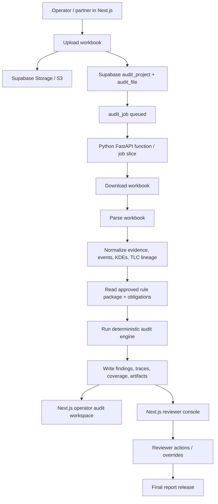

# Enterprise Python Backend And Next.js Integration Plan

Date: 2026-06-16  
Product: TraceReady Audit  
Status: architecture plan  
Owner: TraceReady engineering

## 1. Purpose

TraceReady has enough regulatory intelligence logic to prove the product direction, but the current implementation is still split between:

- a Next.js app that reads local JSON artifacts and local audit JSON files,
- Python ingestion scripts that generate local artifacts,
- Supabase auth/storage setup,
- partial Supabase regulatory-review migrations,
- demo fallbacks used when no customer audit exists.

The next step is to turn the Python layer into a deployable enterprise backend and resumable job system. The customer upload workflow should not depend on hardcoded demo records, local JSON files, or request/response parsing inside the Next.js server.

The target is:

```text
Next.js = UI, auth, upload shell, reviewer/operator workflows
Python = regulatory ingestion, customer evidence validation, audit/review operations
Supabase tables = source of truth
Object storage = uploaded workbooks, source snapshots, generated reports
```

No existing code should be deleted during this migration. Existing scripts and JSON artifacts should be preserved as fixtures, seed data, and test references until the database-backed path fully replaces them.

## 2. Current Codebase Inventory

### 2.1 Next.js Operator / Partner Surface

Navigation is defined in `app/src/components/AppShell.tsx`.

Current operator links:

| Tab | Route | Current behavior | Current data source | Enterprise gap |
|---|---|---|---|---|
| Home | `/operator` | Static dashboard, upload CTA, sample output CTA | Session only + static arrays | Needs real recent audits, job status, readiness summary |
| Upload Records | `/upload` | Uploads workbook through server action | Next.js parses workbook synchronously and saves local audit JSON | Must upload to object storage, create DB rows, enqueue Python job |
| Audits | `/audits` | Lists audits | `storage/audits/*.json`; falls back to demo | Must read `audit_projects` and job/finding summaries from DB |
| Reports | `/audits/demo/report` | Opens demo report link | Demo audit fallback | Must route to latest/customer-owned report artifacts |
| Audit workspace | `/audits/[auditId]` | Shows exception queue and finding detail | Local audit JSON or demo fallback | Must read normalized events, findings, evidence, traces from DB |
| Audit review | `/audits/[auditId]/review` | Phase 14 reviewer ops console | Local audit JSON governance or demo fallback | Must persist reviewer actions/overrides in DB |
| Audit report | `/audits/[auditId]/report` | Renders Markdown report | Local audit JSON or demo fallback | Must read stored report artifact and pinned audit package |
| Artifacts | `/audits/[auditId]/artifacts/*` | Generates downloads from local audit/demo | Local audit JSON | Must read generated artifacts from object storage/DB metadata |

### 2.2 Next.js Reviewer / Regulatory Admin Surface

Current reviewer links:

| Tab | Route | Current behavior | Current data source | Enterprise gap |
|---|---|---|---|---|
| Home | `/reviewer` | Static reviewer dashboard | Static cards | Needs counts from regulatory queues and customer review queues |
| Source Library | `/admin/regulatory/sources` | Shows source registry | `data/regulatory/registry/sources.json` | Needs `regulatory_sources` table and version history |
| Source Chunks | `/admin/regulatory/chunks` | Shows source chunks | `data/regulatory/registry/source-chunks.json` | Needs `source_chunks` table with anchors/hashes |
| AI Drafts | `/admin/regulatory/drafts` | Shows phase 6 draft package | `phase6-review-package.json` | Needs `regulatory_draft_records` DB reads |
| Rule Cards | `/admin/regulatory/rule-cards` | Shows approved rule cards | local JSON approved records | Needs `approved_regulatory_records` filtered by collection/version |
| KDE Requirements | `/admin/regulatory/kde-requirements` | Shows KDE dictionary | local JSON files | Needs approved KDE records in DB |
| Regulatory Review | `/admin/regulatory/review` | Read-only queue | local phase 6 package | Needs approve/reject/edit actions writing DB action log |
| Versions | `/admin/regulatory/versions` | Shows source/rule/KDE versions | local JSON | Needs DB-backed version/publish view |
| Scenarios | `/admin/regulatory/scenarios` | Runs scenarios in app process | local scenario JSON and rule cards | Needs persisted scenario cases and package regression runs |
| Coverage Gate | `/admin/regulatory/coverage` | Shows phase 6 coverage | local phase 6 package | Needs release-gate records from DB and CI/job outputs |

### 2.3 Current Python Layer

Current package: `ingestion/traceready_ingestion`.

Implemented capabilities:

- source fetching/importing for HTML, PDF, XLSX,
- PDF/XLSX/HTML extraction helpers,
- legal-meaning chunking,
- citation anchoring,
- source and chunk hashing,
- regulatory source registry builder,
- AI/deterministic draft schemas,
- obligation inventory generation,
- field mapping governance logic,
- customer evidence normalization artifacts,
- CTE classification hardening,
- approved rule package generation,
- approved rule execution artifact generation,
- generalization/evaluation reports.

Current gaps:

- no FastAPI application,
- no production job runner or job-slice process,
- no durable job queue,
- no Python DB repository for audit tables,
- no Python Supabase read/write path beyond dependencies,
- no object-storage client abstraction,
- no deployed service boundary,
- no audit-project schema migration,
- no normalized evidence/event/finding DB tables,
- no production report artifact writer.

The current `ingestion/traceready_ingestion/storage/db.py` is an in-memory draft store. It is not an enterprise DB layer.

### 2.4 Current Supabase State

Existing migrations:

- `001_initial_auth_and_storage.sql`
  - `traceready_profiles`
  - private storage bucket
- `002_profile_email_verification_lifecycle.sql`
  - profile status lifecycle update
- `003_regulatory_intelligence_review.sql`
  - `regulatory_draft_records`
  - `approved_regulatory_records`
  - `regulatory_review_actions`
- `004_obligation_inventory.sql`
  - `obligation_inventory_records`
  - `approved_obligation_sets`

Existing Prisma schema: `app/prisma/schema.prisma`.

The Prisma schema already defines an important foundation:

- `AuditProject`
- `GapFinding`
- `AuditLog`
- `RegulatorySource`
- `SourceChunk`
- `RuleCard`
- `RuleCardSource`
- `RuleCardReview`
- `RuleCardVersion`
- `KDERequirement`
- `ScenarioCase`
- `RegulatoryDraftRecord`
- `ApprovedRegulatoryRecord`
- `RegulatoryReviewAction`
- `ObligationInventoryRecord`
- `ApprovedObligationSet`

The gap is not "no schema exists." The gap is that the current application is not wired to Prisma as the production source of truth, and the current schema is too coarse for enterprise audit reconstruction. For example, `AuditProject.datasetJson`, `AuditProject.parseErrors`, `GapFinding.evidenceRefsJson`, and approved-record JSON payloads are useful bootstrap fields, but production needs first-class rows for files, runs, jobs, parsed rows, evidence objects, normalized facts, traces, review actions, package pins, and artifacts.

Tables to add or promote:

- customer/org/site tables,
- audit projects,
- audit runs,
- audit files,
- audit jobs,
- job events,
- parsed workbook rows,
- evidence items,
- normalized traceability objects,
- field mapping profiles/candidates,
- audit findings,
- finding traces,
- audit package pins,
- reviewer actions and overrides for customer findings,
- report/artifact metadata,
- regulatory source versions and source ingestion job tables.

### 2.5 Phase 14 Tracker Audit Findings

The Phase 14 regulatory intelligence tracker is mostly accurate for the local artifact-based intelligence layer, but it should not be read as proof that production DB/storage is complete.

Confirmed present as local artifacts:

- 71 source registry records.
- 1,440 canonical source chunks.
- 71/71 raw source artifacts present when registry paths are resolved from `ingestion/`.
- 71/71 normalized source artifacts present when registry paths are resolved from `ingestion/`.
- Raw source artifact types: 53 PDF, 16 HTML, 2 XLSX.
- 0 missing source URLs.
- 0 missing source hashes.
- 0 chunks referencing a missing source record.
- Source registry records include `url`, `raw_artifact_path`, `normalized_artifact_path`, and `raw_hash`.

Important misses:

- RI-005, "Store source registry in Supabase," is still not implemented.
- Source PDFs/HTML/XLSX and normalized extraction JSON are local files under `data/regulatory`, not private object-storage objects with DB metadata.
- `app/src/lib/regulatory/data-loader.ts` reads local JSON through `fs.readFileSync`; regulatory tabs are not DB-backed.
- `app/src/lib/storage/local-audit-store.ts` writes customer audits to `app/storage/audits/{auditId}/audit.json`; customer audit runtime storage is not DB-backed.
- `ingestion/traceready_ingestion/storage/artifacts.py` writes local files; there is no Supabase/S3 object-store abstraction yet.
- `ingestion/traceready_ingestion/storage/db.py` is an in-memory draft store; there is no Python production DB repository yet.
- `app/package.json` does not include `prisma` or `@prisma/client`; Prisma schema exists but the Next.js app is not wired to it.
- Supabase SQL migrations do not yet create `regulatory_sources`, `source_chunks`, source ingestion jobs, audit runs, audit files, audit jobs, parsed workbook rows, evidence items, normalized events, finding traces, customer review actions, or report artifact metadata.
- `phase6-approved-records.json` is empty. The executable package is currently based on the approved Phase 7/9 obligation package, not a full DB-backed approved rule-card/KDE-card publication workflow.
- `docs/blueprint/14-regulatory-intelligence-task-tracker.md` has at least one stale count: it says the canonical chunk index has 1,333 chunks, while the current `source-chunks.json` has 1,440.

These are not failures of the local intelligence work. They are the exact production hardening tasks required before Vercel/Supabase deployment can be treated as enterprise-grade.

Script packaging policy:

Production entrypoints remain at the ingestion root (`ingest.py`, `seed_regulatory_sources.py`, `check_source_artifact_integrity.py`, and Vercel `api/index.py`). Historical phase/evaluation artifact builders live under `ingestion/scripts/intelligence/` and `ingestion/scripts/evaluation/`. Production code should not import those script files directly; reusable logic belongs under `traceready_ingestion/`. This preserves historical/regression workflows while the deployable backend takes over production execution.

### 2.6 Next.js Application Audit Findings

The Next.js app currently proves the workflow, but the production misses are still present in code.

Confirmed current behavior:

- `app/src/app/(pilot)/upload/actions.ts` stores uploaded workbook bytes through `getStorageProvider()`, but then parses the workbook, maps ontology, runs the audit, and saves the audit result synchronously inside the Next.js server action.
- `app/src/app/(pilot)/upload/actions.ts` still imports `runAudit`, `parseWorkbook`, `mapWorkbookToOntology`, `loadRegulatoryBundle`, and `saveAudit`; it does not create an `audit_job` for Python.
- `app/src/lib/storage/supabase-storage.ts` can upload/download objects from Supabase Storage when env vars are present, but the fallback is `LocalMemoryStorageProvider`, which is not durable across Vercel function invocations.
- `app/src/lib/storage/local-audit-store.ts` is still the production route dependency for audit list/detail/report/review/artifact routes.
- `app/src/lib/storage/audit-repository.ts` exists as an interface, but `getAuditRepository()` always returns `LocalAuditRepository`.
- `app/src/app/(pilot)/audits/page.tsx` lists local audit JSON and falls back to demo data.
- `app/src/app/(pilot)/audits/[auditId]/page.tsx`, `/review`, `/report`, and artifact routes load local audit JSON or demo fixtures.
- `app/src/app/(pilot)/audits/[auditId]/review/actions.ts` persists review actions by rewriting local audit JSON, not append-only DB rows.
- `app/src/app/operator/page.tsx` uses static dashboard rows rather than DB audit summaries.
- `app/src/app/reviewer/page.tsx` uses static reviewer cards rather than DB queue counts.
- `app/src/app/(admin)/admin/regulatory/*` pages read local regulatory artifacts through `loadRegulatoryBundle()` / `loadPhase6ReviewPackage()`.
- `app/src/lib/regulatory/data-loader.ts` uses local `fs.readFileSync` against `data/regulatory`.
- `app/package.json` has no `prisma` or `@prisma/client` dependency.
- Route protection is role-based, but customer/org audit scoping is not implemented as DB-backed membership/RLS.

Required app changes:

- Upload should store the workbook object, create audit/run/file/job rows, and return a job-backed audit workspace route.
- Python should parse/normalize/execute rules asynchronously through job-slice endpoints.
- Audit pages should read audit projects, runs, findings, traces, review state, and artifact metadata from Supabase tables/object storage.
- Reviewer actions should write append-only DB records.
- Regulatory admin pages should read DB records and write approval/rejection/publication actions.
- Local JSON and demo fallbacks should remain fixtures only, not production route dependencies.
- Local-memory storage fallback should be disabled in production so missing storage env fails loudly.

### 2.7 Current Vercel Deployment Reality

The MVP task list already points toward one Next.js app on Vercel, managed Supabase tables, object storage, and a Python source-ingestion/job layer. Current Vercel support changes the shape of the implementation:

- Vercel can run Python ASGI/WSGI applications, including FastAPI, through the Python runtime.
- Python functions are bounded invocations, not always-on daemon processes.
- Vercel Functions have duration limits, so large workbook audits and regulatory ingestion must be split into resumable jobs.
- Vercel Cron can trigger HTTP endpoints to claim and process bounded job slices.

Therefore, if everything must deploy on Vercel for the pilot, the Python layer should be implemented as Vercel-deployable FastAPI endpoints plus scheduled/triggered job-slice handlers. It should not rely on a long-running loop in memory.

## 3. Target Enterprise Architecture



### 3.1 Service Ownership

| Area | Owner | Notes |
|---|---|---|
| Auth/session/RLS | Next.js + Supabase | Next already owns login and session cookie |
| Upload UI | Next.js | Server action stores file and creates DB/job records |
| File storage | Supabase Storage or S3-compatible storage | No local-only production uploads |
| Workbook parsing | Python | Excel parsing should move out of Next.js |
| Field mapping | Python + reviewer UI | Draft mapping candidates can be AI-assisted but must be approved |
| CTE classification | Python | Use deterministic multi-signal classifier and review routing |
| Rule execution | Python | Approved package only; no unapproved draft rules |
| Reviewer UI | Next.js | Reads DB, writes review actions |
| Regulatory admin UI | Next.js | Reads/writes regulatory DB tables through server actions |
| Regulatory ingestion | Python service/job slice | Source ingestion is internal/admin, not customer-facing |
| Reports/artifacts | Python generates; Next downloads | Store artifact metadata in DB and bytes in object storage |

### 3.2 Python Service Planes

Python should be split into three enterprise service planes.

#### Plane A: Regulatory Intelligence Ingestion

Purpose: turn FDA/eCFR/FSMA and uploaded source files into versioned source truth and reviewer-approved intelligence.

Flow:

```text
source upload/fetch
-> immutable raw source snapshot in object storage
-> extraction
-> legal-meaning chunks
-> citations, dates, hashes, versions
-> draft rule/KDE/obligation records
-> reviewer action
-> approved package publication
```

Storage:

- raw source object
- normalized text/table extraction artifact
- `regulatory_sources`
- source version rows
- `source_chunks`
- `regulatory_draft_records`
- `approved_regulatory_records`
- package publication rows
- review action rows

#### Plane B: Customer Evidence Validation

Purpose: turn customer uploads into audit-ready evidence and deterministic findings.

Flow:

```text
customer workbook upload
-> object storage
-> audit project/run/file/job rows
-> workbook parse
-> field mapping
-> evidence extraction
-> normalized events/KDEs/TLC lineage
-> approved package pin
-> deterministic rule execution
-> findings/traces/coverage/readiness gates
```

Storage:

- uploaded workbook object
- audit project, run, file, job, job event rows
- parsed sheet/row/cell rows
- evidence item rows
- normalized business object rows
- finding, evidence reference, trace, coverage rows
- generated report/export artifact objects

#### Plane C: Audit Review And Operations

Purpose: support reviewer workflows, overrides, release gates, report publication, and audit reconstruction.

Flow:

```text
reviewer opens finding/source/rule trace
-> approve/reject/edit/request evidence/override
-> append-only action log
-> report release gate
-> final artifact publication
```

Storage:

- customer review action rows
- reviewer override rows
- report release action rows
- audit logs
- artifact metadata
- exact package, parser, classifier, and model/prompt policy pins

### 3.3 Vector Database Decision

A separate vector database is not required for the MVP audit engine.

Use Supabase tables plus object storage as the source of truth. If semantic retrieval becomes useful, use `pgvector` inside Supabase rather than adding a separate vector vendor. Vectors should be optional reviewer/AI-assistance infrastructure only.

Allowed vector use cases:

- source chunk semantic search for reviewers,
- evidence-to-source retrieval for drafting explanations,
- finding triage and similar-case lookup,
- AI draft context retrieval before human approval.

Disallowed vector use cases:

- final compliance verdicts,
- replacing exact citations,
- replacing approved rule package pins,
- deciding whether a KDE is missing,
- deciding whether a customer is compliant.

If enabled later, vector columns should live beside first-class source/evidence rows and be treated as derived indexes. Prisma can keep vector fields behind SQL migrations or `Unsupported` field types where needed; deterministic code should query canonical tables, not vector similarity.

## 4. Complete User Behavior Scenarios

### 4.1 Anonymous Visitor

1. Visitor lands on marketing page.
2. Chooses Operator/Partner login or Reviewer login.
3. No audit/regulatory data is exposed before authentication.

Required changes:

- Keep public marketing page separate from application routes.
- Ensure role-specific login redirects remain enforced.

### 4.2 Operator / Partner Signup And Login

1. User creates operator account.
2. Profile starts as invited/inactive until verification/approval policy is satisfied.
3. After login, user lands on `/operator`.
4. Dashboard shows real audit projects, not static "not checked" rows.

Required changes:

- Add customer/org relationship to profile.
- Add RLS so users can only see their organization audits.
- Replace static dashboard metrics with DB summary queries.

### 4.3 Clean TraceReady Workbook Upload

1. Operator uploads workbook.
2. Next.js validates file name, size, content type.
3. Next.js stores workbook in object storage.
4. Next.js creates:
   - `audit_project`
   - `audit_file`
   - `audit_job`
5. Python job-slice endpoint claims the job.
6. Python parses workbook and writes parsed/normalized records.
7. Python runs deterministic audit.
8. Next.js shows status: queued -> running -> needs review / completed / failed.

Required changes:

- Do not parse the workbook inside the upload server action.
- Add DB job status and progress events.
- Add Python job idempotency by file hash + audit run version.

### 4.4 ERP/WMS/Traceability Platform Export Upload

1. Operator uploads spreadsheet with non-TraceReady headers.
2. Python detects sheet/column structure.
3. Approved mapping profile is applied if available.
4. Unknown columns become `field_mapping_candidates`.
5. Operator/reviewer confirms mapping before deterministic execution.

Required changes:

- Add mapping profile tables.
- Add mapping candidate review UI.
- Treat unapproved mappings as review-blocking, not as final facts.

### 4.5 Incomplete Or Invalid Workbook

1. Workbook is missing sheets or required columns.
2. Python writes parse errors and row-level validation errors.
3. Audit status becomes `needs_input`.
4. UI shows exact missing sheets/columns/rows.

Required changes:

- Persist parse errors in DB.
- Preserve original values and normalized values separately.
- Avoid generating final findings from structurally invalid evidence.

### 4.6 Ambiguous Customer Data

Examples:

- lot value appears in filename but not row,
- date format is unclear,
- partner is implied by sheet name,
- product scope is uncertain,
- shipment/transport-only wording is ambiguous,
- transformation has output lot but missing input lot,
- imported/non-English record needs translation review.

Expected behavior:

- Python stores evidence with confidence and review status.
- Ambiguous facts route to review.
- Audit emits `not_determined` / `cannot_determine` where appropriate.
- No AI-generated final compliance conclusion is allowed.

### 4.7 Audit Finding Review

1. Reviewer opens `/audits/[auditId]/review`.
2. Reviewer sees finding, evidence, normalized event, rule, citation trace.
3. Reviewer approves, rejects, edits, requests more evidence, assigns, comments, or creates override.
4. Every action writes append-only audit log rows.
5. Overrides remain excluded from automation unless promoted.

Required changes:

- Move governance state from local `audit.json` into DB tables.
- Require reason, reviewer identity, timestamp, affected finding/rule.
- Keep report release blocked until required review states are satisfied.

### 4.8 Re-Upload / Corrected Workbook

1. Operator uploads corrected workbook for same audit project or starts a new audit run.
2. Python creates a new audit run version.
3. System compares prior findings to new findings.
4. UI shows fixed, remaining, and newly introduced issues.

Required changes:

- Add audit run versioning.
- Add diff summary table or computed view.
- Preserve old run outputs for reproducibility.

### 4.9 Regulatory Source Ingestion

1. Internal reviewer/admin starts source ingestion job.
2. Python fetches/imports eCFR/FDA/Federal Register/PDF/XLSX.
3. Python stores immutable raw snapshots.
4. Python extracts source metadata, chunks, citations, hashes.
5. Python writes draft records only.
6. Reviewer approves records in Next.js.
7. Approved package is versioned and published.

Required changes:

- Add `regulatory_sources` and `source_chunks` tables.
- Add source ingestion jobs.
- Add object storage paths for raw/normalized source artifacts.
- Keep AI draft writes separate from approved record publication.

### 4.10 Rule Package Change

1. New source/version or approved record changes.
2. System builds package candidate.
3. Scenario regression gate runs.
4. Reviewer approves publication.
5. Existing audits remain pinned to their original package.
6. Optional re-run compares old package vs new package.

Required changes:

- Add active package pin table.
- Add package publication action log.
- Add audit run package pin table.

### 4.11 Job Failure And Retry

1. Python job fails due to malformed file, parser exception, storage error, DB error, or rule package inconsistency.
2. Job status becomes failed.
3. Failure category and retryability are recorded.
4. UI shows actionable error.
5. Retry creates a new attempt, not silent overwrite.

Required changes:

- Add job attempts and event log.
- Add structured error schema.
- Add idempotent job claim lock.

## 5. Required Database Contract

The existing Prisma schema is the starting point. The next migration should expand it rather than create a parallel database model. The production contract must remove local JSON as the runtime source of truth, while keeping JSON fixtures for demos, tests, seeds, and regression baselines.

### 5.1 Regulatory Tables To Add Or Promote

Existing regulatory approval and source models are useful but incomplete. Add or promote:

```text
regulatory_sources
source_versions
source_chunks
source_ingestion_jobs
source_ingestion_job_events
approved_rule_packages
approved_rule_package_records
scenario_cases
scenario_regression_runs
scenario_regression_results
semantic_source_embeddings (optional/deferred pgvector-derived index)
```

### 5.2 Customer And Audit Tables

```text
customers
customer_sites
customer_memberships
source_systems
audit_projects
audit_runs
audit_files
audit_jobs
audit_job_events
audit_package_pins
audit_artifacts
```

### 5.3 Parsing And Evidence Tables

```text
parsed_workbook_sheets
parsed_workbook_rows
parsed_workbook_cells
evidence_items
field_mapping_profiles
field_mapping_rules
field_mapping_candidates
```

### 5.4 Normalized Audit Object Tables

```text
normalized_business_profiles
normalized_products
normalized_locations
normalized_partners
normalized_traceability_plans
normalized_events
normalized_event_line_items
normalized_kde_values
normalized_tlc_lineage
normalized_source_documents
normalized_exemption_claims
```

### 5.5 Finding And Review Tables

```text
audit_findings
finding_evidence_refs
finding_traces
audit_coverage_results
audit_readiness_gate_results
customer_review_actions
customer_reviewer_overrides
report_release_actions
```

### 5.6 Minimum Record Principles

Every customer-facing finding must include:

- `audit_project_id`
- `audit_run_id`
- `finding_id`
- finding type/status/severity
- affected event/line/KDE/TLC where applicable
- customer evidence references
- normalized object references
- approved rule package ID/version
- approved regulatory record or obligation ID
- source chunk/citation reference
- deterministic check code/version
- reviewer state

## 6. Python Backend Shape

Recommended package addition:

```text
ingestion/
  traceready_backend/
    api/
      main.py
      dependencies.py
      routes/
        health.py
        audits.py
        jobs.py
        regulatory.py
    core/
      config.py
      logging.py
      errors.py
      security.py
    db/
      connection.py
      repositories/
        audit_repository.py
        regulatory_repository.py
        job_repository.py
        artifact_repository.py
    storage/
      object_store.py
      supabase_store.py
      local_store.py
    services/
      audit_orchestrator.py
      workbook_parser.py
      evidence_normalizer.py
      field_mapping_service.py
      cte_classifier_service.py
      rule_package_loader.py
      rule_execution_service.py
      finding_trace_service.py
      report_artifact_service.py
      regulatory_ingestion_service.py
    job_handlers/
      audit_job_handler.py
      regulatory_job_handler.py
    schemas/
      audit.py
      jobs.py
      evidence.py
      findings.py
      regulatory.py
```

The existing `traceready_ingestion` modules should be reused as domain logic. The new `traceready_backend` layer should provide API, DB, storage, job orchestration, and deployment boundaries.

## 7. Internal API Contract

Python API endpoints:

```text
GET  /health
GET  /ready
POST /internal/audits/{audit_id}/runs
GET  /internal/audits/{audit_id}/runs/{run_id}
POST /internal/audit-jobs/{job_id}/claim
POST /internal/audit-jobs/{job_id}/events
POST /internal/audit-jobs/{job_id}/retry
POST /internal/regulatory/ingestion-jobs
GET  /internal/regulatory/ingestion-jobs/{job_id}
```

Next.js server actions should call Python only for job creation/status where needed. The UI should read final state from Supabase tables, not from Python memory.

## 8. Deployment Plan

Recommended first deployment for the user's stated goal: Vercel-first.

- Next.js on Vercel.
- Python FastAPI service on Vercel Python runtime.
- Python job-slice endpoints triggered by Vercel Cron and explicit Next.js/internal calls.
- Supabase tables.
- Supabase Storage private bucket.
- Internal API token between Next.js and Python.

This means Python is not an always-on process. Jobs must be resumable:

```text
queued audit_job
-> claim next job slice
-> process bounded batch
-> commit progress/checkpoint
-> enqueue/keep job pending if more work remains
-> final completion writes findings/artifacts
```

Python Vercel deployment artifacts required:

```text
ingestion/api/main.py or ingestion/app.py with FastAPI app
ingestion/pyproject.toml dependency lock discipline
vercel.json function bundle excludes for tests/fixtures/sample data
bounded audit job-slice endpoint
bounded regulatory ingestion job-slice endpoint
cron endpoint or Next.js route that calls job-slice endpoint
health and readiness endpoints
structured JSON logging
```

If a single workbook or source ingestion run cannot reliably fit inside Vercel function limits after chunking, the same DB/job/storage contract can later move the worker to Render/Fly/Railway/ECS without changing the Next.js UI or audit records.

Required environment variables:

```text
SUPABASE_DATABASE_URL
SUPABASE_SERVICE_ROLE_KEY
SUPABASE_PRIVATE_BUCKET
TRACEREADY_INTERNAL_API_TOKEN
ANTHROPIC_API_KEY
OPENAI_API_KEY
ENVIRONMENT
LOG_LEVEL
```

### 8.1 External Platform Facts Checked

- Vercel's Python runtime supports ASGI/WSGI apps and FastAPI-style entrypoints.
- Vercel function duration is bounded and configurable; long work must be split into job slices.
- Vercel Cron can trigger functions by HTTP GET for scheduled job claiming.
- Supabase supports vectors inside Supabase through `pgvector`; this is optional for semantic retrieval, not required for deterministic validation.
- Prisma can manage PostgreSQL extensions through custom migrations and use unsupported field types when a database type is not represented natively.

References checked on 2026-06-16:

- https://vercel.com/docs/functions/runtimes/python
- https://vercel.com/docs/functions/configuring-functions/duration
- https://vercel.com/docs/cron-jobs
- https://supabase.com/docs/guides/ai/vector-columns
- https://www.prisma.io/docs/orm/prisma-schema/postgresql-extensions

## 9. Migration Strategy

Do not attempt a big-bang rewrite.

### Stage 0: Prisma And Storage Alignment

- Treat `app/prisma/schema.prisma` as the canonical application schema.
- Add Prisma dependencies/client wiring to the Next.js app.
- Add migrations that expand the existing schema instead of creating a parallel data model.
- Define object storage key conventions for sources, customer uploads, generated artifacts, and raw/normalized extraction outputs.

### Stage 1: Database Foundation

- Add missing audit/regulatory source tables.
- Add repositories in Python and Next.js.
- Keep local JSON fallback only for demo/dev fixtures.

### Stage 2: Python Audit Job Runner

- Move workbook parsing and normalization into Python service.
- Add audit job creation/status.
- Persist parse errors, evidence, normalized objects, findings, traces.

### Stage 3: Next.js Reads DB

- Replace `/audits`, `/audits/[auditId]`, `/audits/[auditId]/review`, `/report`, artifact routes with DB/object-storage reads.
- Keep demo route as explicit fixture only.

### Stage 4: Regulatory Admin DB Path

- Replace regulatory tabs with DB reads.
- Add reviewer actions for approving/rejecting regulatory drafts.
- Publish approved packages from DB.

### Stage 5: Deployment

- Add Vercel Python API/function deployment files.
- Add resumable job-slice handlers and cron trigger.
- Add production env configuration.
- Add health checks and job observability.
- Deploy behind internal auth.

## 10. Implementation Task Tracker

Statuses:

- `done`: completed and verified.
- `in_progress`: actively being implemented.
- `ready_for_user_execution`: code/SQL is prepared in the repo and waiting for the user to run the SQL in Supabase and report the result.
- `planned`: not started.
- `blocked`: waiting for external decision/access.

| ID | Task | Status | Acceptance Criteria |
|---|---|---|---|
| EPY-001 | Inventory current Next.js tabs and data sources | `done` | Operator, reviewer, audit, report, and regulatory admin routes are mapped with current data source and enterprise gap. |
| EPY-002 | Inventory current Python ingestion capabilities | `done` | Existing source ingestion, chunking, customer evidence, classification, rule execution, and storage gaps are documented. |
| EPY-003 | Define target service ownership | `done` | Architecture separates Next.js UI/auth/review from Python parsing/intelligence/rule execution and Supabase tables/source-of-truth persistence. |
| EPY-004 | Define end-to-end user behavior scenarios | `done` | Operator, reviewer, regulatory admin, upload, rerun, failure, and package-change scenarios are documented. |
| EPY-005 | Add audit database migration | `done` | Prisma audit foundation models and `app/supabase/migrations/005_enterprise_audit_foundation.sql` are prepared and user confirmed Supabase SQL execution succeeded. |
| EPY-006 | Add regulatory source database migration | `done` | Prisma regulatory source/chunk/package models and `app/supabase/migrations/006_regulatory_source_foundation.sql` are prepared and user confirmed Supabase SQL execution succeeded after prerequisite migrations. |
| EPY-007 | Add Python backend package skeleton | `done` | FastAPI app, config, health checks, Vercel-compatible import shim, repository/service/job/schema folders, structured logging, safe errors, internal-token auth, README docs, and tests are created without deleting existing scripts. |
| EPY-008 | Add Python Supabase repository layer | `done` | Python has lazy Supabase tables connection lifecycle, typed repository inputs, audit job/file/artifact/evidence/finding/trace/source repositories, source ingestion job/event writes, repository tests, and production guardrails around the old in-memory store. |
| EPY-009 | Add Python object storage abstraction | `done` | Python has object key conventions, Supabase Storage implementation, explicit local/test object store, settings-driven store factory, hash/size/content-type capture, docs, and tests for uploads/downloads/listing. |
| EPY-010 | Move customer workbook parsing into Python job | `done` | Added audit parse job schema, job wrapper, parse service, object-storage download, existing CSV/XLSX parser reuse, evidence persistence, dataset snapshot update, parse-error persistence, job checkpoints/events, and tests. |
| EPY-011 | Persist normalized customer evidence | `done` | Prisma models, Supabase migration `007_normalized_customer_evidence.sql`, Python normalized evidence repository/service, and tests are complete for normalized events, KDE values, TLC lineage, business objects, and review routing. User confirmed Supabase SQL execution succeeded. |
| EPY-012 | Persist approved-rule execution outputs | `done` | Python loads approved package pins from Supabase, runs deterministic approved-rule checks, persists findings/evidence refs/traces, updates audit-run readiness/package summary, uploads generated artifacts to object storage, records artifact metadata, and has focused tests. |
| EPY-013 | Connect Next.js upload to Python job creation | `done` | Upload server action now stores workbook bytes in private storage, creates customer/audit/run/file/job/event rows, queues `parse_customer_workbook`, and redirects to a DB-backed status page instead of synchronously running local audit logic. |
| EPY-014 | Convert operator audit tabs to DB reads | `done` | `/operator`, `/audits`, `/audits/[auditId]`, `/report`, and artifact routes now read Supabase audit rows/object-storage artifact metadata for real audits; only explicit `/audits/demo` sample paths use demo fixtures. |
| EPY-015 | Convert customer review console to DB writes | `done` | Finding review actions, overrides, promotions, comments, assignments, evidence requests, and approvals persist in `customer_review_actions` with DB-backed finding state updates. |
| EPY-016 | Convert regulatory tabs to DB reads/actions | `done` | Source, chunk, draft, rule-card, KDE, review, version, scenario, and coverage tabs read/write Supabase DB tables rather than local JSON artifacts. |
| EPY-017 | Add job observability and retry | `done` | Jobs expose queued/running/succeeded/failed states, event log, failure category, retryability, attempt count, stale lock reclaim, and controlled retry. |
| EPY-018 | Add Python deployment artifacts | `done` | Vercel-compatible FastAPI entrypoint, requirements, bundle excludes, env docs, health checks, job-slice endpoint, cron config, and deployment smoke checklist exist. |
| EPY-019 | Add integration tests | `done` | Added stitched Python integration coverage plus focused Next tests for upload/job/review/repository boundaries using test-safe repositories and local object storage. |
| EPY-020 | Remove production dependency on local JSON/local audit storage | `done` | Production route imports now use DB/storage repositories; local audit JSON is guarded for non-production/demo/test use, regulatory JSON is limited to demo/test fixtures, and production storage fallback fails loudly. |
| EPY-021 | Align Prisma schema with enterprise audit storage | `done` | Prisma now includes first-class parsed workbook sheet/row/cell models alongside audit runs, files, jobs, events, evidence, normalized objects, traces, review actions, package pins, and artifacts. User confirmed `008_parsed_workbook_records.sql` executed successfully. |
| EPY-022 | Add Prisma client/dependencies and DB repository in Next.js | `done` | Added Prisma 6 dependencies, client generation scripts, server-side Prisma singleton, repository contracts, Prisma-backed audit/job/artifact/regulatory repositories, and made queued uploads use Prisma by default. |
| EPY-023 | Add Python Vercel FastAPI service boundary | `done` | Python exposes `/health`, `/ready`, protected internal audit job status/retry/list endpoints, regulatory source ingestion job create/status endpoints, and audit artifact metadata endpoints through the Vercel-compatible ASGI app. |
| EPY-024 | Add Vercel job slicing and cron claim model | `done` | Added protected `/internal/jobs/audit/process-slice`, bounded claim/process/checkpoint/complete flow for parse and approved-rule jobs, automatic rule-execution queueing after parse success, stale lock reclaim reuse, and Vercel Cron now targets the processor endpoint. |
| EPY-025 | Decide optional pgvector semantic retrieval layer | `done` | Section 3.3 records no separate vector DB for MVP; pgvector is optional later as a derived reviewer/AI retrieval index only, while deterministic validation continues to use approved records, citations, package pins, and canonical DB rows. |
| EPY-026 | Add source/chunk ingestion storage path | `done` | Added source raw/normalized/chunk/draft/approval object-key conventions and `regulatory_source_artifact_service.py` to upload private artifacts and persist regulatory source/chunk DB metadata. |
| EPY-027 | Store all audit records and artifacts in DB/storage | `done` | Customer uploads, parsed workbook rows/cells, evidence items, normalized evidence, findings/traces, reviewer actions, generated exports/reports, and artifact metadata are persisted in Supabase tables/object storage; real audit routes no longer rely on `app/storage/audits`. |
| EPY-028 | Seed current regulatory source artifacts into production storage | `done` | Ran the idempotent production seed against Supabase bucket `traceready-pilot-private`: 71 source rows, 1,440 chunk rows, 71 raw artifacts, 71 normalized artifacts, 71 chunk packages, and 0 skipped sources. Production integrity check passed with 0 issues. |
| EPY-029 | Replace regulatory local JSON loader with DB repository | `done` | Production regulatory admin tabs now use `regulatory-admin-db.ts` against Supabase tables; the local JSON loader remains available for tests/fixtures but is no longer imported by those admin routes. |
| EPY-030 | Replace local audit JSON store with DB/object-storage repository | `done` | Production routes use DB/object-storage paths, and `getAuditRepository()` now returns a Prisma-backed repository in production; local JSON remains explicit local/demo compatibility only. |
| EPY-031 | Add Python Supabase table repository implementation | `done` | Python runtime writes use `backend/repositories/supabase_tables.py` for source records, chunks, ingestion jobs, audit jobs/files/artifacts, evidence, parsed workbook rows, normalized evidence, findings, traces, and packages; in-memory stores remain test-only. |
| EPY-032 | Add Python Supabase object-store implementation | `done` | `storage/artifacts.py` uses Supabase object storage for raw sources, normalized artifacts, customer uploads, exports, and reports; local object storage is test-only and unavailable for runtime. |
| EPY-033 | Persist approved rule-card and KDE-card publication workflow | `done` | Regulatory approve/reject/publish actions write approved regulatory records, reviewer action logs, immutable approved rule packages, and package records in DB; approved package loading uses DB package pins/records, not Phase 6 JSON artifacts. |
| EPY-034 | Add Supabase migration parity for Prisma models | `done` | Prisma schema validates and `docs/deployment/epy-034-prisma-supabase-parity-report.json` shows all 44 Prisma-mapped tables are covered by Supabase migrations with no missing app-table models. |
| EPY-035 | Reconcile tracker counts and artifact health checks | `done` | `14-regulatory-intelligence-task-tracker.md` now matches the current registry: 71 sources, 1,440 chunks, 0 source issues, 0 chunk issues, 0 errors, 0 warnings, and 10 intentionally dropped boilerplate chunks. |
| EPY-036 | Add production source artifact integrity checks | `done` | Added `source_artifact_integrity_service.py`, `check_source_artifact_integrity.py`, and `/internal/regulatory/source-integrity-check`; checks DB source URL/hash fields, raw/normalized object reachability, raw SHA-256 match, chunk package count, chunk citations/anchors, and chunk text hashes before publication. |
| EPY-037 | Convert upload action to job-backed workflow | `done` | `app/src/app/(pilot)/upload/actions.ts` no longer imports or runs `parseWorkbook`, `mapWorkbookToOntology`, `runAudit`, or `saveAudit` in production; it stores the workbook, creates audit/run/file/job rows, and redirects to a DB-backed audit status page. |
| EPY-038 | Disable non-durable storage fallback in production | `done` | `getStorageProvider()` now fails in production unless Supabase Storage env vars are configured or an explicit `TRACEREADY_ALLOW_MEMORY_STORAGE=true` break-glass override is set; guardrail tests cover the behavior. |
| EPY-039 | Add DB-backed audit repository implementation | `done` | Added `PrismaStoredAuditRepository`; production `getAuditRepository()` returns the Prisma/Supabase adapter unless an explicit local-store break-glass flag is set. |
| EPY-040 | Convert audit workspace/report/artifact routes to DB/storage reads | `done` | `/operator`, `/audits`, `/audits/[auditId]`, `/audits/[auditId]/review`, report, status, and artifact routes use DB/object-storage reads for real audits; only explicit demo audit paths use fixtures. |
| EPY-041 | Convert reviewer actions to append-only DB writes | `done` | `/audits/[auditId]/review/actions.ts` writes review, override, promotion, comment, assignment, and evidence-request actions to `customer_review_actions` instead of rewriting local `audit.json`. |
| EPY-042 | Convert operator and reviewer dashboards to DB summaries | `done` | `/operator` already uses `loadOperatorAuditDashboard(session)` for org-scoped audit/job/readiness summaries; `/reviewer` now loads DB-backed regulatory draft, source chunk, approved package, scenario, customer finding queue, and review-action counts. |
| EPY-043 | Add customer/org authorization and audit scoping | `done` | Audit pages/status/actions/artifact routes require TraceReady sessions, real audit reads enforce owner/customer membership/founder-admin scope through DB checks, demo artifact downloads now require auth, and org-aware access tests cover owner, membership, outsider, and founder-admin cases. |
| EPY-044 | Add DB-backed regulatory approval actions | `done` | Regulatory review pages support approve/reject draft actions and package publication actions that write `regulatory_review_actions`, approved records, approved package rows, and package record rows in DB. |

### 10.1 Execution Rules For Database Tasks

For every task that changes Supabase SQL:

1. Codex prepares the Prisma/schema code and a numbered SQL migration file.
2. Codex stops and reports the exact SQL file to run.
3. User runs the SQL manually in the Supabase Dashboard SQL Editor.
4. User reports success or the exact error.
5. Codex only then marks the task `done` or fixes the SQL.

No later DB-dependent implementation task should start until the prior SQL migration is confirmed.

Current required Supabase SQL execution order:

```text
app/supabase/migrations/001_initial_auth_and_storage.sql
app/supabase/migrations/002_profile_email_verification_lifecycle.sql
app/supabase/migrations/003_regulatory_intelligence_review.sql
app/supabase/migrations/004_obligation_inventory.sql
app/supabase/migrations/005_enterprise_audit_foundation.sql
app/supabase/migrations/006_regulatory_source_foundation.sql
app/supabase/migrations/007_normalized_customer_evidence.sql
app/supabase/migrations/008_parsed_workbook_records.sql
```

If a migration was already applied successfully, do not re-run it unless the SQL is explicitly idempotent and a retry is needed. The EPY-006 migration depends on `approved_obligation_sets` from migration 004 and will fail if migration 004 has not been applied. The EPY-011 migration depends on audit/evidence tables from migration 005.

### 10.2 EPY-005 Detailed Checklist: Audit Database Foundation

Status: `done`

Prepared files:

- `app/prisma/schema.prisma`
- `app/supabase/migrations/005_enterprise_audit_foundation.sql`

Subtasks:

| Subtask | Status | Notes |
|---|---|---|
| EPY-005.1 Add customer/org tables | `done` | `customers`, `customer_sites`, `customer_memberships`. |
| EPY-005.2 Expand audit project model | `done` | `audit_projects` keeps snapshot JSON nullable but adds customer, creator, metadata, and relations. |
| EPY-005.3 Add audit run versioning | `done` | `audit_runs` supports run number, status, parser/classifier versions, package pin, and summary. |
| EPY-005.4 Add uploaded audit file records | `done` | `audit_files` stores storage bucket/key, hash, size, uploader, run/project relation. |
| EPY-005.5 Add job queue foundation | `done` | `audit_jobs` and `audit_job_events` support status, attempts, locks, checkpoints, and event log. |
| EPY-005.6 Add audit artifacts | `done` | `audit_artifacts` stores generated reports/exports by storage bucket/key and artifact type. |
| EPY-005.7 Add evidence and finding trace tables | `done` | `evidence_items`, `finding_evidence_refs`, and `finding_traces`. |
| EPY-005.8 Add customer review action table | `done` | `customer_review_actions` is append-only review/override/comment/action history. |
| EPY-005.9 Add audit logs | `done` | `audit_logs` maps the existing Prisma `AuditLog` concept to snake_case SQL. |
| EPY-005.10 Add indexes and updated-at triggers | `done` | Indexes exist for project/run/job/status/artifact/finding/review lookups. |
| EPY-005.11 Add RLS read policy shape | `done` | Authenticated users can read by customer membership; reviewers/admins can read across customers. Writes remain service-role controlled. |
| EPY-005.12 User runs SQL in Supabase | `done` | User confirmed SQL execution succeeded. |
| EPY-005.13 Mark task done after confirmation | `done` | EPY-005 marked done after user confirmation. |

Supabase execution instruction:

```text
Open Supabase Dashboard -> SQL Editor -> New query.
Paste the full contents of:
app/supabase/migrations/005_enterprise_audit_foundation.sql
Run it.
Then tell Codex whether it succeeded or paste the exact error.
```

### 10.3 EPY-006 Detailed Checklist: Regulatory Source Database Foundation

Status: `done`

Important: EPY-006 SQL is prepared, but do not run it until migrations 001, 003, 004, and 005 exist in Supabase. The `approved_rule_packages.approved_obligation_set_id` foreign key depends on `public.approved_obligation_sets(id)` from migration 004.

Subtasks:

| Subtask | Status | Notes |
|---|---|---|
| EPY-006.1 Align Prisma `RegulatorySource` with SQL names | `done` | Added snake_case mappings and storage artifact metadata. |
| EPY-006.2 Align Prisma `SourceChunk` with SQL names | `done` | Added source version relation, citation anchor, section ref, quality flags, usage role, source URL/type, and artifact metadata. |
| EPY-006.3 Add source version model | `done` | `regulatory_source_versions` pins raw/normalized hashes and storage keys. |
| EPY-006.4 Add source ingestion job model | `done` | `source_ingestion_jobs` and `source_ingestion_job_events` support resumable source ingestion. |
| EPY-006.5 Align rule card/KDE/scenario models | `done` | Existing Prisma fields now map to snake_case SQL names with indexes. |
| EPY-006.6 Align draft/approved/review action models | `done` | Existing Prisma models now map to SQL tables from migrations 003 and 004. |
| EPY-006.7 Add approved rule package publication tables | `done` | Added `approved_rule_packages` and `approved_rule_package_records`. |
| EPY-006.8 Add scenario regression run/result tables | `done` | Added `scenario_regression_runs` and `scenario_regression_results`. |
| EPY-006.9 Add Supabase SQL migration file | `done` | Added `app/supabase/migrations/006_regulatory_source_foundation.sql` with dependency guards for migrations 001, 003, and 004. |
| EPY-006.10 Run typecheck/schema sanity checks | `done` | `npm run typecheck` passed; SQL/table presence checked locally. |
| EPY-006.11 User runs SQL in Supabase | `done` | User confirmed SQL execution succeeded after prerequisite migrations. |
| EPY-006.12 Mark task done after confirmation | `done` | EPY-006 marked done after user confirmation. |

### 10.4 Full EPY Subtask Tracker

This section is the working checklist. The top-level table above shows the parent task status; this table tracks the smaller pieces that must be completed before a parent task can move to `done`.

#### EPY-001: Inventory Current Next.js Tabs And Data Sources

| Subtask | Status | Notes |
|---|---|---|
| EPY-001.1 Inventory operator routes | `done` | `/operator`, `/upload`, `/audits`, audit detail, review, report, and artifact routes documented. |
| EPY-001.2 Inventory reviewer/admin routes | `done` | Reviewer home and regulatory admin tabs documented. |
| EPY-001.3 Identify current route data sources | `done` | Local JSON, static arrays, demo fallbacks, and Supabase auth usage documented. |
| EPY-001.4 Identify enterprise gaps per route | `done` | DB/storage/Python gaps documented in sections 2.1, 2.2, and 2.6. |

#### EPY-002: Inventory Current Python Ingestion Capabilities

| Subtask | Status | Notes |
|---|---|---|
| EPY-002.1 Inventory source ingestion modules | `done` | Fetchers, extractors, chunkers, citation anchoring, registry builder documented. |
| EPY-002.2 Inventory intelligence modules | `done` | Drafting, review workflow, obligations, approved package, customer evidence, classifier, rule execution, evaluation documented. |
| EPY-002.3 Inventory storage gaps | `done` | Local artifact writer and in-memory store documented as non-production. |
| EPY-002.4 Confirm no Python deletion plan | `done` | Existing Python remains; production app is added around it. |

#### EPY-003: Define Target Service Ownership

| Subtask | Status | Notes |
|---|---|---|
| EPY-003.1 Define Next.js ownership | `done` | UI, auth, upload shell, reviewer/operator workflows. |
| EPY-003.2 Define Python ownership | `done` | Regulatory ingestion, customer evidence validation, audit/review operations. |
| EPY-003.3 Define Supabase table/storage ownership | `done` | Source of truth for records and private files. |
| EPY-003.4 Define no-AI-final-verdict rule | `done` | AI drafts/assists; approved deterministic checks decide findings. |

#### EPY-004: Define End-To-End User Behavior Scenarios

| Subtask | Status | Notes |
|---|---|---|
| EPY-004.1 Anonymous and login scenarios | `done` | Public/role-specific access documented. |
| EPY-004.2 Operator upload scenarios | `done` | Clean workbook, ERP/WMS export, invalid workbook, ambiguous data documented. |
| EPY-004.3 Reviewer workflow scenarios | `done` | Finding review, overrides, report release documented. |
| EPY-004.4 Regulatory admin scenarios | `done` | Source ingestion and package change documented. |
| EPY-004.5 Failure/retry scenarios | `done` | Structured errors, attempts, retryability documented. |

#### EPY-005: Audit Database Migration

Status: `done`. Detailed checklist is in section 10.2.

#### EPY-006: Regulatory Source Database Migration

Status: `done`. Detailed checklist is in section 10.3.

#### EPY-007: Python Backend Package Skeleton

| Subtask | Status | Notes |
|---|---|---|
| EPY-007.1 Define backend package location | `done` | Added `traceready_ingestion.api` and `traceready_ingestion.backend` without deleting existing ingestion scripts. |
| EPY-007.2 Add FastAPI/Vercel entrypoint | `done` | Added `traceready_ingestion.api.main:app` and `ingestion/api/index.py` import shim. |
| EPY-007.3 Add health and readiness routes | `done` | Added `/health`, `/ready`, and protected `/internal/ping`. |
| EPY-007.4 Add config/env loader | `done` | DB, Supabase, storage bucket, internal token, environment, CORS origins, and readiness requirement flags load from env. |
| EPY-007.5 Add structured logging/errors/security modules | `done` | Added request IDs, JSON logs, safe exception responses, and internal-token validation. |
| EPY-007.6 Add skeleton tests | `done` | `python3 -m unittest tests/test_api_skeleton.py` passes; compile check passes for new API/backend modules. |

#### EPY-008: Python Supabase Repository Layer

| Subtask | Status | Notes |
|---|---|---|
| EPY-008.1 Add Supabase table connection module | `done` | Added lazy connection lifecycle for Supabase table access in `traceready_ingestion.backend.db`; Python runtime requires `SUPABASE_DATABASE_URL`. |
| EPY-008.2 Add audit job repository | `done` | Added create, claim with `for update skip locked`, checkpoint, complete, fail, and event append operations. |
| EPY-008.3 Add audit file/artifact repository | `done` | Added file and generated artifact inserts for `audit_files` and `audit_artifacts`. |
| EPY-008.4 Add evidence repository | `done` | Added typed evidence item persistence/listing for parsed workbook cells/facts, normalized values, confidence, and review status. |
| EPY-008.5 Add finding/trace repository | `done` | Added finding creation, evidence linking, trace creation, and run-scoped finding reads. |
| EPY-008.6 Add regulatory source/chunk repository | `done` | Added source upsert, chunk upsert, source ingestion job creation, and source job event append operations. |
| EPY-008.7 Keep in-memory store test-only | `done` | `InMemoryDraftStore` raises in preview/production unless explicitly overridden for controlled debugging. |

#### EPY-009: Python Object Storage Abstraction

| Subtask | Status | Notes |
|---|---|---|
| EPY-009.1 Define object key conventions | `done` | Added key builders for source raw snapshots, normalized artifacts, chunk packages, approved packages, customer uploads, and audit artifacts. |
| EPY-009.2 Add Supabase/S3-compatible store | `done` | Added `SupabaseObjectStore` with lazy Supabase dependency, upload/download/list support, service-role configuration, and metadata return. |
| EPY-009.3 Add local dev store | `done` | Added `LocalObjectStore` for local/test only; preview/production are blocked unless explicitly overridden. |
| EPY-009.4 Add file hash and size capture | `done` | Added `StoredObject`/`ObjectPayload` metadata with byte count, SHA-256 hash, and content type. |
| EPY-009.5 Add storage tests | `done` | `python3 -m unittest tests/test_api_skeleton.py tests/test_backend_repositories.py tests/test_storage_db.py tests/test_storage_artifacts.py` passes. |

#### EPY-010: Move Customer Workbook Parsing Into Python Job

| Subtask | Status | Notes |
|---|---|---|
| EPY-010.1 Define audit parse job input schema | `done` | Added `AuditParseJobPayload`, `ParseIssue`, and `AuditParseJobResult` with audit/run/file IDs, storage key, parser version, and metadata. |
| EPY-010.2 Python downloads uploaded workbook | `done` | Parse service downloads bytes from configured `ObjectStore` by bucket/key and writes a temporary parser input file. |
| EPY-010.3 Python parses workbook | `done` | Parse service reuses existing `read_spreadsheet_evidence` CSV/XLSX parser instead of duplicating parsing logic. |
| EPY-010.4 Persist parse errors | `done` | Parse failures update `audit_projects.parse_errors`, fail the audit job with structured `error_json`, and append a `parse_failed` job event. |
| EPY-010.5 Persist job checkpoint/progress | `done` | Parse service checkpoints download/parse/persist/completed stages, appends started/completed/failed events, completes/fails the job, and passes the EPY-010 focused verification bundle. |

#### EPY-011: Persist Normalized Customer Evidence

| Subtask | Status | Notes |
|---|---|---|
| EPY-011.1 Persist evidence items | `done` | EPY-010 persists original/normalized cell values, confidence, and review state into `evidence_items`; EPY-011 links those rows to normalized events/KDEs. |
| EPY-011.2 Persist normalized events | `done` | Added `normalized_events` Prisma/SQL model and Python persistence from Phase 10 event graph, including CTEs, event dates, actors, movement, document/product/lot context, confidence, and review status. |
| EPY-011.3 Persist KDE values | `done` | Added `normalized_kde_values` Prisma/SQL model and Python persistence for field-level values linked to evidence and normalized events. |
| EPY-011.4 Persist TLC lineage | `done` | Added `tlc_lineage_links` Prisma/SQL model and Python persistence for event-lot and input/output TLC links. |
| EPY-011.5 Persist normalized business objects | `done` | Added `normalized_business_objects` Prisma/SQL model and Python persistence for products, product forms, lots, actors, locations, counterparties, documents, traceability plans, and exemption claims. |
| EPY-011.6 Route ambiguous facts to review | `done` | Added `normalized_review_items` Prisma/SQL model and Python routing for reviewer questions, event ambiguity, food-form review, actor-role review, and evidence conflicts. |
| EPY-011.7 User runs SQL in Supabase | `done` | User confirmed `app/supabase/migrations/007_normalized_customer_evidence.sql` executed successfully. |
| EPY-011.8 Mark task done after confirmation | `done` | EPY-011 marked done after user confirmation. |

#### EPY-012: Persist Approved-Rule Execution Outputs

| Subtask | Status | Notes |
|---|---|---|
| EPY-012.1 Load approved package by pin | `done` | Added `ApprovedRulePackageRepository.load_package(package_id, version, package_hash)` to compose approved packages from `approved_rule_packages` and `approved_rule_package_records`. |
| EPY-012.2 Run deterministic checks | `done` | Added rule-execution job schema/service/wrapper that runs the existing Phase 11 deterministic approved-rule engine with `approvedRuleOnly: true`. |
| EPY-012.3 Persist findings | `done` | Added persistence from Phase 11 audit findings into `audit_findings` with severity, status, check code/version, approved obligation refs, package pin, citation metadata, and review state. |
| EPY-012.4 Persist evidence refs and traces | `done` | Added finding evidence refs plus three-step traces: customer evidence -> approved rule/citation -> deterministic check. |
| EPY-012.5 Persist coverage/readiness gates | `done` | Added audit-run summary update with package pin, package hash, readiness status, export status, finding counts, and execution metadata. |
| EPY-012.6 Persist generated artifact metadata | `done` | Added upload of Phase 11 JSON/export artifacts through `ObjectStore` and metadata rows in `audit_artifacts`. |
| EPY-012.7 Add rule execution tests | `done` | `python3 -m unittest tests/test_api_skeleton.py tests/test_backend_repositories.py tests/test_storage_db.py tests/test_storage_artifacts.py tests/test_audit_parse_job.py tests/test_normalized_evidence_service.py tests/test_rule_execution_service.py` passes. |

#### EPY-013: Connect Next.js Upload To Python Job Creation

| Subtask | Status | Notes |
|---|---|---|
| EPY-013.1 Remove production synchronous audit execution | `done` | `uploadWorkbookAction` no longer imports or calls `parseWorkbook`, `mapWorkbookToOntology`, `runAudit`, `loadRegulatoryBundle`, `initializePhase14Governance`, `createAuditId`, or `saveAudit`. |
| EPY-013.2 Store workbook object | `done` | `createUploadAuditJob` writes the original workbook to required private Supabase-backed storage, records bucket/key/content type/size, computes SHA-256, and rejects production upload queueing when required storage env vars are missing. |
| EPY-013.3 Create audit project/run/file/job rows | `done` | Added Supabase service-role upload repository that upserts customer and membership rows, inserts `audit_projects`, `audit_runs`, `audit_files`, `audit_jobs`, and appends an `upload_queued` job event. |
| EPY-013.4 Trigger or expose job processing path | `done` | Upload creates a durable `parse_customer_workbook` job with parser/classifier/package checkpoints for the Python job claimer introduced in EPY-010 and expanded by EPY-024/EPY-017. |
| EPY-013.5 Redirect to audit status page | `done` | Added `/audits/[auditId]/status`, which reads project/run/file/job status from Supabase and shows queued/running/failed/completed state after upload. |
| EPY-013.6 Add upload queue tests | `done` | Added focused Vitest coverage for upload object key generation, file hashing, package pin metadata, queue record creation, and workbook-extension validation. |

#### EPY-014: Convert Operator Audit Tabs To DB Reads

| Subtask | Status | Notes |
|---|---|---|
| EPY-014.1 Convert `/operator` dashboard | `done` | Dashboard snapshot reads real audit/job/finding/export counts through the DB repository and reflects current upload constraints. |
| EPY-014.2 Convert `/audits` list | `done` | Audit list reads authorized `audit_projects`, latest `audit_runs`, latest `audit_jobs`, and persisted finding counts from Supabase instead of `storage/audits/*.json`. |
| EPY-014.3 Convert audit detail page | `done` | Audit workspace reads authorized DB project/run/findings/evidence/normalized-event rows and maps them into the existing finding/evidence UI shape. |
| EPY-014.4 Convert report page | `done` | Report route first reads stored report artifact metadata/object bytes when present, otherwise generates draft markdown from DB-backed audit rows; local JSON is not used for real audits. |
| EPY-014.5 Convert artifact routes | `done` | Findings/package/workbook artifact routes authorize through DB membership, resolve `audit_artifacts`, and download from Supabase Storage; real audits no longer load local audit JSON. |

#### EPY-015: Convert Customer Review Console To DB Writes

| Subtask | Status | Notes |
|---|---|---|
| EPY-015.1 Convert finding review actions | `done` | Approve/reject/edit/comment/assign/request-evidence actions update `audit_findings.review_state` when applicable and append a structured DB action row. |
| EPY-015.2 Convert override workflow | `done` | Overrides require a reason, are stored as append-only `override` rows, and remain excluded from automation until a later `promote_override` row is appended. |
| EPY-015.3 Add append-only action log | `done` | `customer_review_actions` stores before/after JSON, actor identity, role, reason, comment, and assignment metadata; local `audit.json` rewrites are removed from live review actions. |
| EPY-015.4 Add report release gate reads | `done` | Review console reads DB-backed finding review states/action log so release readiness reflects persisted review state instead of local governance JSON. |
| EPY-015.5 Add reviewer identity/audit scope checks | `done` | Review page/actions require authenticated session, route role access, and DB project ownership/customer membership before reading or writing review state. |

#### EPY-016: Convert Regulatory Tabs To DB Reads/Actions

| Subtask | Status | Notes |
|---|---|---|
| EPY-016.1 Convert source/chunk pages | `done` | Source library, source detail, and chunk pages read `regulatory_sources` and `source_chunks` through the DB repository. |
| EPY-016.2 Convert draft/review pages | `done` | Draft and review pages read `regulatory_draft_records`; review actions approve/reject drafts and append `regulatory_review_actions`. |
| EPY-016.3 Convert rule/KDE pages | `done` | Rule-card and KDE pages read `rule_cards` and `kde_requirements` from DB and show DB-backed approval/final-source status. |
| EPY-016.4 Convert scenario/coverage pages | `done` | Scenario, coverage, and versions pages read `scenario_cases`, `scenario_regression_runs`, approved packages, sources, rules, and KDE rows from DB. |
| EPY-016.5 Add package publication actions | `done` | Coverage page can publish an immutable approved rule package from approved regulatory records, including `approved_rule_packages` and `approved_rule_package_records`. |

#### EPY-017: Job Observability And Retry

| Subtask | Status | Notes |
|---|---|---|
| EPY-017.1 Add claim lock semantics | `done` | Python `claim_next_job` records lock owner/time, increments attempts, and can reclaim stale `running` jobs after a configurable lock age. |
| EPY-017.2 Add attempt and retry policy | `done` | `attempt_count < max_attempts` is enforced for claim/retry, retryable failures schedule `available_at`, and failure categories/error JSON are retained. |
| EPY-017.3 Add job event stream | `done` | Audit status reads recent `audit_job_events`; retry action appends `manual_retry_requested` without deleting prior events. |
| EPY-017.4 Add UI status display | `done` | `/audits/[auditId]/status` shows job status, failure category, structured error payload, retryability, and event stream. |
| EPY-017.5 Add admin retry action | `done` | Status page provides controlled retry for accessible failed/retryable jobs, preserving checkpoint JSON and appending a retry event. |

#### EPY-018: Python Deployment Artifacts

| Subtask | Status | Notes |
|---|---|---|
| EPY-018.1 Add Vercel Python runtime files | `done` | `ingestion/api/index.py`, `ingestion/requirements.txt`, and `ingestion/vercel.json` define the Vercel Python ASGI runtime path. |
| EPY-018.2 Add function bundle excludes | `done` | `ingestion/.vercelignore` excludes tests, caches, local object-store files, bulky generated data, and export artifacts. |
| EPY-018.3 Add cron/job-slice endpoint | `done` | Added `POST /internal/jobs/audit/slice` protected by internal token plus Vercel cron config for periodic bounded claiming. |
| EPY-018.4 Add env documentation | `done` | Deployment smoke checklist documents DB, Supabase storage, internal token, object-store mode, origin, and dependency-required env vars. |
| EPY-018.5 Add deployment smoke checklist | `done` | `docs/deployment/epy-018-python-vercel-smoke-checklist.md` covers health, ready, token auth, upload, job claim, event stream, and artifact download checks. |

#### EPY-019: Integration Tests

| Subtask | Status | Notes |
|---|---|---|
| EPY-019.1 Add DB fixture setup | `done` | `test_enterprise_audit_integration.py` adds test-safe audit/job/run/file/customer IDs, fake DB repositories, approved package fixture loading, and local object-store setup. |
| EPY-019.2 Test upload -> job creation | `done` | Existing `upload-job.test.ts` covers workbook storage, hash, customer/audit/run/file/job/event rows, and package checkpoint metadata. |
| EPY-019.3 Test job -> parse -> evidence | `done` | Integration test runs real parse service against uploaded workbook bytes and verifies parse errors, dataset snapshot, evidence persistence, and job events. |
| EPY-019.4 Test rule execution -> findings/traces | `done` | Integration test runs approved-rule execution using `approved-rule-package-v1`, verifies findings, traces, readiness summary, and approved-rule-only metadata. |
| EPY-019.5 Test review actions | `done` | `customer-review-db.test.ts` covers DB review-state transitions and append-only override/promotion reconstruction. |
| EPY-019.6 Test artifact download authorization | `done` | Integration test verifies generated artifact metadata points to object-store bytes; Next repository/security focused tests cover authorized read/action boundaries without live Supabase. |

#### EPY-020: Remove Production Dependency On Local JSON/Local Audit Storage

| Subtask | Status | Notes |
|---|---|---|
| EPY-020.1 Isolate demo fixtures | `done` | Demo audit generation remains the only non-test app path that reads the local regulatory bundle. |
| EPY-020.2 Remove production local audit imports | `done` | Production audit routes import shared `StoredAudit` types from `audit/stored-audit`; no route production path imports `local-audit-store`. |
| EPY-020.3 Remove production regulatory JSON reads | `done` | Regulatory admin pages use `regulatory-admin-db.ts`; local `data-loader` usage is confined to tests and explicit demo audit fixtures. |
| EPY-020.4 Keep seed/test artifacts | `done` | Local JSON/test artifacts remain available for demo, seed, and regression tests. |
| EPY-020.5 Add guardrails | `done` | Production blocks local audit JSON, local audit repository, and memory storage fallback unless explicit break-glass env flags are set. |

#### EPY-021 Through EPY-044: Production Hardening Subtasks

| Parent Task | Subtask | Status | Notes |
|---|---|---|---|
| EPY-021 | Expand Prisma schema for normalized audit objects | `done` | Added `ParsedWorkbookSheet`, `ParsedWorkbookRow`, and `ParsedWorkbookCell`; normalized domain object models already existed from prior phases. |
| EPY-021 | Keep useful JSON snapshots nullable | `done` | Dataset snapshots, raw row JSON, normalized row JSON, and metadata JSON remain nullable debug/reconstruction fields, not the deterministic compliance source of truth. |
| EPY-022 | Add `prisma` and `@prisma/client` | `done` | Installed and pinned Prisma/client to `6.19.3`, generated the client, and added `postinstall` plus `prisma:generate` scripts. |
| EPY-022 | Add shared Prisma client helper | `done` | Added `src/lib/db/prisma.ts` singleton helper for server-side Prisma access. |
| EPY-022 | Add repository interfaces | `done` | Added repository contracts plus Prisma audit, job, artifact, and regulatory implementations with focused tests. |
| EPY-023 | Add Python internal audit endpoints | `done` | Added protected audit job list/status/retry endpoints plus artifact metadata listing. |
| EPY-023 | Add Python internal regulatory endpoints | `done` | Added protected regulatory source ingestion job create/list/status endpoints. |
| EPY-024 | Add bounded job slice protocol | `done` | `audit_job_slice_service.py` claims jobs, executes supported job types, checkpoints through existing services, queues continuation work, returns continue status, and fails unsupported processor errors with retry semantics. |
| EPY-024 | Add Vercel Cron trigger | `done` | `ingestion/vercel.json` cron now invokes `/internal/jobs/audit/process-slice`; claim-only `/slice` remains available for diagnostics. |
| EPY-025 | Keep vector layer optional | `done` | No separate vector DB is required for MVP validation. |
| EPY-025 | If needed, add pgvector as derived index | `done` | Future pgvector use is constrained to reviewer/AI retrieval, not compliance verdicts. |
| EPY-026 | Define source storage keys | `done` | Raw snapshots, normalized artifacts, chunk packages, draft payloads, approval artifacts, and package artifacts have stable private object keys. |
| EPY-026 | Persist source artifact metadata | `done` | Regulatory artifact service uploads private objects and writes source/chunk bucket/key metadata through the Supabase table repository. |
| EPY-027 | Persist all customer artifacts | `done` | Uploads are stored in private object storage; parse outputs, findings, traces, reports, workbook exports, and export packages are represented by DB rows and object artifacts. |
| EPY-027 | Remove production `app/storage/audits` dependency | `done` | Production audit list/detail/review/report/artifact routes use DB/object-storage paths; local audit JSON remains isolated for explicit local/demo compatibility. |
| EPY-028 | Build source seed/import tool | `done` | Added `regulatory_seed_import_service.py` and `ingestion/seed_regulatory_sources.py` to load registry sources, raw artifacts, normalized artifacts, chunk packages, and chunk rows. |
| EPY-028 | Make source seed idempotent | `done` | Importer uses source/chunk upsert paths and object-store upserts, so it is safe to re-run by source/version/key. |
| EPY-029 | Add regulatory DB repository | `done` | Added `regulatory-admin-db.ts` for sources, chunks, drafts, rule cards, KDEs, scenarios, regression runs, coverage, and approved packages. |
| EPY-029 | Convert regulatory pages to repository reads | `done` | Regulatory admin pages no longer import `loadRegulatoryBundle` or `loadPhase6ReviewPackage`. |
| EPY-030 | Add DB-backed audit repository | `done` | Added Prisma-backed stored audit adapter and production repository selection. |
| EPY-030 | Convert storage provider production behavior | `done` | Durable Supabase/object storage is required in production by default; memory storage needs an explicit break-glass override. |
| EPY-031 | Add Python production DB repositories | `done` | Mirrors EPY-008 implementation and now includes parsed workbook and source artifact import paths. |
| EPY-032 | Add Python production object store | `done` | Mirrors EPY-009 implementation with Supabase storage and local/test guardrails. |
| EPY-033 | Persist approved rule/KDE/package workflow | `done` | DB-approved records and package records are the executable truth; Phase 6 artifacts remain fixtures/regression history only. |
| EPY-034 | Verify SQL migration parity | `done` | Validated Prisma with a dummy Supabase table connection URL and generated the EPY-034 parity report. |
| EPY-035 | Update tracker/source counts | `done` | Corrected Phase 14's stale 1,333 chunk count to the current 1,440 chunk count and verified the health report summary. |
| EPY-036 | Add source artifact integrity job | `done` | Added a reusable integrity service, production CLI, protected internal API endpoint, repository list methods, and unit/API tests for URL/hash/object/chunk/citation coverage. |
| EPY-037 | Convert upload action to DB job | `done` | Upload action creates DB-backed storage/job records and redirects to queued audit status instead of running synchronous local audit execution. |
| EPY-038 | Disable memory storage in production | `done` | `storage-guardrails.test.ts` verifies production fails loud when storage env is missing. |
| EPY-039 | Return DB repo from `getAuditRepository` | `done` | `getAuditRepository()` returns `PrismaStoredAuditRepository` in production and local repository outside production. |
| EPY-040 | Convert audit UI routes | `done` | Audit workspace, report, review, status, and artifact routes read from DB/object storage for real audit IDs. |
| EPY-041 | Convert review server actions | `done` | Append-only DB writes through `customer_review_actions`; no production local audit JSON mutation. |
| EPY-042 | Convert dashboards | `done` | Reviewer dashboard now reads regulatory/customer queue counts from DB; operator dashboard remains DB-backed through `loadOperatorAuditDashboard`. |
| EPY-043 | Add org/audit authorization checks | `done` | Artifact routes now require auth before demo/live downloads, and access helper/tests cover owner, customer membership, outsider, and founder-admin scoping. |
| EPY-044 | Add regulatory approval mutations | `done` | Added DB-backed approve/reject draft and publish approved package server actions. |

#### EPY-045 Through EPY-048: Post-MVP Operations And Extraction Hardening

| Parent Task | Subtask | Status | Notes |
|---|---|---|---|
| EPY-045 | Add generalized PDF table extraction service | `defer` | Build normalized PDF table objects with page/cell lineage and citation anchors when onboarding broader table-heavy regulatory sources. Current FSMA 204 MVP relies on controlled source chunks plus targeted extractors. |
| EPY-046 | Add generalized typed XLSX source-schema extraction service | `defer` | Extend source ingestion with reusable typed workbook-table extraction beyond the current FDA sortable workbook and customer evidence parser. Not required for first pilot validation. |
| EPY-047 | Add regulatory source change monitor | `planned` | Schedule source checks for FDA/eCFR/Federal Register URLs, compare hashes/effective dates, create source-ingestion jobs and reviewer tasks, and require approval plus regression gates before package publication. |
| EPY-048 | Reassess non-Vercel long-running worker | `defer` | Vercel bounded job slices and cron are the intentional MVP architecture. Add a separate always-on worker only if audit volume, file size, or source-monitor cadence exceeds Vercel function limits. |

## 11. Key Engineering Rules

1. Do not delete existing scripts or artifacts during migration.
2. Keep demo data explicit and isolated behind `demo` routes/fixtures.
3. Do not use AI output for final compliance conclusions.
4. Python may draft, normalize, classify, and route to review.
5. Approved rules and deterministic checks create findings.
6. Every finding must be reproducible from DB records and pinned package versions.
7. Every job/action must be append-only where audit trail matters.
8. Local JSON artifacts can seed DB and support tests, but cannot be the production source of truth.
9. Long-running parsing/audit work must run in Python job-slice handlers, not in Next.js request/response handlers.
10. Next.js should render current state from DB and object storage, not from Python memory.
