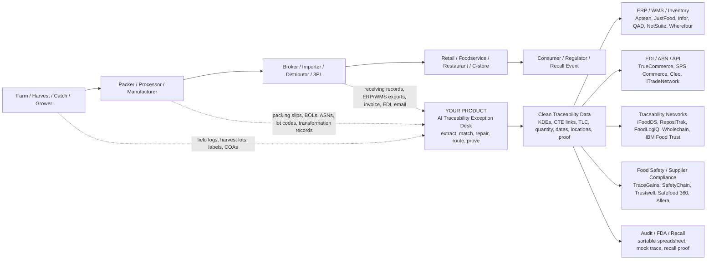

# Food Traceability Startup And Vendor Landscape

Date: June 7, 2026

## Core Conclusion

The proposed product should not be positioned as a traceability database, ERP, WMS, EDI provider, recall tool, or supplier compliance platform.

It sits in the missing layer:

**AI traceability data operations for food distributors: exception detection, exception repair, supplier follow-up, and clean KDE/CTE output into existing systems.**

Short version:

**Food traceability systems need clean data. This product makes messy supplier and receiving data clean.**

## Industry Pipeline

## Competitive Layers

### 1. FSMA 204 Native / Newer AI Traceability Startups

These are the closest conceptual competitors because they pitch FSMA 204 or AI traceability directly.

| Company | What They Appear To Do | Overlap With Your Idea | Your Opening |
|---|---|---|---|
| Solute | Agentic OS for regional food distributors; order-to-cash plus built-in FSMA 204 traceability | High if they go deep on distributor traceability | Be narrower: supplier traceability exception repair, not full OS |
| TraceWiseAI | FSMA 204 software with ERP/spreadsheet sync, AI tracing, audit-ready export, offline capture, label printing | High | Own messy document/ASN/label/email resolution more deeply |
| Tracerty | AI-powered FSMA 204 compliance platform | Medium-high | Differentiate on operational exception desk, not compliance dashboard |
| ActaPath | FSMA 204 traceability for fresh produce growers/co-packers | Medium | Focus downstream distributor/broker/receiving complexity |
| CropOrigin | KDE/CTE capture for farms and packing operations | Medium | You clean inbound supplier data after first-mile capture |
| TagOne | Traceability management, supplier link, integration engine, mismatch/exception reports | High | This is a serious adjacent/direct player; you need a narrower wedge |
| STEPLogic Trace / STEPLogic Tracker | FSMA 204 traceability recordkeeping, food genealogy, receiving/transformation/shipping | Medium-high | You are the exception operations layer before/around recordkeeping |
| LotAtlas | Food safety traceability, inventory, suppliers, HACCP, cleaning schedules | Medium | More SMB food safety platform; you target distributor data repair |
| IONI | AI agents for food and beverage compliance, quality, traceability, frontline efficiency | Medium-high | Differentiate by distributor-specific supplier/ASN/EDI exception workflows |
| BatchLynx | Blockchain agricultural traceability and compliance | Medium | More farm-to-fork provenance; you are data ops for distribution |
| FoodTraze | Blockchain food/agri traceability and export/buyer trust | Medium | More provenance/export transparency; less exception workflow |
| FarmRoket | Blockchain-powered traceability for suppliers/exporters/importers/co-ops | Medium | You can integrate with exporters/importers but focus on exception repair |

### 2. Traceability Networks / Systems Of Record

These platforms try to collect, store, exchange, and report traceability records.

| Company | Category | Notes | Your Relationship |
|---|---|---|---|
| ReposiTrak | Traceability network and supplier compliance | Large network; in 2026 announced automated traceability error detection/correction | Most important incumbent. Partner or competitor. Your wedge must handle pre-network messy data and human supplier follow-up |
| iFoodDS Trace Exchange | FSMA 204 traceability exchange | Supports data capture and exchange; partnered with IBM | Feed clean data into it |
| FoodLogiQ / Trustwell | Traceability, recall, supplier management, compliance | Strong with restaurants, retailers, brands, recall workflows | Feed or repair records before they enter FoodLogiQ |
| Wholechain | Blockchain/standards-based traceability | End-to-end chain mapping and event capture | Partner/adjacent |
| IBM Food Trust | Enterprise blockchain traceability network | Large-enterprise platform; partnered with iFoodDS | Enterprise layer; not your first wedge |
| Trace Register / ORIGIN | Seafood traceability, GDST-capable | Strong in seafood, document management, interoperability | Vertical competitor in seafood |
| ThisFish / Tally | Seafood traceability and production workflow | Seafood-focused traceability | Adjacent/vertical competitor |
| BlueTrace | Seafood traceability/inventory, especially shellfish/seafood operations | Strong vertical workflow | Direct if you choose seafood distributors |
| Legit Fish | Seafood traceability and verification | Seafood origin/compliance | Adjacent |
| Fishcoin | Blockchain seafood traceability concept | First-mile seafood traceability | Mostly provenance/first-mile |
| Open Food Chain | Shared blockchain network for food provenance | End-to-end provenance | Adjacent |
| TE-FOOD | Blockchain farm-to-table traceability | Broad traceability tooling | Adjacent |
| Kezzler | Digital IDs and connected products, FSMA 204 batch traceability | Connects ERP/WMS/MES/partner systems | Strong infrastructure competitor/partner |
| Antares Vision / ACSIS | Cloud traceability/transparency for food & beverage | Raw materials, purchase orders, labeling, compliance | Larger incumbent |
| SGS TRAKKEY | Enterprise-grade digital traceability + audits/training | Global assurance + platform | Larger incumbent |
| DNV + Kezzler + Provision | Traceability assurance and data capture partnership | FSMA data aggregation from growers | Adjacent ecosystem |

### 3. Supplier Compliance / Food Safety / QMS Platforms

These manage documents, audits, HACCP, GFSI, supplier approvals, COAs, quality events, and recall readiness.

| Company | Category | Your Relationship |
|---|---|---|
| TraceGains | Supplier compliance, specs, documents, ingredient/supplier network | Adjacent. They own supplier documents; you own shipment/lot/KDE repair |
| SafetyChain | Food safety, plant management, quality, compliance | Adjacent, may own QA workflows |
| Trustwell | FoodLogiQ + Genesis Foods; compliance, labeling, recall, traceability | Adjacent/partner/competitor |
| Safefood 360 / Ideagen | Food safety management, compliance, supplier, traceability | Larger QMS ecosystem |
| Authenticate / Qadex / Ideagen | Supply chain transparency, supplier compliance | Adjacent |
| ETQ | Enterprise QMS | Adjacent in quality/compliance |
| RizePoint | Quality, audit, supplier compliance | Adjacent |
| FoodReady | AI-powered food safety, traceability, inventory, HACCP, consulting | SMB/mid-market competitor in food safety |
| FoodDocs | AI HACCP and food safety app with traceability logs | SMB food safety, mostly restaurants/small producers |
| Smart Food Safe | Food safety/QMS/HACCP/traceability | Adjacent |
| Allera | FSQA paperwork, supplier management, AI document control | Adjacent; strong paper digitization |
| Icicle Technologies | Food production software, traceability, HACCP, compliance | Manufacturer-focused adjacent |
| Provision Analytics | Food safety and QA cloud software; partnered with Kezzler/DNV | Adjacent/partner |
| Notify Technology | Food and beverage safety software | Adjacent |
| Verifye | Safety/document/audit workflows | Light adjacent |
| Auditus | Inspections/audit workflows | Light adjacent |
| Safefood 360 | Food safety management software | Adjacent |

### 4. ERP / WMS / Inventory / Manufacturing Systems

These are systems of record. They can do lot tracking, but usually do not solve cross-party messy supplier data.

| Company | Notes | Your Relationship |
|---|---|---|
| Aptean / JustFood | Food ERP, traceability, compliance | Integrate/export |
| Deacom / ECI | ERP for manufacturers/distributors | Integrate/export |
| Infor Food & Beverage | Enterprise ERP | Integrate/export |
| QAD | Manufacturing ERP; food/bev traceability content | Integrate/export |
| SAP | Enterprise ERP | Integrate/export |
| Oracle NetSuite | ERP used by food distributors/brands | Integrate/export |
| Microsoft Dynamics | ERP | Integrate/export |
| Wherefour | Cloud ERP for food manufacturers, lot traceability | SMB manufacturer competitor/partner |
| Food Connex | Food distribution ERP | High relevance for distributor ICP |
| BlueCart | Restaurant/food distributor ordering and inventory | Adjacent |
| CDX / Central Data Exchange | Food ERP and traceability | Adjacent |
| inecta | Food ERP/traceability on Microsoft stack | Adjacent |
| BatchMaster | Process manufacturing ERP | Adjacent |
| Minotaur / CAI Software | Food production, QC, traceability | Adjacent |
| Digit | Inventory/manufacturing workflows with lot traceability | Adjacent |
| MRPeasy | Manufacturing ERP with lot tracking | Adjacent |
| Fishbowl | Inventory/manufacturing, lot tracking | Adjacent |
| Cin7 | Inventory/order management | Adjacent |
| Katana | Manufacturing inventory | Adjacent |
| Odoo | ERP/inventory/manufacturing | Adjacent |

### 5. EDI / Integration / Transaction Data

These move documents and data: PO, invoice, ASN, 856, 810, 850, CSV, API. They generally do not resolve semantic food traceability exceptions.

| Company | Category | Your Relationship |
|---|---|---|
| TrueCommerce | EDI and supply chain connectivity; FSMA 204 content | Partner/integration; you repair KDE data before/after EDI |
| SPS Commerce | Retail/supplier EDI network | Partner/integration |
| Cleo | Integration/EDI | Partner/integration |
| iTradeNetwork | Food and beverage supply chain network, traceability | Adjacent/partner |
| Procurant | Produce supply chain platform and trace product identification | Adjacent; fresh produce |
| DiCentral / TrueCommerce | EDI | Partner |
| OpenText | B2B integration/EDI | Partner |
| IBM Sterling | Supply chain intelligence / B2B integration | Enterprise partner |
| Boomi / MuleSoft / Workato | Integration platforms | Generic partner/infra |

### 6. Provenance, Sustainability, Supply Chain Mapping, And First-Mile Startups

These are often not FSMA-first, but they overlap on traceability, provenance, supplier mapping, and verified claims.

| Company | Focus | Your Relationship |
|---|---|---|
| Sourcemap | N-tier supply chain mapping, supplier-attested data, verification | Adjacent. More mapping/due diligence than shipment exception repair |
| Cropin | Ag intelligence and farm-to-fork traceability | First-mile/producer adjacent |
| Farmforce | First-mile farmer/farm/field traceability | First-mile adjacent |
| SourceTrace | Agriculture value-chain traceability | First-mile adjacent |
| BanQu | Food/beverage traceability and source-to-shelf transparency | Adjacent, sustainability/provenance |
| Bext360 | Blockchain/AI traceability, commodities, sustainability, compliance | Adjacent; strong origin/provenance |
| Oritain | Forensic origin verification | Verification layer, not workflow system |
| Scantrust | Product authentication and traceability via secure QR/digital IDs | Adjacent authentication layer |
| Provenance | Consumer-facing supply-chain transparency/claims | Adjacent |
| OpenSC | Ethical/sustainable supply chain verification | Adjacent |
| Connecting Food | Blockchain/AI live audit food transparency | Adjacent |
| ripe.io | Blockchain/IOT food digital twin | Adjacent/early blockchain food traceability |
| Tracingly | Global food supply chain traceability data platform | Adjacent |
| BlockTrack | Agricultural supply chain transparency | Adjacent |
| Modern Provenance / Enabled Label | Supply-chain proof/data platform | Adjacent |
| FoodTraze | Blockchain food/agri traceability | Adjacent |
| Mocaya | Blockchain farm food traceability | Adjacent |
| FarmRoket | Blockchain traceability for suppliers/exporters/importers | Adjacent |
| AgUnity | Smallholder farmer traceability and transaction records | First-mile adjacent |
| Grain Discovery | Grain supply chain traceability/marketplace | Commodity vertical adjacent |
| Agritask | Ag operations/supply chain visibility | First-mile adjacent |
| FarmERP | Farm/agribusiness ERP and traceability | First-mile/producer adjacent |

### 7. Cold Chain / Sensor / Label / Edge Data Capture

These create better physical-world data. They are upstream data sources for your product.

| Company | Focus | Your Relationship |
|---|---|---|
| Wiliot | Ambient IoT, item/case-level sensing and traceability | Data source/partner |
| Evigence | Freshness sensors and QR freshness indicators | Data source |
| PLM TrustLink | Cold chain IoT and traceability translator | Data source/adjacent |
| Zebra | Scanning, labels, RFID, warehouse hardware | Hardware/data capture |
| BarTender / Seagull Scientific | Labeling software | Output/input partner |
| Loftware | Enterprise labeling | Output/input partner |
| Avery Dennison / atma.io | Connected product cloud/digital IDs | Adjacent |
| Impinj | RFID infrastructure | Data capture |
| Sensitech / Carrier | Cold chain monitoring | Data source |
| Tive | Shipment visibility sensors | Data source |
| Roambee | Supply chain visibility sensors | Data source |

### 8. YC / Recent Startup Signals Relevant To The Wedge

These are not all direct food traceability companies, but they show YC-like patterns around supply chain AI, logistics, procurement, and compliance.

| Company | Signal |
|---|---|
| Cognitio Labs | FDA-grade traceability requirements with sensors and AI |
| RetailReady | AI-powered supply chain compliance engine |
| Trackstar | Plaid for supply chain logistics |
| Reform | Workflow automation for logistics |
| Spherecast | AI supply chain manager for CPG |
| Guac | Grocery forecasting and replenishment |
| Trava | AI agents for global trade compliance |
| VortexifyAI | AI applications and automations for supply chain operations |
| Cartage | Autonomous freight coordination |
| Lighthouz AI | Freight bill audits/AP/AR automation |
| Panora | Messy inboxes to ERP-ready data |
| Soff | AI agents for distributors |
| Distro | AI co-pilot for industrial wholesale distributors |
| Mercura | AI quote and order automation for distributors/manufacturers |
| Seals AI | AI employees for wholesalers and distributors |
| Mandel AI | AI supply chain coordinator |
| Terminal | API for telematics data in commercial trucking |

### 9. Food Distributor AI OS / Back-Office Automation Startups

This category is easy to miss if the search is only "FSMA 204" or "traceability software." These companies describe themselves as order-entry automation, food distributor AI OS, ERP automation, customer support, procurement automation, or order-to-cash systems. They are strategically important because they can expand into traceability from daily operations.

| Company | What They Do | Why It Matters For Your Idea |
|---|---|---|
| Anchr | AI-native operating system for food distributors; order management, procurement, inventory, customer support, finance ops, insights | Very important adjacent/direct competitor. If they add traceability exception workflows, they sit near your wedge |
| Choco | AI-powered growth/order platform for food and beverage wholesalers; OrderAgent turns voicemail, email, text, handwritten notes into ERP-ready orders | Strong signal that messy unstructured distributor data is a huge market. Mostly sales orders today, but same motion can apply to traceability records |
| Choco OrderAgent / Autopilot | AI order-entry agent with human review and ERP autopilot | Your traceability product can copy this mental model: "OrderAgent for traceability exceptions" |
| Burnt | Agentic OS for food supply chain; deploys AI agents inside legacy ERPs, starting with sales/order management | Direct YC-pattern competitor in food distribution AI agents |
| Solute | Agentic OS for regional food distributors; order-to-cash plus built-in FSMA 204 traceability | Directly overlaps on distributor operations and traceability |
| Arbia | AI operating system for food distributors; automated order capture, supplier coordination, demand forecasting, traceability | Direct adjacent competitor; supplier coordination is especially relevant |
| Butter / GrubMarket | Butter digitized food distribution workflows with AI; acquired by GrubMarket | Shows exit/consolidation path and incumbent appetite |
| GrubMarket | Food supply chain marketplace/software consolidator with many acquisitions | Strategic acquirer/incumbent; could bundle traceability into its software stack |
| Fresho OrderPilot | AI order entry for food distributors from email, voicemail, text, PDFs into ERP | Adjacent order automation; same input channels as your traceability exceptions |
| OrderAI / REKKI | AI order processing agent for food distributors from voicemail, Excel, PDFs, emails into ERP | Adjacent; messy format normalization competitor |
| Pepper | Growth/ecommerce platform for independent food distributors with automation, payments, mobile ordering, support, insights | Adjacent; owns distributor customer channel |
| APFoods | Operating system for independent food distributors; lot-tracked inventory, accounting, routing, FSMA-204 reports | Important competitor for smaller independent distributors |
| Confinus | Digital ordering platform for food distributors with analytics and AI query | Adjacent; order and customer workflow layer |
| Stock68 | AI-powered ERP for food distributors; order management, predictive inventory, routing, accounting | Direct operating-system competitor |
| Distributal | Mobile-first DSD and foodservice fleet platform with inventory, delivery, proof of delivery, forecasting | Adjacent downstream distribution workflow |
| Distrinote | Food distributor back-office system with AI decision support and integration | Adjacent distributor OS |
| Nucleus | AI phone/customer communication for wholesale food distributors | Adjacent communication layer; can capture order/status/inventory requests |
| Agentplace | AI agent templates for food distributors | Horizontal agent platform with food templates |
| VyasTec | AI workflows inside Microsoft Dynamics 365 for wholesale distribution, including PDF/fax/email order processing | Services/software competitor inside D365 customers |
| Didero | AI supply chain management for mid-market companies: suppliers, POs, invoices, payments | Adjacent procurement/AP supplier workflow |
| Keychain | AI-powered operating system for CPG manufacturing; procurement, production, food safety auditing | Adjacent upstream manufacturer platform |
| Helios / Cersi | AI supply chain risk analyst for food/ag supply chains | Adjacent intelligence/risk layer |

Implication:

The most dangerous competitors may not be traceability companies. They may be distributor AI operating systems that start with order entry, then expand into receiving, supplier coordination, inventory, lot tracking, and FSMA.

The counter-position is to be the best at one painful workflow:

**Traceability exception resolution from inbound supplier/receiving data.**

Do not try to be the full distributor OS first.

### 10. Additional Food Traceability / FSMA 204 Vendors Found In Follow-Up Search

This pass focused back on explicit food traceability, FSMA 204, KDE/CTE, vertical produce/seafood traceability, and FDA traceability challenge sources. Some of these are direct competitors; some are narrow point tools or older platforms that matter because buyers may mention them.

| Company | Layer | What They Appear To Do | Relevance To Your Wedge |
|---|---|---|---|
| Shrink Manager | FSMA 204 execution / production ops | Captures daily production work as structured data; FSMA 204 traceability and audit docs alongside ERP | Adjacent/direct for production and institutional foodservice |
| Ladle TrackAssure | Foodservice traceability | Mobile traceability for multi-location foodservice operations; lot-level records from daily ops | Adjacent downstream foodservice |
| QTRACA | FSMA 204 / food manufacturer compliance | FSMA 204 compliance software for food manufacturers; also references MPI, FSANZ | Adjacent/direct for manufacturers |
| Provarx | FSMA 204 software | FSMA 204-aligned food and beverage manufacturer compliance | Adjacent/direct |
| CompliTrace | AI FSMA 204 tool | AI KDE extraction from invoices/shipping docs, lot registry, FDA export | Direct, especially for lightweight SMB compliance |
| TraceWiseAI | AI FSMA 204 platform | ERP/spreadsheet sync, AI tracing, offline capture, label scanning, audit export | Direct |
| Tracerty | AI FSMA 204 platform | Connects existing systems, paper-to-intelligence positioning, traceability API layer | Direct |
| FoodChainAPI | Developer/API data layer | API for FDA Food Traceability List, CTE/KDE requirements, classification guidance | Infra/partner for builders |
| PureChex | Verifiable product event infrastructure | Lot-level digital records, verifiable provenance, recall response for food/ag pilots | Adjacent infra/provenance |
| Certen | AI compliance infra for F&B manufacturing | CAPA, deviations, supplier document verification, FSMA 204 awareness | Adjacent FSQA/compliance |
| VeriPura / Clean Hands Farmers | Import compliance / label compliance | Pre-shipment food import compliance, labels, Prior Notice, EUDR, FSMA 204 traceability docs | Adjacent import/compliance |
| GAP APP | Farm compliance | GAP audit and FSMA 204 lot tracking with CTEs/KDEs for farms | First-mile adjacent |
| FoodTrace UK | UK/GCC food traceability | Supplier-to-plate traceability, HACCP records, audit reports, international food standards | Adjacent/global |
| FoodChain S.A. / foodchain.farm | Blockchain foodchain / marketplace | Produce sourcing with traceability and AI market intelligence | Adjacent provenance/marketplace |
| Food Tracs | Food traceability/transparency | GFSC Group traceability and transparency software for FSMA | Adjacent/direct |
| SFS Trace | Seafood traceability | Seafood traceability for FSMA 204, SIMP, EU CATCH, GDST | Direct if seafood distributor wedge |
| PTIprint | Produce labeling / inventory | PTI labels and inventory/reporting for growers, pack houses, shippers, distributors | Produce-specific adjacent/direct |
| ActaPath | Fresh produce FSMA 204 | Fresh produce growers/co-packers, small operator traceability | First-mile/produce adjacent |
| CropOrigin | Farm/packing traceability | KDE/CTE capture for farms and packing operations | First-mile/produce adjacent |
| Batchtrail | Small maker traceability | Batch/lot traceability for craft producers and small manufacturers | SMB adjacent |
| Consultare / InterlinkIQ | FSMA traceability integration | Mentioned in practitioner discussions as interlinked FSMA 204 solution | Needs more validation; keep on watchlist |

### 11. FDA Low-/No-Cost Traceability Challenge Winners To Track

FDA's 2021 challenge is older, but useful because it collected credible traceability approaches from multiple countries. These are not all active startups today, but they help map the solution space and buyer vocabulary.

| Company / Solution | What FDA Described | Relevance |
|---|---|---|
| atma.io / Avery Dennison | Item-level traceability from source to store/farm to fork using Avery Dennison systems and Mastercard Provenance | Digital ID / item-level traceability incumbent |
| FarmTabs | Free Excel-based traceability/records tool for small and mid-size farmers | Low-end substitute / first-mile |
| Freshly | Batch tracking software for retailers, manufacturers, distributors | SMB batch/lot tracking |
| HeavyConnect | Cloud/mobile traceability and compliance documentation for producers | First-mile and field documentation |
| Kezzler | Item identifiers and grower-level mobile data capture | Digital ID / traceability infra |
| Mojix | Standards-based item/lot traceability events across food supply chain | Direct traceability platform |
| OpsSmart | Cloud traceability, recall, food safety for complex supply chains | Direct enterprise traceability |
| Precise Traceability Suite | Geospatial, ML, IoT-based end-to-end supply chain tracking | Direct/adjacent; verify current product depth |
| Roambee / GSM / Wiliot | IoT sensor tags and shipment visibility for farm-to-plate traceability | Data capture / cold-chain source |
| Rfider / Haloglide | SaaS for capturing, securing, sharing critical event data; evolved into Haloglide | Digital ID / event data / interoperability |
| TagOne | Role-based capture, blockchain, industry standards, interoperability | Direct traceability competitor |
| Wholechain | Blockchain supply chain traceability with Mastercard | Direct traceability/provenance |

### 12. Additional Interoperability, Produce, ERP, And Recall/Execution Vendors Found In Deeper Pass

This pass used different vocabulary: "interoperable traceability," "FoodTrace," "Starfish," "produce traceability," "lot recall software," "food genealogy," and trade publications such as The Packer, Food Safety Magazine, Food Engineering, and FoodNavigator-USA.

| Company | Layer | What They Do | Relevance To Your Wedge |
|---|---|---|---|
| Starfish | Neutral data-sharing / interoperability network | Connects existing ERP, WMS, EDI, spreadsheets, and traceability systems; translates data into GS1/EPCIS and partner formats | Very important. This is close to the "connect everything, replace nothing" layer |
| CAT Squared FoodTrace | MES + traceability portal | FoodTrace Compliance Portal powered by Starfish; captures production data, KDEs/CTEs, quality records, supplier certs | Important for processors/manufacturers |
| CAT Squared CYNERGY | Food MES | Manufacturing execution system for food processors with production and quality data | Adjacent system of record |
| iTradeNetwork | Food supply chain network / traceability | Traceability as core specialization; FSMA 204 and order agent for purchase orders | Important incumbent/network |
| Procurant | Produce procurement / traceability | Retail grocery collaborative software; selected by Associated Food Stores for FSMA 204 | Important produce/retail traceability player |
| RedLine Solutions / MyProduce | Produce traceability + inventory | Grower, distributor, shipper software; PTI labels, inventory, CTE/KDE collection, iFoodDS integration | Strong produce-specific competitor/partner |
| Produce Pro Software | Produce ERP | ERP for produce distributors, grower/packer/shippers, terminal markets, wholesalers; FSMA 204 thought leadership | Adjacent system of record |
| Famous Software | Produce ERP | Produce platform with FSMA 204 guidance and traceability as core platform capability | Adjacent system of record |
| inecta | Food ERP / traceability | Microsoft Dynamics-based food ERP with lot tracking, recall response, FSMA 204 KDE/CTE capture | Adjacent/direct for manufacturers |
| TracyCore | Food production traceability | Production planning, inventory, traceability, recall management, smart labeling | Adjacent execution layer |
| Fiddle | Lot traceability / inventory | Lot traceability from raw materials to finished goods; recall readiness and FSMA/GMP support | Adjacent SMB/manufacturer layer |
| PLM TrustLink | Food traceability / recall / IoT | Track and trace food from origin to destination; captures KDEs at CTEs | Adjacent/direct, especially cold chain |
| Upliftic | General lot traceability | Lot traceability for food, cosmetics, chemicals, batch manufacturing | Adjacent generic batch software |
| BakeFlow | Bakery production traceability | Bakery-focused batch tracking, labeling, recall management | Vertical adjacent |
| 1WorldSync | Product content / vendor requirements | Appears in retailer/vendor FSMA 204 requirements and item data workflows | Adjacent product data layer |
| RegEngine | API-first regulatory compliance | FSMA 204 readiness/compliance guide; likely regulatory API/compliance infra | Adjacent infra/watchlist |
| IFS | Enterprise ERP | Mentioned in FSMA readiness context; enterprise manufacturing/food ERP with traceability | Adjacent incumbent |
| Movilitas | Serialization / track and trace | Track-and-trace SaaS across supply chains, including food use cases | Adjacent serialization/traceability |

Strategic note:

Starfish changes the map. It is not trying to be every customer's ERP or traceability app. It is a neutral network/data translation layer. If your product is the exception-resolution layer, then Starfish-like platforms could be either:

- a partner/output channel for clean KDE/CTE data, or
- a competitor if they add exception management and supplier follow-up.

For your wedge, the defensible job remains:

**Resolve the messy exception before it becomes a clean data-sharing problem.**

### 13. Additional GS1, Labeling, Serialization, ERP, And Market-Report Vendors

This pass used the vocabulary that buyers, GS1 partner directories, ERP vendors, labeling vendors, and analyst/vendor-list pages use: "EPCIS," "serialization," "track and trace," "food manufacturing traceability," "labeling compliance," "lot genealogy," "FSMA 204 solution partner," and "warehouse traceability."

| Company | Layer | What They Do | Relevance To Your Wedge |
|---|---|---|---|
| Trace One | Product lifecycle / compliance / supplier network | Product lifecycle, regulatory, supplier, and transparency workflows for CPG/retail/private label | Adjacent enterprise compliance layer; could own item/supplier context |
| OPTEL | Serialization / supply chain traceability | Product traceability, digital IDs, serialization, ESG and supply chain visibility | Strong enterprise infrastructure player, more serialization/provenance than exception desk |
| Farmsoft | Fresh produce packing / warehouse traceability | Fresh produce packing, inventory, dispatch, recall, pallet/label workflows | Important produce packer/shipper system of record |
| VicinityFood | Food manufacturing ERP / Dynamics add-on | Formula, batch, QC, inventory, and lot traceability for food manufacturers | Adjacent manufacturing system of record |
| ProLinc / Ashton Potter | Track and trace / authentication | Secure item-level identity and supply chain verification | Adjacent data-capture / authentication infrastructure |
| NORMEX | Food safety / traceability software | Food safety management, HACCP-style workflows, supplier/document and traceability features | SMB/mid-market FSQA adjacent |
| Minotaur / CAI Software | Food ERP / QC / traceability | Food manufacturing ERP with QC, production, inventory, and traceability | Adjacent incumbent for processors/manufacturers |
| SYSPRO | ERP for food and beverage | Food and beverage ERP with inventory, compliance, recall, and traceability capabilities | Enterprise/mid-market system of record |
| Carlisle Technology | Food ERP / production / traceability | Food processing software covering shop floor, inventory, labeling, quality, traceability | Important meat/processor-oriented system |
| rfxcel / Antares Vision Group | Regulated track and trace | Serialization, traceability, compliance, transparency across regulated industries | Enterprise track-and-trace incumbent |
| Loftware | Enterprise labeling / artwork / compliance | Label management and product labeling; FSMA/traceability-adjacent through label data and compliance | Data capture/output layer, especially labels and GTIN/lot data |
| SATO | Labeling / auto-ID / food traceability | Barcode/RFID/labeling, auto-ID, food safety and traceability solutions | Edge capture and labeling infrastructure |
| Lotmetric | Lot tracking / traceability | Lot traceability, inventory, recall, and compliance workflows | Adjacent/direct SMB traceability layer |
| TEKLYNX | Barcode labeling | Barcode label design/automation, traceability via compliant label data | Labeling infrastructure; source of lot/GTIN/date truth |
| GearChain | Supply chain traceability / compliance | Traceability and compliance workflow positioned around food and product supply chains | Watchlist; potentially direct depending product maturity |
| Aware Innovations | GS1/EPCIS / supply chain visibility | RFID, EPCIS, inventory, and traceability implementations | Important GS1 implementation partner / integration layer |
| Kwik Lok | Packaging closure / traceability labels | Closure, labeling, and traceability solutions for bakery/produce and fresh foods | Edge/packaging data capture layer |
| Mitten | GS1 partner / traceability-adjacent | Appears in GS1-style solution-provider searches; verify exact food traceability depth | Watchlist / needs validation |
| Nutrad | GS1 partner / nutrition or compliance-adjacent | Appears in food/GS1 solution searches; verify exact traceability role | Watchlist / needs validation |
| TradeLink Technologies | EDI / supply chain integration | Supply chain data exchange and integration | EDI/API channel; may handle structured data after exceptions are resolved |

Why this matters:

These vendors explain why the product should not be framed as "we store traceability records." Many incumbents can store, label, serialize, transmit, or report traceability records.

Your sharper claim is:

**We repair the broken operational record before it reaches Trace One, OPTEL, Farmsoft, SYSPRO, Loftware, SATO, Starfish, ReposiTrak, iFoodDS, ERP, WMS, EDI, or FDA audit export.**

## Startup Density By Category

```mermaid
flowchart TD
  M["Food Traceability Market"] --> A["Systems of record / networks\nReposiTrak, iFoodDS, FoodLogiQ, Wholechain, IBM"]
  M --> B["FSMA-native startups\nTraceWiseAI, Tracerty, CompliTrace, Shrink, QTRACA"]
  M --> C["Supplier compliance / FSQA\nTraceGains, SafetyChain, FoodReady, Allera, FoodDocs"]
  M --> D["ERP/WMS/inventory\nAptean, Wherefour, Infor, NetSuite, Food Connex"]
  M --> E["EDI/API/integration\nTrueCommerce, SPS, Cleo, iTradeNetwork"]
  M --> F["Provenance/sustainability\nSourcemap, Cropin, BanQu, Bext360, Oritain"]
  M --> G["Cold-chain/data capture\nWiliot, Evigence, Zebra, BarTender, Tive"]
  M --> I["Food distributor AI OS\nAnchr, Choco, Burnt, Arbia, Solute"]
  M --> J["Vertical traceability\nSFS Trace, PTIprint, ActaPath, Ladle, HeavyConnect"]
  M --> K["Interoperability / produce ops\nStarfish, CAT Squared, RedLine, Produce Pro, Procurant"]
  M --> L["Labeling / serialization / GS1\nOPTEL, Loftware, SATO, TEKLYNX, Aware"]

  H["YOUR WEDGE\nException repair + supplier follow-up + clean KDE output"] --> A
  H --> C
  H --> D
  H --> E
  H --> I
  H --> J
  H --> K
  H --> L
```

## Direct Competitor Risk

The biggest direct threat is not a small FSMA startup. It is ReposiTrak adding automated error correction inside its network. That is very close to your insight.

The counter-position:

ReposiTrak can correct errors inside its network and file formats. Your product should handle everything before and around the network:

- email threads
- supplier PDFs
- paper scans
- photos of labels
- broker messages
- invoices
- BOLs
- packing slips
- incomplete ASNs
- mismatched SKU/item master data
- QA approvals
- supplier chase workflows
- export into any target system

## Best Positioning

Do not pitch:

**AI document scanner for FSMA 204**

Do not pitch:

**Another traceability platform**

Pitch:

**AI Traceability Exception Desk for food distributors**

More direct buyer language:

**We fix broken supplier traceability records before they break your ERP, WMS, EDI, ReposiTrak, iFoodDS, or FDA audit.**

## Best Initial Wedge

Start with a service-led product:

**KDE Exception Audit**

Input:

- 50-200 supplier record sets
- invoices
- ASNs/EDI files
- packing slips
- labels/photos
- BOLs
- receiving logs
- item master export
- supplier master export

Output:

- KDE coverage score
- supplier exception leaderboard
- invoice vs ASN vs label mismatch report
- missing TLC/lot/date/quantity/location fields
- auto-repairable record percentage
- mock FDA sortable spreadsheet
- estimated monthly labor cost
- recommended supplier outreach actions

Then convert to:

**Monthly managed traceability exception desk**

Pricing anchor:

- per facility
- per supplier count
- per inbound shipment/record set
- plus premium for EDI/ERP integration

## Why This Can Win

Most platforms compete to be the clean repository.

Your product competes to be the operational cleaning layer.

That is a different job:

1. Gather messy records.
2. Extract candidate KDEs.
3. Match across documents and systems.
4. Detect missing/conflicting fields.
5. Route exception to supplier, broker, QA, EDI, or receiving.
6. Keep field-level proof.
7. Export clean records to whichever system the customer already uses.

The thesis:

**By 2028, every food distributor will need traceability data operations, not just traceability software.**

## Selected Sources

- FDA FSMA Food Traceability Rule: https://www.fda.gov/food/food-safety-modernization-act-fsma/fsma-proposed-rule-food-traceability
- ReposiTrak automated traceability error correction: https://www.foodlogistics.com/warehousing/packaging/news/22961345/repositrak-repositraks-touchless-error-correction-technology-improves-traceability-data
- iFoodDS / IBM FSMA 204 Trace Exchange: https://www.foodlogistics.com/safety-security/food-safety/news/22873405/ifoodds-ibm-ifoodds-launch-new-solution-to-address-fsma-204-food-traceability-rule
- TrueCommerce FSMA 204 KDE/CTE guide: https://www.truecommerce.com/blog/fsma-204-kdes-ctes-guide/
- TraceWiseAI: https://www.tracewiseai.com/
- Solute: https://www.solute.so/
- TagOne: https://www.tagone.com/
- Wholechain: https://wholechain.com/
- Trustwell FoodLogiQ: https://www.trustwell.com/products/foodlogiq/
- TraceGains supplier compliance: https://tracegains.com/compliance/supplier-compliance/
- Kezzler traceability: https://kezzler.com/solutions/traceability/
- DNV FSMA partners: https://www.dnv.us/life-sciences/fsma/fsma_partners/
- FoodReady: https://foodready.ai/
- Allera: https://www.alleratech.com/food-safety-software
- FoodDocs: https://www.fooddocs.com/food-safety-solutions
- Icicle Technologies: https://icicletechnologies.com/
- Sourcemap supply chain mapping: https://www.sourcemap.com/technology/supply-chain-mapping
- Cropin Trace: https://www.cropin.com/cropin-trace-roottrace/
- Farmforce: https://farmforce.com/
- BanQu food and beverage traceability: https://www.banqu.co/industries/food-beverage
- Bext360: https://www.bext360.com/
- Trace Register ORIGIN: https://www.foodlogistics.com/safety-security/food-safety/news/22944409/trace-register-trace-register-launches-traceability-solution-for-seafood-industry
- Korber STEPLogic Tracker: https://www.foodlogistics.com/software-technology/software-solutions/news/22968147/krber-ag-krber-launches-food-traceability-solution
- Anchr: https://anchr.tech/
- Anchr media page: https://anchr.tech/media
- Choco: https://choco.com/
- Choco OrderAgent: https://choco.com/us/orderagent
- OpenAI Choco case study: https://openai.com/index/choco/
- Burnt YC profile: https://www.ycombinator.com/companies/burnt
- Arbia: https://www.arbia.io/
- APFoods: https://www.apfoodz.com/
- Distributal: https://distributal.com/
- Distrinote: https://www.distrinote.com/
- Confinus: https://www.confinus.com/solutions/distributors/
- Stock68: https://stock68.com/
- GrubMarket / Butter acquisition: https://techcrunch.com/2024/05/16/grubmarket-buys-butter-to-give-its-food-distribution-tech-an-ai-boost/
- Didero: https://techcrunch.com/2024/07/17/didero-is-using-ai-to-solve-supply-chain-management-at-mid-market-companies/
- KeychainOS: https://agfundernews.com/keychain-raises-30m-series-b-launches-ai-powered-operating-system-for-cpg
- Helios / Cersi: https://agfundernews.com/cersi-what-are-the-biggest-risks-to-my-supply-chain-today-helios-launches-ai-supply-chain-analyst-raises-1-85m-pre-seed-round
- FDA Traceability Challenge winners: https://www.fda.gov/food/new-era-smarter-food-safety/meet-winners-fdas-low-or-no-cost-food-traceability-challenge
- PrecisionFDA challenge results: https://precision.fda.gov/challenges/13/results
- Shrink Manager: https://www.shrinksoftware.com/
- Ladle TrackAssure launch: https://www.food-safety.com/articles/11431-ladle-launches-mobile-traceability-platform-for-multi-location-foodservice-operations
- QTRACA: https://www.qtraca.com/fsma-204-software
- CompliTrace: https://complitrace.com/
- PureChex: https://purechex.com/
- Certen: https://getcerten.com/
- GAP APP: https://mygapapp.com/
- FoodTrace UK: https://foodtrace.uk/
- FoodChain S.A.: https://www.foodchain.farm/
- SFS Trace: https://www.sfstrace.com/
- PTIprint: https://www.ptiprint.com/
- Food Tracs: https://www.foodtracs.com/
- Provarx: https://getprovarx.com/
- Mojix food traceability: https://www.mojix.com/industries/food
- HeavyConnect: https://heavyconnect.com/
- OpsSmart: https://www.opssmartglobal.com/
- Haloglide / Rfider: https://www.haloglide.com/about
- Freshly batch tracking: https://apps.shopify.com/freshly
- Batchtrail: https://batchtrail.com/
- Starfish: https://www.starfish-network.com/
- FoodNavigator on Starfish FSMA 204: https://www.foodnavigator-usa.com/Article/2024/11/18/starfish-software-addresses-FSMA-204-compliancy/
- IFMA / Starfish partnership: https://foodaway.org/IFMA/Resources/News/2025/Partnership-with-Starfish-to-Accelerate-Traceability-and-FSMA-204-Compliance-for-Members.aspx
- CAT Squared FoodTrace Compliance: https://www.catsquared.com/traceability-compliance
- CAT Squared / Starfish partnership: https://www.starfish-network.com/blog/cat-squared
- iTradeNetwork FSMA 204: https://www.itradenetwork.com/fsma-204
- Procurant / Associated Food Stores FSMA 204: https://www.businesswire.com/news/home/20250210236280/en/Procurant-Selected-by-Associated-Food-Stores-for-FSMA-Rule-204-Compliance
- RedLine Solutions / MyProduce: https://redlineforproduce.com/
- RedLine MyProduce software: https://redlineforproduce.com/software/
- RedLine and iFoodDS partnership: https://www.thepacker.com/news/food-safety/redline-solutions-ifoodds-talk-traceability-partnership
- Produce Pro Software: https://www.producepro.com/
- Famous Software FSMA 204 summary: https://support.famoussoftware.com/article/fsma-204-general-summary
- inecta food traceability software: https://www.inecta.com/food-traceability-software
- TracyCore: https://tracycore.com/
- Fiddle lot traceability: https://fiddle.io/solutions/lot-traceability
- PLM TrustLink: https://plmtrustlink.com/
- Upliftic lot traceability: https://upliftic.app/lot-traceability-software
- BakeFlow: https://www.bakeflow.co.uk/
- Food Safety Magazine / Antares ACSIS solution: https://www.food-safety.com/articles/9690-new-food-safety-solution-from-antares-vision-group-enables-traceability-ensures-fsma-compliance
- Food Engineering FSMA 204 readiness article: https://www.foodengineeringmag.com/articles/102922-are-you-ready-for-fsmas-section-204d-food-traceability-rule
- Trace One PLM: https://www.traceone.com/formula-based-product-lifecycle-management-software
- OPTEL OPTCHAIN / food safety traceability: https://www.optelgroup.com/en/optchain-/
- Farmsoft fresh produce traceability: https://farmsoft.com/traceability/fresh-produce-software.html
- VicinityFood: https://www.vicinitysoftware.com/food-beverage-manufacturing-software/
- Ashton Potter ProLinc: https://www.ashtonpotter.com/prolinc/
- NORMEX: https://normex.io/
- CAI Software / Minotaur: https://caisoft.com/products/minotaur/
- SYSPRO food and beverage traceability: https://www.syspro.com/food-beverage/
- Carlisle Technology: https://carlisletechnology.com/
- rfxcel / Antares Vision Group: https://rfxcel.com/
- Loftware FSMA 204 labeling: https://www.loftware.com/resources/white-papers/2024/supply-chain-fsma-204-compliance-ready
- SATO food solutions: https://www.satoamerica.com/industry-solutions/food
- Lotmetric: https://www.lotmetric.com/
- TEKLYNX FSMA label management: https://www.teklynx.com/en-EMEA/products/regulatory-compliance/fsma
- GearChain: https://www.gearchain.io/
- Aware Innovations: https://www.awareinnovations.com/
- Kwik Lok traceability: https://www.kwiklok.com/
- TradeLink Technologies: https://tradelink-technologies.com/
