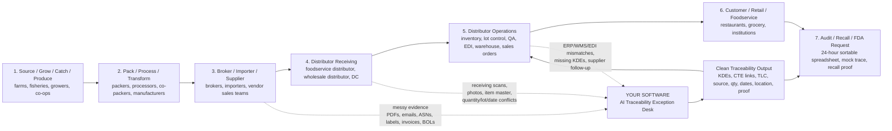
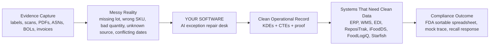

# Food Traceability Workflow Map

## Your Category

Your software sits in this category:

**AI Traceability Exception Desk**

It is not the ERP, not the traceability network, not the label tool, and not the supplier compliance system.

It is the operational layer that turns messy supplier/shipment evidence into clean, auditable KDE/CTE records.

## End-To-End Industry Workflow

## Vendor Map By Workflow Position

```mermaid
flowchart TD
  S["Suppliers / Growers / Packers / Processors"] --> R["Distributor Receiving"]
  R --> O["Distributor Operations"]
  O --> C["Customers / Retail / Foodservice"]
  O --> A["Audit / Recall / FDA"]

  subgraph L1["First-Mile, Provenance, Sustainability"]
    P1["Sourcemap"]
    P2["Cropin"]
    P3["Farmforce"]
    P4["BanQu"]
    P5["Bext360"]
    P6["Oritain"]
    P7["OpenSC"]
    P8["Connecting Food"]
    P9["FoodTraze"]
    P10["FarmRoket"]
  end

  subgraph L2["Produce / Seafood / Vertical Traceability"]
    V1["Farmsoft"]
    V2["RedLine / MyProduce"]
    V3["Produce Pro"]
    V4["Famous Software"]
    V5["BlueTrace"]
    V6["Trace Register / ORIGIN"]
    V7["ThisFish / Tally"]
    V8["SFS Trace"]
    V9["PTIprint"]
    V10["ActaPath"]
    V11["CropOrigin"]
  end

  subgraph L3["ERP, WMS, Inventory, Manufacturing Systems"]
    E1["Aptean / JustFood"]
    E2["Infor"]
    E3["QAD"]
    E4["NetSuite"]
    E5["Microsoft Dynamics"]
    E6["Wherefour"]
    E7["Food Connex"]
    E8["SYSPRO"]
    E9["VicinityFood"]
    E10["Minotaur / CAI"]
    E11["Carlisle Technology"]
  end

  subgraph L4["EDI, API, Data Exchange"]
    D1["TrueCommerce"]
    D2["SPS Commerce"]
    D3["Cleo"]
    D4["iTradeNetwork"]
    D5["Procurant"]
    D6["TradeLink Technologies"]
    D7["Boomi / MuleSoft / Workato"]
  end

  subgraph L5["Traceability Networks / Systems Of Record"]
    T1["ReposiTrak"]
    T2["iFoodDS"]
    T3["FoodLogiQ / Trustwell"]
    T4["Wholechain"]
    T5["IBM Food Trust"]
    T6["Starfish"]
    T7["TagOne"]
    T8["Kezzler"]
    T9["Antares / ACSIS / rfxcel"]
  end

  subgraph L6["Supplier Compliance / FSQA / QMS"]
    Q1["TraceGains"]
    Q2["SafetyChain"]
    Q3["FoodReady"]
    Q4["Allera"]
    Q5["FoodDocs"]
    Q6["Icicle"]
    Q7["Safefood 360"]
    Q8["Trace One"]
    Q9["NORMEX"]
  end

  subgraph L7["Labeling, Auto-ID, GS1, Serialization"]
    G1["Loftware"]
    G2["SATO"]
    G3["TEKLYNX"]
    G4["Zebra"]
    G5["BarTender"]
    G6["OPTEL"]
    G7["Aware Innovations"]
    G8["Kwik Lok"]
    G9["PLM TrustLink"]
  end

  subgraph L8["Food Distributor AI / Back-Office OS"]
    A1["Anchr"]
    A2["Choco"]
    A3["Burnt"]
    A4["Arbia"]
    A5["Solute"]
    A6["Pepper"]
    A7["Fresho"]
    A8["Didero"]
    A9["Keychain"]
  end

  subgraph XG["Your Wedge"]
    X["YOUR SOFTWARE\nAI Traceability Exception Desk"]
    X1["Extract KDEs from messy docs"]
    X2["Match SKU, lot, qty, dates, TLC"]
    X3["Detect missing/conflicting fields"]
    X4["Route supplier / QA / EDI / receiving follow-up"]
    X5["Export clean records + proof"]
  end

  S --> L1
  S --> L2
  S --> L7
  L1 --> R
  L2 --> R
  L7 --> R

  R --> X
  L3 --> X
  L4 --> X
  L6 --> X
  L8 --> X

  X --> X1 --> X2 --> X3 --> X4 --> X5

  X5 --> L3
  X5 --> L4
  X5 --> L5
  X5 --> L6
  X5 --> A

  L3 --> O
  L4 --> O
  L5 --> A
  L6 --> A
  O --> C
```

## Simpler Mental Model

## Where Each Company Type Competes

| Workflow Job | Company Examples | Are They Direct Competitors? | Your Angle |
|---|---|---|---|
| Capture farm/packer/source data | Sourcemap, Cropin, Farmforce, BanQu, Bext360, FarmRoket | Usually not direct | They create source data; you clean inbound distributor data |
| Run produce/seafood operations | Farmsoft, RedLine, BlueTrace, Trace Register, SFS Trace | Direct only in a vertical | They own a vertical workflow; you own cross-supplier exceptions |
| Store operational records | Aptean, Infor, QAD, NetSuite, Food Connex, SYSPRO | Adjacent | They need clean inputs; you repair bad inputs |
| Exchange structured traceability data | TrueCommerce, SPS, Cleo, iTradeNetwork, Procurant | Adjacent | They move structured data; you fix unstructured/broken data |
| Serve as traceability system of record | ReposiTrak, iFoodDS, FoodLogiQ, Wholechain, Starfish, TagOne | Yes, partially | You should feed them clean KDE/CTE data instead of replacing them |
| Manage supplier compliance / QA | TraceGains, SafetyChain, FoodReady, Allera, Trace One | Adjacent | They manage documents/audits/specs; you manage shipment-level traceability exceptions |
| Label / serialize / identify products | Loftware, SATO, TEKLYNX, Zebra, OPTEL, Aware | Adjacent | They create/read identifiers; you reconcile identifiers against documents and receipts |
| Automate distributor back office | Anchr, Choco, Burnt, Arbia, Solute, Pepper | Potentially direct over time | They may expand from order entry into traceability ops; you can be the traceability-native agent |

## Best Category Name

The best category name is:

**AI Traceability Exception Desk**

Alternative names:

- **Traceability Data Operations Platform**
- **FSMA 204 Exception Management Desk**
- **Distributor Traceability Repair Layer**
- **KDE/CTE Data Quality Agent**

The strongest buyer-facing line:

**We fix broken supplier traceability records before they break your ERP, WMS, EDI, ReposiTrak, iFoodDS, FoodLogiQ, Starfish, or FDA audit.**

