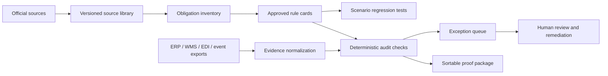
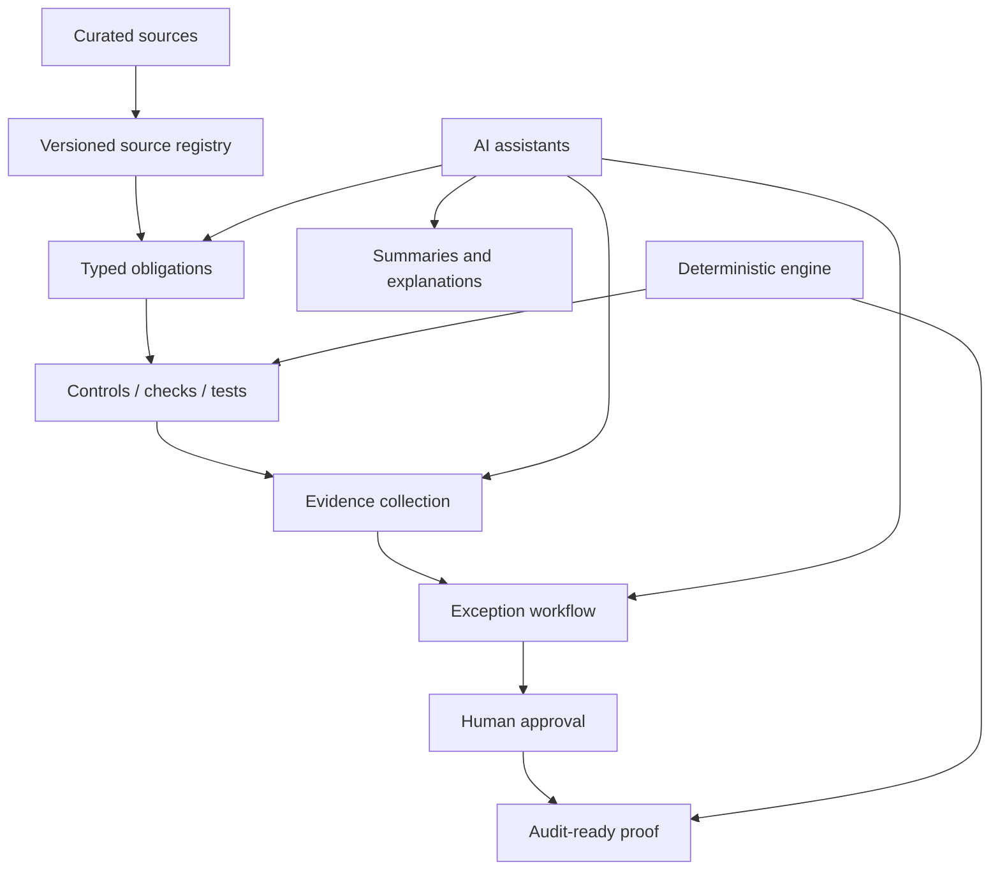
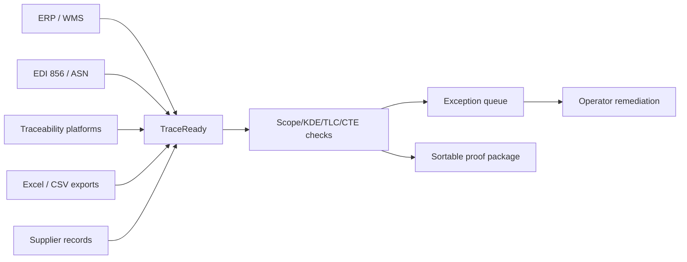

# Similar Product Build Patterns For TraceReady

Date: 2026-06-16  
Purpose: map companies building similar systems, infer their build architecture from public docs, and connect the lessons to TraceReady.

## Important Boundary

I cannot access private internal company documents. This note uses public product pages, help centers, developer docs, API docs, and public architecture signals. Treat this as competitive architecture inference, not confirmation of private implementation.

## Executive Takeaway

TraceReady is not only competing with food traceability platforms. It is combining two markets:

1. Food traceability event systems: Wholechain, ReposiTrak, FoodLogiQ/Trustwell, iFoodDS, ENSESO4Food/TrakKey, TagOne, TraceWiseAI, TraceGains, SafetyChain.
2. Regulatory intelligence and proof systems: AscentAI, Regology, Norm Ai, Vanta.

The best architecture pattern is:



This confirms TraceReady's current direction: AI can read, extract, map, and summarize; approved rules and deterministic checks must decide.

## Companies Building Adjacent Products

| Company | Similarity To TraceReady | Public Build Signal | What To Learn |
|---|---:|---|---|
| Wholechain | Very high on traceability architecture | Developer docs show ERP event mapping, EPCIS exchange, real-time vs pooled transmission, API keys, event capture | Build event-first normalization and support staged validation before pushing/claiming compliance |
| AscentAI | Very high on regulatory intelligence | Public docs describe horizon scanning, obligation inventory, rule comparison, change summaries, policy/control mapping, audit trails | Build an obligation inventory before rule cards; maintain source-to-obligation-to-check traceability |
| Regology | High on regulatory intelligence | Public docs describe Smart Law Library, primary-source regulatory data, regulatory change agent, compliance agent, research agent, requirements/controls/policies | Build a curated source library and compliance object graph, not a simple RAG chatbot |
| Norm Ai | High on AI legal/compliance design | Public site says attorneys encode legal judgment into AI systems; describes legal engineering and supervisory AI | Keep FSMA expert approval as a first-class workflow, not an afterthought |
| Vanta | High on evidence/audit workflow | Public docs show frameworks, documents, evidence, tests, controls, API, MCP agent access, failing-test remediation | Productize evidence objects, tests/checks, owner workflow, audit trail, and exports |
| FoodLogiQ / Trustwell | High food traceability competitor | Public positioning around traceability, compliance, supplier workflows | Avoid being another event-entry platform; focus on readiness/gap proof and interoperability |
| ReposiTrak | High incumbent threat | Public market positioning around traceability network and supplier compliance; previous research notes automated error detection/correction | Differentiate on pre-network evidence readiness, source citations, and FSMA rule intelligence |
| TraceGains | Medium-high | Supplier compliance, documents, ingredient/supplier networks | Supplier document intelligence is adjacent; TraceReady needs shipment/event/KDE proof depth |
| SafetyChain | Medium | Food safety/quality/compliance workflows | Adjacent QMS; TraceReady should integrate/report, not replace QMS |
| ENSESO4Food / TrakKey | High partner/adjacent | Jim demo showed user-entered CTE/event data and traceability workflow | TraceReady should audit exported events from systems like this rather than force new event entry |

## What Wholechain's Docs Reveal

Wholechain is the most useful architecture reference for the traceability side.

Public docs show:

- ERP systems must be mapped event-by-event to traceability events.
- A receiving event in the ERP maps to a Receive Event.
- Inventory adjustments may map to Transform or Decommission depending on reason codes.
- Real-time transmission gives immediate visibility but can create disconnected traceability records when corrections happen later.
- Pooled transmission stores events temporarily and sends them in a batch at shipping time, allowing validation and correction before submission.
- EPCIS is used as a standardized event exchange format with `what`, `when`, `where`, and `why`.
- Wholechain supports EPCIS XML and JSON-LD capture endpoints.
- Their integration page names ERP, traceability, compliance, certification, standards, and analytics integrations.

Sources:
- https://developers.wholechain.com/EventsV2/ERP_intro/
- https://developers.wholechain.com/EventsV2/What_is_EPCIS/
- https://developers.wholechain.com/EventsV2/EPCIS_Integration_Overview/
- https://wholechain.com/integrations
- https://wholechain.com/food-traceability

### TraceReady Implication

Do not only accept a flat Excel sheet forever. The Excel MVP should mimic an event export contract:

```text
source system event
-> normalized TraceReady event
-> CTE classification
-> required KDE dictionary
-> evidence matrix
-> deterministic finding
-> exception queue
-> sortable proof package
```

The key architecture lesson is staging. For TraceReady, staging is not optional:

```text
raw export -> staging table -> validation -> review -> approved audit output
```

That is also exactly where TraceReady can differ from event-entry platforms: they capture/store events; TraceReady proves whether the events hold up.

## What AscentAI's Docs Reveal

AscentAI is the strongest regulatory intelligence comparison.

Public docs show:

- Horizon scanning: capture new regulatory content.
- Change management: identify impacts of rule changes.
- Obligations inventory: a granular source of truth for requirements.
- Rule compare: side-by-side old/new rule changes.
- Automatic summaries: AI-generated summaries of obligation changes.
- Policy/control mapping: link obligations to downstream controls.
- Audit trail: every activity is logged for exam readiness.
- Human oversight is explicitly mentioned for continual updates.

Sources:
- https://www.ascentregtech.com/
- https://www.ascentregtech.com/rlm-platform/
- https://www.ascentregtech.com/rlm-platform/ascentfocus/
- https://www.ascentregtech.com/rlm-platform/ascent-horizon/

### TraceReady Implication

Before rule cards, build a real obligation layer:

```text
source chunk
-> typed extraction
-> obligation record
-> KDE requirement
-> deterministic check
-> customer finding
```

This is stronger than:

```text
source chunk -> AI rule card -> finding
```

Why: obligations are the stable middle layer that lets TraceReady explain exactly which regulatory requirement created each audit check.

## What Regology's Docs Reveal

Regology is a strong model for regulatory source library and compliance object graph.

Public docs show:

- Proprietary primary-source regulatory data.
- Smart Law Library.
- Regulatory Change Agent.
- Compliance Agent.
- Regulatory Research Agent.
- Generation of obligations, risks, controls, and policies.
- Onboarding begins by setting up or importing a law library.
- Users customize alerts and expand the library as the business changes.

Sources:
- https://www.regology.com/
- https://www.regology.com/platform

### TraceReady Implication

TraceReady's FSMA source library should not be a folder of PDFs. It needs to become a structured compliance graph:

```text
Source
Source version
Chunk
Citation span
Defined term
Obligation
KDE requirement
CTE applicability rule
Exemption rule
Scenario test
Approved rule version
Audit check
Finding
Evidence link
```

This supports enterprise defensibility because every output can be traced backward.

## What Norm Ai's Docs Reveal

Norm is the clearest public example of the "expert-coded AI judgment" model.

Public docs show:

- Agentic law means embedding law into AI agents.
- Attorneys encode legal understanding into AI agents.
- Legal Engineers translate law, policies, regulatory interpretations, and workflows into executable AI logic.
- Norm emphasizes supervisory AI for regulated environments.

Sources:
- https://www.norm.ai/
- https://www.norm.ai/platform/

### TraceReady Implication

TraceReady needs an FSMA expert/reviewer console. This is not polish; it is part of the product architecture.

Required workflow:

```text
AI draft
-> schema validation
-> citation span validation
-> reviewer edit/approve/reject
-> scenario test pass
-> published rule version
```

The AI is a drafting assistant. The approved rule object is the executable authority.

## What Vanta's Docs Reveal

Vanta is not food traceability, but it is one of the best public examples of proof-layer compliance software.

Public docs show:

- Frameworks, documents, controls, tests, and evidence are first-class data objects.
- Evidence can be listed and uploaded through API.
- Their public docs include statuses like `Needs document` and examples of framework-filtered documents.
- Vanta's product uses continuous monitoring, automated tests, actionable alerts, evidence collection, audit prep, and remediation.
- Their MCP docs allow AI agents to query controls, inspect failing tests, access evidence, analyze gaps, and help remediate.

Sources:
- https://www.vanta.com/products/automated-compliance
- https://developer.vanta.com/docs
- https://developer.vanta.com/docs/vanta-mcp
- https://help.vanta.com/en/collections/12575233-getting-started-hub

### TraceReady Implication

TraceReady should make these objects first class:

```text
Audit
Evidence
Check
Finding
Owner
Status
Resolution action
Export package
Audit log
```

Do not make the audit page a dashboard full of explanation. It should be a workbench:

```text
readiness status
exception queue
selected finding detail
evidence table
rule citation
resolution actions
export package
```

This matches the direction already taken in the audit workspace UI.

## Product Architecture Pattern To Copy

The market is converging on this architecture:



In TraceReady language:

```text
FSMA source library
-> source chunks
-> obligation inventory
-> CTE/KDE/TLC/exemption requirements
-> approved rule cards
-> scenario tests
-> customer evidence matrix
-> deterministic audit findings
-> exception queue
-> sortable readiness package
```

## Where TraceReady Should Be Different

TraceReady should not try to beat Wholechain, FoodLogiQ, ReposiTrak, iFoodDS, or ENSESO4Food as the main event-entry system in v1.

TraceReady should be the proof and validation layer that sits across them:



## What This Means For The MVP

The MVP should implement these in order:

1. Source registry and canonical chunks.
2. Typed extraction for FTL items, defined terms, obligations, CTEs, KDEs, TLC rules, exemptions, and sortable export requirements.
3. Citation span validation.
4. Reviewer approval console.
5. Scenario tests.
6. Workbook/event export upload.
7. Evidence matrix.
8. Deterministic checks.
9. Exception queue.
10. Export package with citations and evidence links.

## Strategic Positioning

Use this positioning:

> TraceReady checks whether traceability records from Excel, EDI, ERP, WMS, and traceability platforms can stand up as audit-ready proof.

Do not lead with:

> AI FSMA 204 chatbot.

Do not lead with:

> Another food traceability platform.

Better:

> Make traceability provable.

## Competitive Risk

The closest product-risk pattern is:

- Wholechain expands deeper into validation and exception queues.
- ReposiTrak automates more traceability error correction.
- FoodLogiQ/Trustwell adds stronger readiness audit exports.
- ENSESO4Food adds rule-backed gap analysis.
- A RegTech company enters FSMA 204 specifically.

TraceReady's defense is not "we use AI." The defense is:

- FSMA-specific obligation inventory.
- Event-export agnostic audit layer.
- Source-cited findings.
- Human-approved rule versions.
- Scenario-tested deterministic checks.
- Strong exception workflow for operators.
- Partnerships with event-entry and traceability platforms instead of replacing them.

