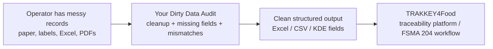

# ENSESO4Food / TRAKKEY4Food Deep Analysis

## Purpose

This document explains what ENSESO4Food / TRAKKEY4Food appears to be building, what the likely inputs and outputs are, where it overlaps with your idea, and where your idea can be clearly different.

Use this before the Jim White call.

The goal is not to attack ENSESO4Food.

The goal is to understand whether your product is:

1. competitive,
2. complementary,
3. pre-onboarding support,
4. or a narrower dirty-data workflow they may not want to own.

## Short Answer

ENSESO4Food / TRAKKEY4Food appears to be a **traceability, serialization, compliance, and product-journey visibility platform**.

Your idea should be positioned as a **messy intake cleanup and exception-resolution service before data is ready for any traceability platform**.

The clearest difference:

| Layer | ENSESO4Food / TRAKKEY4Food | Your Idea |
|---|---|---|
| System layer | Traceability platform / compliance system | Pre-platform intake cleanup |
| Main job | Capture, store, share, and display traceability information | Convert messy records into clean structured records |
| Data state | Assumes data can be entered, scanned, integrated, or transmitted | Assumes data starts messy: paper, handwriting, PDF, label, Excel |
| Buyer promise | FSMA 204 compliance, farm-to-fork visibility, serialization | Missing-KDE / mismatch report and clean export |
| Best fit | Operators ready to adopt traceability system | Operators not yet data-ready, or larger operators with exceptions |

## What ENSESO4Food Says Publicly

From ENSESO4Food public pages:

- ENSESO4Food says its Trakkey SaaS provides food traceability and low-cost farm-to-fork visibility.
- It says its job is to get systems ready for FSMA 204 and future customer supply-chain needs.
- It presents TRAKKEY4Food as a traceability solution from winners of the FDA Food Traceability Challenge.
- It says TRAKKEY4Food is ready for FSMA 204.
- It says the system has robust developer-friendly interfaces and services in serialization and traceability.
- It says TRAKKEY4Food ensures full compliance with FSMA 204.
- It describes end-to-end traceability and transparency.
- It lists an FSMA 204 solution for farms, fisheries, packers, distributors, food brands, retail markets, and restaurants.
- It shows Trakkey Dashboard, real-time traceability display, product journey map display, and Trakkey Mobile.
- It describes IoT environmental sensors: temperature, air pressure, acceleration, humidity, GPS/location.
- It describes SafeBite consumer awareness app and a Trakkey food alert system.
- Its About page says it supports web/mobile apps, REST API, and GS1 EPCIS.
- It says it extends beyond regulation into item-level traceability, aggregation, product authentication, and real-time consumer alerts.

Sources:

- [ENSESO4Food home](https://enseso4food.com/)
- [ENSESO4Food mission](https://enseso4food.com/mission/)
- [ENSESO4Food solutions](https://enseso4food.com/our-solutions/)
- [ENSESO4Food Box](https://enseso4food.com/box/)
- [ENSESO4Food about](https://enseso4food.com/aboutus/)

## What Their Software Seems To Be

Based on public material, TRAKKEY4Food is likely a platform that helps food supply-chain participants:

1. identify products,
2. create or capture traceability events,
3. connect events across the supply chain,
4. support FSMA 204 recordkeeping,
5. show product journey visibility,
6. support recalls/alerts,
7. share data through APIs / GS1 EPCIS,
8. support consumer transparency or authentication.

This means ENSESO4Food is not just a document OCR tool.

It is closer to:

- traceability system
- serialization system
- compliance platform
- supply-chain visibility platform
- product journey / consumer transparency platform

## Likely Inputs To ENSESO4Food / TRAKKEY4Food

### Inputs Explicitly Mentioned Or Strongly Signaled

These are based on public site claims:

| Input | Evidence From Public Site | What It Means |
|---|---|---|
| GS1 identifiers / barcodes | Site links to GS1 company prefix and single GTIN pages | Product/company identity likely matters |
| Traceability events | They discuss farm-to-fork visibility and traceability | The system likely needs event data across supply chain steps |
| Serialization data | They repeatedly mention serialization and item-level traceability | Individual items/cases/pallets may receive IDs |
| Web app data | About page says web apps are supported | Users may enter/manage data in a web interface |
| Mobile app data | Solutions page shows Trakkey Mobile; About page says mobile apps | Users may scan/check journey on mobile |
| REST API data | About page says REST API | Systems can send/receive data programmatically |
| GS1 EPCIS data | About page says GS1 EPCIS | Standards-based event data exchange |
| IoT sensor data | Solutions/Box pages mention temperature, pressure, acceleration, humidity, GPS/location | Environmental/journey sensor data can enrich traceability |
| Product journey/location data | Product journey map and GPS/location sensors | Track where product moves |
| Product alert data | SafeBite / food alert system | Consumer or downstream alert/notification workflows |

### Inputs They Probably Need, Even If Not Listed In Detail

This is inference from FSMA 204 and traceability platform logic:

| Likely Needed Input | Why It Is Needed |
|---|---|
| Product identity | To know what food item is being traced |
| GTIN / item code / SKU | Needed for standardized product identification |
| Lot / batch / TLC | Needed for traceability and recall scope |
| CTE/KDE event data | Needed for FSMA 204 compliance |
| Business locations | Needed for ship-from, ship-to, receive, transform events |
| Dates/times | Needed for event sequencing |
| Quantity and unit of measure | Needed for traceability records and reconciliation |
| Supplier / customer party information | Needed to link chain of custody |
| Shipment/receiving events | Needed for distributor/retail traceability |
| Transformation/packing events | Needed for packers/processors |
| Existing ERP/WMS/EDI feeds | Likely integration source for larger customers |

### The Important Assumption

Their system likely works best when the customer can provide structured or semi-structured data:

- scanned barcodes
- GS1 identifiers
- mobile entries
- REST API feeds
- GS1 EPCIS events
- properly entered product/lot/shipment data
- sensor streams

Your field visits showed many smaller operators are upstream of that maturity:

- paper invoice
- handwritten note
- box label
- PDF
- Excel
- QuickBooks
- DProduce Man
- personal laptop

That is your opening.

## Likely Outputs From ENSESO4Food / TRAKKEY4Food

### Outputs Explicitly Mentioned Or Strongly Signaled

| Output | Evidence From Public Site | What It Means |
|---|---|---|
| FSMA 204 compliance readiness | Home/About say full compliance with FSMA 204 | Compliance records and workflows |
| Farm-to-fork visibility | Home/Mission discuss farm-to-fork visibility | Product journey view |
| Dashboard | Solutions page lists Trakkey Dashboard | User-facing operational/compliance view |
| Real-time display | Solutions page lists real-time traceability display | Live traceability visibility |
| Product journey map | Solutions page lists product journey map display | Visual path through supply chain |
| Mobile journey check | Solutions page references Trakkey Mobile | Mobile access to journey data |
| API / EPCIS exchange | About page mentions REST API and GS1 EPCIS | Machine-readable exchange |
| Recall / alert support | About mentions quick recall data submission and real-time consumer alerts | Recall/notification workflows |
| Consumer awareness | SafeBite consumer app | Consumer-facing transparency/alerts |
| Product authentication | About says product authentication | Anti-counterfeit / authenticity use cases |
| Sensor alerts | Solutions page mentions custom alarms per sensor attribute | Temperature/location/etc. alerts |

### What Output Their Customers Probably Want

Customers likely use ENSESO4Food to get:

- traceability records
- compliance confidence
- recall readiness
- product journey visibility
- standardized event exchange
- consumer transparency
- dashboards
- mobile traceability tools
- alerts
- proof that supply-chain events happened

## Your Idea's Inputs And Outputs

### Your Inputs

Your product should ask for messy, real-world inputs:

- paper invoices
- handwritten notes
- PDFs
- BOLs
- packing slips
- label photos
- pallet labels
- ASNs / EDI if available
- receiving records
- Excel files
- QuickBooks exports
- DProduce Man exports or CSVs
- item master sample
- supplier contact / email trail

### Your Outputs

Your product should return practical cleaned artifacts:

- clean Excel / CSV
- missing-KDE report
- invoice vs BOL vs label mismatch report
- lot/source/TLC gap report
- FDA-style sortable export sample
- DProduce Man-ready or QuickBooks-ready CSV if possible
- evidence packet showing where each field came from
- supplier follow-up questions
- later: supplier response SLA / data-quality scorecard

## Input/Output Difference

| Area | ENSESO4Food / TRAKKEY4Food | Your Idea |
|---|---|---|
| Input quality | Structured/semi-structured traceability data, scans, APIs, EPCIS, mobile entries, sensor data | Messy unstructured records: paper, handwriting, labels, PDFs, Excel |
| Input source | Traceability events, product identifiers, sensors, platform entries, system integrations | Supplier documents, field labels, receiving artifacts, operator spreadsheets |
| User action | Enter/scan/integrate traceability information into a platform | Send messy records for cleanup/audit |
| Processing | Trace, serialize, display, exchange, comply | Extract, compare, classify exceptions, clean, export |
| Output | Traceability platform records, dashboards, journey maps, alerts, APIs/EPCIS | Clean spreadsheet/CSV, missing-field report, mismatch report, evidence packet |
| Buyer outcome | Compliance + visibility | Data readiness + fewer manual exceptions |

## Same Things

You and ENSESO4Food both care about:

1. FSMA 204.
2. traceability.
3. supply-chain visibility.
4. supplier/customer data.
5. recall readiness.
6. cleaner records.
7. food safety.
8. reducing manual chaos.
9. making traceability usable for smaller food businesses.

This is why the call matters.

The overlap is real.

## Different Things

Your difference must be sharp:

| Question | ENSESO4Food | Your Idea |
|---|---|---|
| Are they the system of record? | Likely yes, or close to it | No, you feed/prepare systems |
| Are they customer-facing traceability software? | Yes | Not at first |
| Are they built around GS1/EPCIS/API/serialization? | Publicly yes | Later integration, not first wedge |
| Are they focused on IoT/sensors? | Publicly yes | No |
| Are they focused on consumer app/alerts? | Publicly yes | No |
| Are they focused on messy intake cleanup? | Not clear publicly | Yes, core wedge |
| Are they focused on handwritten notes / paper invoices? | Not clear publicly | Yes |
| Are they focused on "before onboarding" readiness? | They say they get systems ready, but exact cleanup workflow is unclear | Yes, this is your positioning |

## Biggest Unknowns To Ask Jim

Public site does not fully answer these. Ask Jim:

1. Does TRAKKEY4Food ingest messy paper invoices, handwritten notes, PDFs, and label photos directly?
2. Or does it expect customers to enter/scan/upload clean fields?
3. What happens when lot/source/TLC fields are missing?
4. Does ENSESO4Food clean customer data during onboarding?
5. Do customers need pre-onboarding cleanup before using TRAKKEY4Food effectively?
6. Who fixes data conflicts: platform, customer, supplier, consultant, or ENSESO4Food team?
7. Is messy intake data a common reason small/mid-sized operators delay FSMA 204 readiness?
8. Would a Dirty Data Audit help qualify or prepare customers before a traceability platform implementation?

## Feedback On Their Software From Your Perspective

This is what you can say carefully, not as criticism:

### Strengths

ENSESO4Food appears strong in:

- traceability system design
- FSMA 204 compliance framing
- serialization experience
- GS1 / EPCIS / API language
- dashboard / mobile / product journey visibility
- IoT sensor enrichment
- product authentication
- consumer alerts
- regulated-industry traceability background

### Possible Gap

The public site does not clearly show whether they deeply handle:

- messy paper invoices
- handwritten supplier notes
- box label photo extraction
- Excel cleanup
- QuickBooks / DProduce Man readiness
- invoice vs BOL vs label mismatch workflows
- supplier chase for missing fields
- human review of ambiguous documents
- pre-onboarding "dirty data audit"

This is not a claim that they do not do it.

It is the question to ask.

Use this wording:

```text
Your public materials make the traceability and compliance layer clear. The part I could not tell from the outside is how much messy pre-system document cleanup you handle when customers are still on paper, Excel, QuickBooks, or DProduce Man.
```

## Your Best Complementary Position

Say:

```text
I am not trying to build another traceability platform.

I am testing whether there is a useful pre-platform workflow: take messy supplier records, clean them, identify missing fields and mismatches, and produce a clean file that can go into whatever system the operator uses.
```

Then:

```text
If this is already solved inside TRAKKEY4Food, I would love to understand how. If not, I want to know whether this cleanup layer could help customers become ready for platforms like yours.
```

## Partner Hypothesis

Possible partner story:



Your value to them could be:

- qualify customers before platform onboarding
- reduce onboarding friction
- expose whether customer has usable data
- create first clean sample record set
- help smaller operators become platform-ready
- give ENSESO4Food a lower-friction entry offer

## Do Not Reveal

Do not reveal:

- exact automation strategy
- AI model stack
- supplier risk scorecard roadmap
- pricing
- full customer list
- detailed future integrations
- complete product roadmap
- "we will become the pre-layer for every traceability platform"

## Safe Questions For The Call

Use these:

```text
What does a customer need to have ready before they can successfully use TRAKKEY4Food?
```

```text
When customers have paper invoices, labels, Excel files, or missing lot fields, how does that get handled?
```

```text
Do you see messy pre-system data as a blocker, or is the bigger challenge something else?
```

```text
Would a small Dirty Data Audit make sense as a readiness step before onboarding customers into a traceability platform?
```

```text
What would a credible audit output need to include?
```

## Meeting Bottom Line

Do not go into the call saying:

**"My product is complementary to yours."**

Go in saying:

**"I am testing whether the dirty data step before traceability software is a real market gap. From the outside, ENSESO4Food looks strong at the traceability platform layer. I want to understand the customer-readiness layer before that."**

That protects your idea and makes you sound serious.

