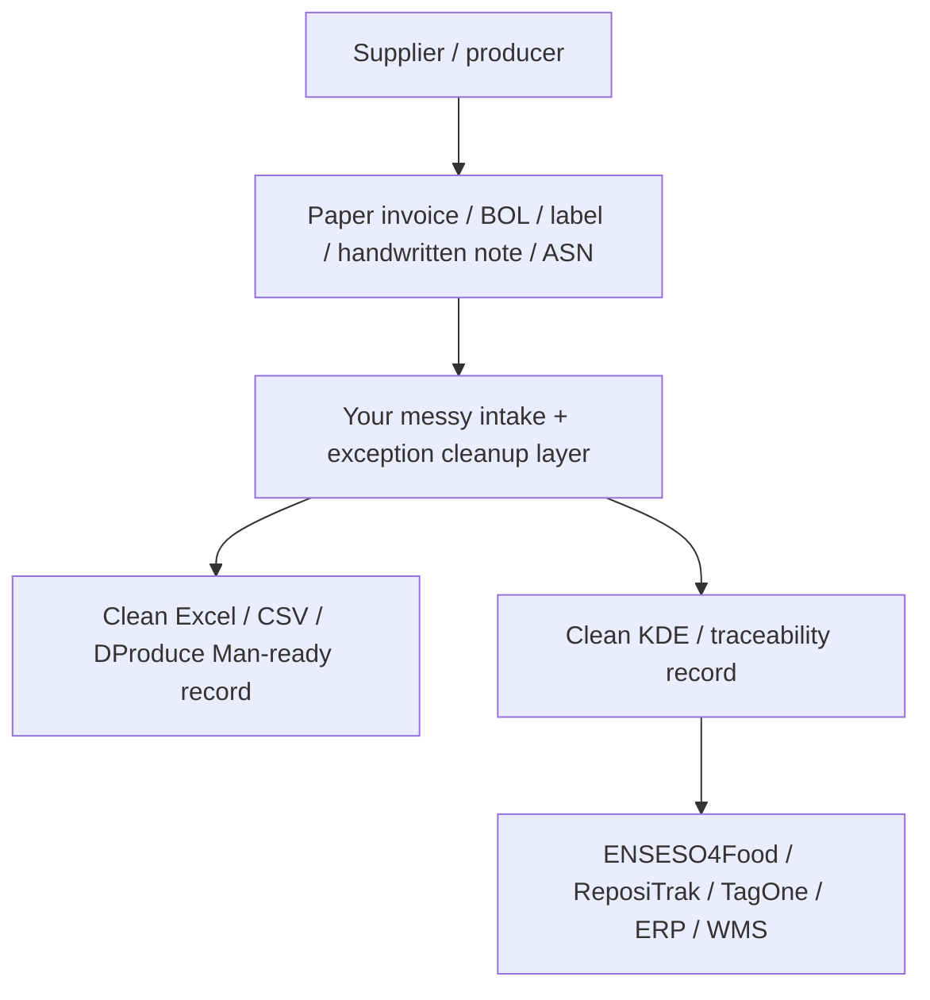

# ENSESO4Food vs Your Idea: Difference, Overlap, and Conversation Strategy

## Short Answer

ENSESO4Food and your idea are in the same broad market:

**food traceability and FSMA 204 readiness.**

But they appear to sit at different layers.

ENSESO4Food appears to be a **traceability platform / serialization / compliance system**.

Your idea should be positioned as the **messy intake and exception-resolution layer before data is ready for traceability platforms**.

The simplest distinction:

**ENSESO4Food helps companies run traceability.**

**You help companies clean, structure, and resolve messy supplier records before traceability systems can work well.**

## ENSESO4Food Public Positioning

Based on ENSESO4Food's public website, they position around:

- TRAKKEY4Food traceability SaaS
- FSMA 204 compliance
- supplier compliance
- farm-to-fork visibility
- serialization and traceability
- GS1 identifiers / barcodes
- dashboards and real-time product journey display
- IoT sensors for temperature, pressure, acceleration, humidity, GPS/location
- SafeBite consumer awareness app
- food, beverage, and wine traceability

Important public claims:

- They say TRAKKEY4Food is a traceability solution from winners of the FDA Food Traceability Challenge.
- They say their system ensures full compliance with FSMA 204.
- They describe "robust, developer-friendly interfaces" and services in serialization and traceability.
- They say they collaborate rather than compete and help get systems ready for FSMA 204.

Sources:

- [ENSESO4Food home](https://enseso4food.com/)
- [ENSESO4Food solutions](https://enseso4food.com/our-solutions/)
- [ENSESO4Food Box / IoT container page](https://enseso4food.com/box/)

## Your Public Positioning Should Be Different

Do not describe your idea as:

**"FSMA 204 traceability software."**

That sounds too close to ENSESO4Food, ReposiTrak, TagOne, iFoodDS, FoodLogiQ, and other traceability systems.

Describe it as:

**"Messy supplier record cleanup before traceability systems."**

Or:

**"Invoice, label, BOL, handwritten note, and Excel cleanup for food distributors."**

Or:

**"Traceability exception resolution before ERP/WMS/Excel/DProduce Man/traceability platform upload."**

## Comparison Matrix

| Area | ENSESO4Food / TRAKKEY4Food | Your Idea |
|---|---|---|
| Main layer | Traceability platform / compliance system | Intake cleanup + exception-resolution layer |
| Core promise | FSMA 204 traceability, farm-to-fork visibility, serialization | Clean messy supplier records before they enter systems |
| Data assumption | Customers can capture/share traceability data in a system | Data often starts as paper invoices, handwritten notes, labels, PDFs, Excel |
| Customer interface | SaaS/app/dashboard/traceability platform | Service-led workflow, clean Excel/CSV, evidence packets, missing-data report |
| Primary user | Companies needing traceability/compliance system | Operators, QA, receiving, EDI, admin staff doing manual record cleanup |
| Small operators | May be too advanced if they are paper/Excel-first | Strong fit: paper/label/photo to Excel/CSV |
| Larger distributors | Could be a traceability system | You handle mismatches and data prep before their system |
| AI positioning | Not central from public site | Internal engine for extraction, matching, routing, cleanup |
| IoT/serialization | Stronger ENSESO4Food area | Not your first wedge |
| Supplier scorecard | Not clear publicly | Future moat: supplier data-quality and response SLA scoring |
| Competition risk | Same FSMA 204 category | Different workflow layer if positioned correctly |

## Where You Overlap

There is real overlap:

1. FSMA 204
2. food traceability
3. supplier compliance
4. traceability data quality
5. distributors / food businesses
6. readiness for audits and recalls

Because of that, do not give away your full roadmap in the first call.

## Where You Are Different

Your unique wedge is not "traceability."

Your unique wedge is:

**pre-traceability messy data repair.**

The evidence from your field visits:

- small operators receive paper invoices
- some records are handwritten
- labels on boxes contain source/lot information
- people manually type into Excel, QuickBooks, DProduce Man, or internal systems
- larger distributors already have traceability but still need exception resolution when records do not match

This is not the same as a traceability platform.

It is the work before the platform works.

## The Best Analogy

ENSESO4Food is like the traceability system of record.

You are like the intake clerk + QA exception desk + data cleanup operator.



## What ENSESO4Food Might Already Do

They may already support:

- FSMA 204 compliance records
- traceability data capture
- serialization
- GS1 identifiers
- dashboards
- mobile app workflows
- APIs
- sensor data
- product journey display

So do not assume they lack functionality.

Instead ask:

**"What do customers need to have ready before they can successfully use a traceability system?"**

That question puts you in the upstream layer.

## What They May Not Want To Do

They may not want to spend time on:

- reading messy paper invoices
- interpreting handwritten notes
- extracting data from label photos
- cleaning Excel files
- chasing suppliers for missing fields
- normalizing messy customer-specific item names
- doing manual first-pass onboarding cleanup

That could be your opening.

## Your Defensible Insight

The customer does not wake up saying:

**"I need traceability SaaS."**

Many smaller operators wake up saying:

**"I have paper invoices and someone has to type this."**

Larger operators wake up saying:

**"Our system is fine, but supplier records and exceptions still create manual QA/ops work."**

That is your wedge.

## How To Talk To Jim

Say:

```text
I looked at ENSESO4Food and it seems like you are solving the traceability and FSMA 204 system layer.

What I am trying to understand is the step before that: when smaller distributors have invoices, handwritten notes, PDFs, labels, and Excel files, how do they get clean enough data to use a traceability system?
```

Then ask:

```text
Do you see dirty intake data as a real blocker for FSMA 204 adoption, or do your customers usually already have clean data?
```

This is the most important question.

## Questions To Ask Jim

### Product Boundary Questions

1. What does ENSESO4Food expect a customer to already have ready before onboarding?
2. Do customers usually have clean digital records, or do they still have paper invoices, PDFs, labels, and Excel?
3. If a customer has missing lot/source/TLC fields, does your platform solve that or does the customer need to fix it first?
4. Do you see document cleanup as part of traceability software, or as a pre-onboarding service?
5. Which customers are least ready for FSMA 204: growers, distributors, processors, importers, restaurants, or small wholesalers?

### Pain Questions

1. Where do FSMA 204 projects fail in practice?
2. What data is most often missing?
3. Who usually does the cleanup: QA, receiving, operations, admin, EDI, or supplier compliance?
4. Are handwritten notes and paper invoices common in the customers you see?
5. Does supplier non-response create delays?

### Partnership-Discovery Questions

Ask these only after the conversation is warm:

1. Would a pre-onboarding dirty-data audit make traceability platforms easier to sell or implement?
2. If I created a sample output, would you be open to critiquing whether it is useful?
3. Could this be complementary to ENSESO4Food, or would you view it as overlapping?
4. If someone handled messy document cleanup before platform onboarding, what would they need to do well?

## What Not To Share Yet

Do not share:

- your full supplier scorecard roadmap
- your exact automation plan
- your target customer spreadsheet
- pricing
- future integrations
- detailed agent architecture
- "we will sit in front of all traceability systems"

Keep the call at the workflow-discovery layer.

## What You Can Share Safely

You can share:

- you visited wholesalers
- you heard paper, Excel, QuickBooks, DProduce Man
- you noticed small operators do not speak FSMA language
- you are testing a simple Dirty Data Audit
- you want to learn whether dirty intake data blocks traceability adoption

## Best One-Sentence Positioning

Use this:

**"I am not trying to replace traceability platforms; I am testing whether messy supplier records need to be cleaned before companies are ready for platforms like ENSESO4Food."**

## Final Take

ENSESO4Food is close enough that you should be careful.

But they are also close enough to be useful.

Do not pitch him the whole company.

Use the call to answer one question:

**Is messy pre-platform intake data a painful enough problem that traceability platforms, distributors, or consultants would want someone else to solve it?**

If the answer is yes, your idea becomes more credible.

If the answer is no, ask where onboarding actually breaks.

