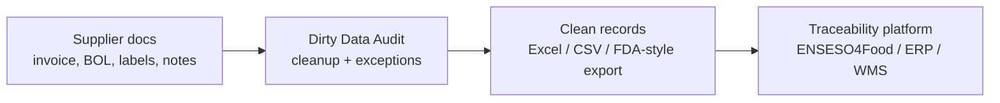

# Jim White Controlled Pitch And Slide Outline

## Recommendation

Do not use a full pitch deck.

Use a **3-slide conversation aid** or a **one-page visual**.

The goal is not to pitch your company like fundraising.

The goal is to show:

1. You did real field discovery.
2. You understand ENSESO4Food is a traceability platform layer.
3. Your pilot is complementary: messy intake cleanup before traceability software.
4. You are asking for expert feedback, not revealing your roadmap.

## What To Avoid

Do not show:

- architecture
- AI workflow
- agent design
- supplier scorecard roadmap
- pricing
- target customer list
- detailed product roadmap
- "we sit before ENSESO4Food"
- "we want to partner" as the opening
- detailed competitor teardown of ENSESO4Food

Do not say:

```text
I analyzed your software and my product is complementary.
```

That can sound too strategic or threatening.

Say:

```text
From your public materials, ENSESO4Food seems focused on traceability and FSMA 204 system readiness. I’m exploring a narrower pre-system cleanup workflow that may help operators get cleaner records before traceability software.
```

## What To Show

Only show business/workflow evidence.

### Slide 1: Field Discovery

Title:

**What I Saw In The Field**

Content:

- Small operators still use paper invoices, handwritten notes, Excel, QuickBooks, DProduce Man.
- Labels often contain useful lot/source information that is not digitized cleanly.
- Larger operators already have traceability programs, but exceptions still matter.
- The split: small operators need digitization; larger operators need exception resolution.

What to say:

```text
I’m not assuming the problem from a desk. I visited local operators and heard the same pattern: records exist, but the intake is messy and inconsistent.
```

### Slide 2: Pilot

Title:

**Bay Area Dirty Data Audit Pilot**

Content:

- Target: 3-5 local medium-scale produce/food operators.
- Input: 5 redacted shipment record sets per operator.
- Documents: invoice, BOL, label, ASN if available, receiving record.
- Output: missing-KDE report, mismatch report, clean Excel/FDA-style export sample.

What to say:

```text
The pilot is intentionally narrow. I’m not asking operators to adopt software. I’m testing whether cleaned outputs are useful enough for them to want this repeatedly.
```

### Slide 3: Complementary Layer

Title:

**Possible Complement To Traceability Platforms**

Content:



What to say:

```text
I’m not trying to replace traceability platforms. I’m trying to understand whether there is a useful pre-platform cleanup layer that helps operators become ready for platforms like ENSESO4Food.
```

## Opening Script

Use this version. It is shorter and more controlled.

```text
Jim, thanks again for taking the call.

I wanted to give quick context. I’ve been doing field discovery around San Jose with produce wholesalers, restaurant suppliers, and a larger avocado distributor.

The pattern I’m seeing is that records often exist, but the intake layer is messy: paper invoices, handwritten notes, PDFs, labels, Excel, QuickBooks, DProduce Man, or internal systems.

I’m planning a focused Bay Area pilot with a few medium-scale produce or food operators. The first pilot is not a dashboard. It is a cleanup output: 5 redacted shipment record sets in, missing-KDE/mismatch report and clean Excel or FDA-style export out.

I’d value your perspective on whether this pilot is structured correctly and whether this pre-system cleanup layer could be useful before operators onboard into traceability platforms.
```

## Safer ENSESO4Food Line

Use:

```text
From your public materials, ENSESO4Food seems focused on traceability, serialization, and FSMA 204 readiness. I’m trying to understand the step before that: how operators get messy supplier records clean enough to use any traceability system.
```

Avoid:

```text
I analyzed ENSESO4Food and I think my product complements yours.
```

## Partnership Line

Do not ask for partnership at the start.

Ask this near the end:

```text
If the pilot shows that messy intake data is a blocker, could this kind of cleanup workflow be complementary to traceability platforms like ENSESO4Food?
```

Then:

```text
What would I need to prove for this to be useful to a platform or implementation partner?
```

Then:

```text
Would you be open to reviewing the first pilot output once I run it?
```

## Questions To Ask

1. Does 5 redacted shipment record sets per operator sound enough to expose the issue?
2. Which documents should be included for a meaningful FSMA 204 audit?
3. What fields should I absolutely check?
4. Which customer segment is most likely to care first?
5. Where do traceability platform implementations usually get stuck?
6. Do operators usually have clean data before onboarding?
7. Would a pre-onboarding cleanup workflow be useful or unnecessary?
8. What would make the audit output credible?
9. Who else should I speak with?

## What You Can Safely Reveal

- You are running a small Bay Area pilot.
- You are targeting medium-scale operators.
- The pilot input is 5 redacted shipment records.
- The pilot output is a missing-KDE/mismatch report and clean export.
- You are not replacing traceability platforms.
- You are validating the cleanup workflow before building too much.

## What To Keep Private

- Exact automation method.
- AI model stack.
- Supplier risk scorecard roadmap.
- Full customer list.
- Pricing.
- Long-term platform strategy.
- Detailed competitor analysis.
- How you plan to scale operations.

## If He Asks For A Demo

Say:

```text
The first demo is the output, not an app. I’m preparing a sample audit output with messy inputs, a missing-field report, mismatch summary, and clean export. I’d rather validate that output with experts before overbuilding software.
```

## Final Meeting Goal

Get one of these:

- feedback on pilot design
- confirmation that dirty intake data is real
- fields/documents to include
- permission to send first pilot output
- referral to one operator or consultant
- view on whether this could be complementary to ENSESO4Food

Do not try to close a partnership in the first call.

First call goal:

**Make Jim think: "This founder is serious, did fieldwork, and may be solving a real pre-platform problem."**

