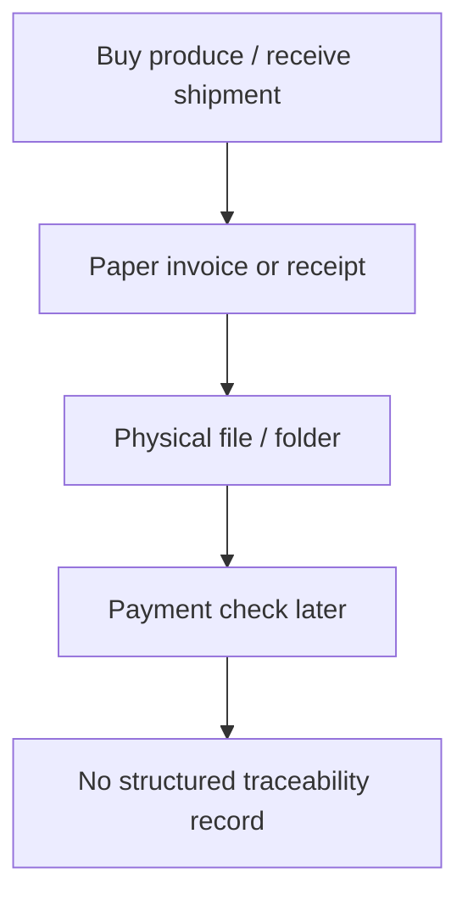
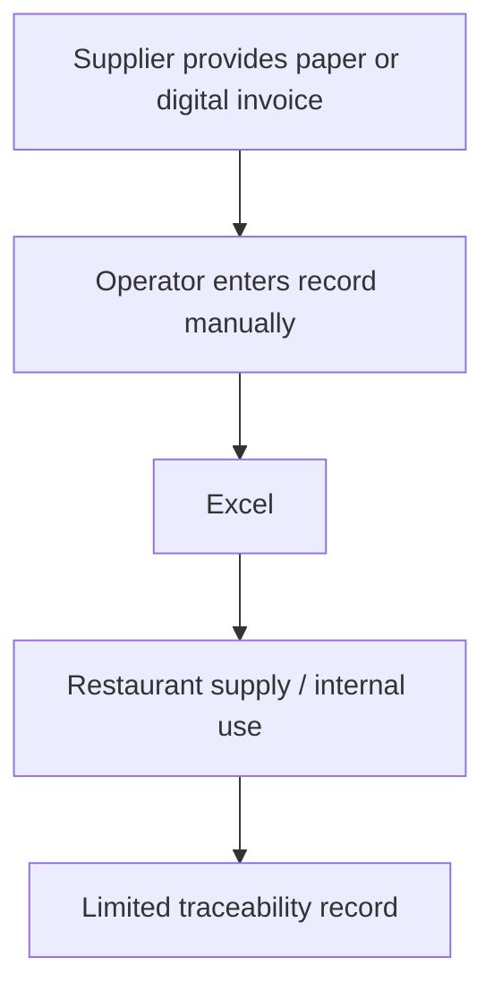
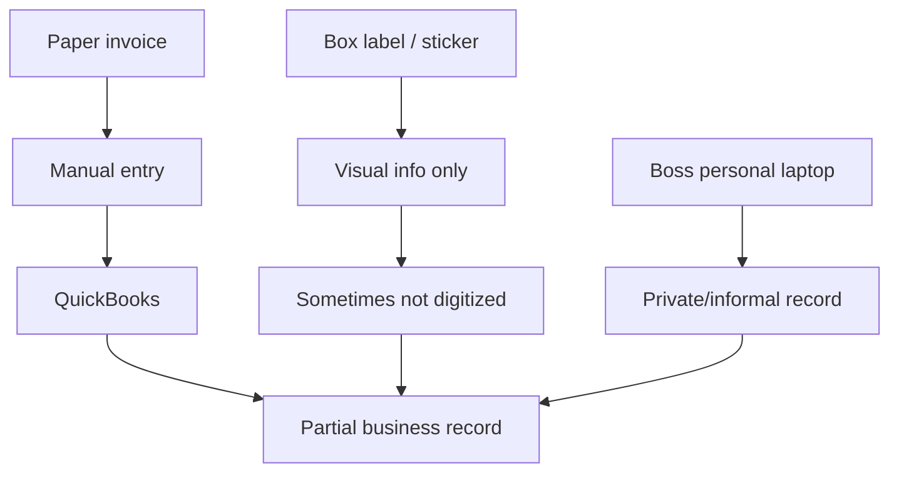
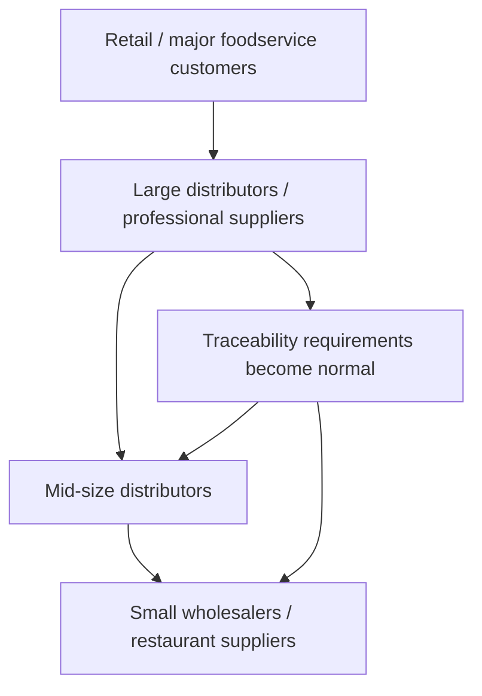
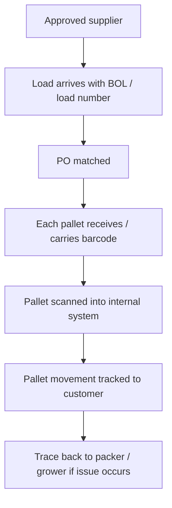
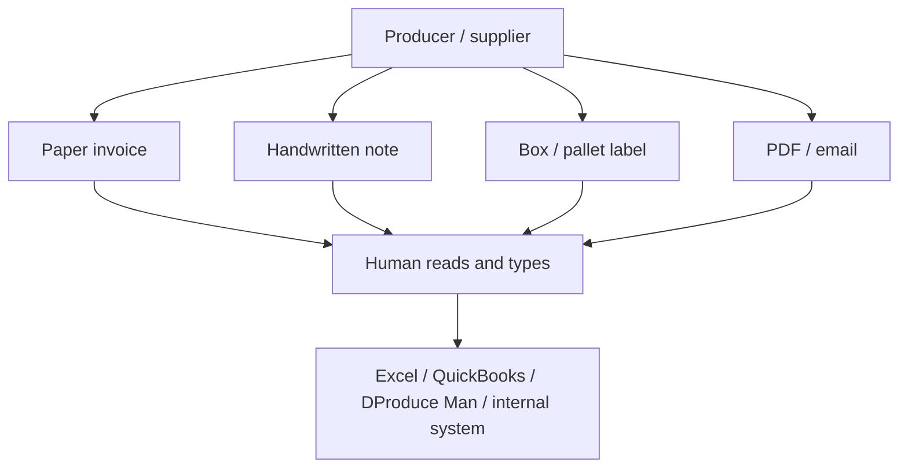
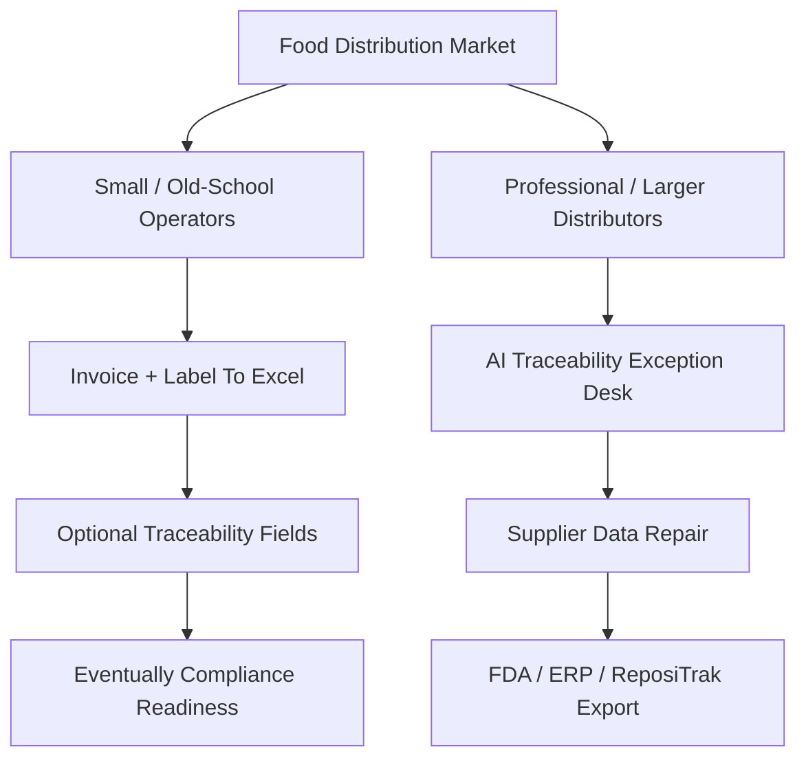

# Field Visit Customer Discovery Notes: Wholesalers, Producers, Restaurants

Date: June 8, 2026

## Why These Notes Matter

These field conversations are very important.

They show that the food distribution market is not one market.

It splits into at least three different operating realities:

1. **Small market / restaurant supply operators**
   - paper invoices
   - Excel
   - QuickBooks
   - owner laptop
   - limited FSMA 204 awareness

2. **Old-school wholesalers**
   - paper receipts
   - physical filing
   - direct market purchasing
   - no real software workflow
   - traceability is not top-of-mind

3. **Professional / larger distributors**
   - approved vendor program
   - load numbers
   - pallet-level barcode scans
   - internal IT system
   - existing food safety program
   - traceability already operational

This means the product cannot be pitched the same way to everyone.

## Regulatory Context

Your July 2028 framing is correct.

FDA says the original compliance date for the Food Traceability Rule was **January 20, 2026**, but FDA proposed extending it by 30 months to **July 20, 2028**. Congress also directed FDA not to enforce the rule before **July 20, 2028**.

Source: [FDA FSMA Final Rule on Requirements for Additional Traceability Records for Certain Foods](https://www.fda.gov/food/food-safety-modernization-act-fsma/fsma-proposed-rule-food-traceability)

This matters because small operators may not feel urgency yet.

They may think:

- "Not mandatory."
- "We don't use that."
- "We just keep receipts."
- "The city/fda person checks boxes sometimes."
- "It is not a big problem."

That does not mean the pain is fake.

It means the pain is not yet framed in their language.

## Conversation 1: Busy Operator Asked For Email

### What Happened

The person was busy and could not stop.

They said:

> Email your questions to us, and we can try to answer them back.

### What This Means

This is not a rejection.

It means walk-in research works, but the ask must be much smaller.

Your current opening:

**"I am doing research around food distribution."**

is polite, but vague.

Better opening:

**"I am studying how produce invoices and box labels are tracked. I have two questions only."**

### Better Follow-Up Email

```text
Hi {{name}},

Thank you for speaking with me briefly today.

I am a San Jose State student studying how local food distributors handle produce invoices, box labels, and traceability records.

Two quick questions:

1. When you receive produce, do supplier records usually arrive as paper invoices, PDFs, labels on boxes, or digital data?
2. If someone asks where a product came from, do you check paper files, Excel/QuickBooks, or another system?

Thank you,
Ramesh
```

Do not mention AI or product yet.

## Conversation 2: Old-School Wholesaler / Market Operator

### Key Quotes / Signals

The operator said different warehouses work differently:

- some receive shipments at the warehouse
- some go directly to the market and buy
- different vendors give different invoices

Most important line:

> "It's still old-fashioned style. You get a piece of paper and you file it yourself."

They also said:

> "Half of us using softwares, half of us still working old school style."

When you asked about traceability / FSMA 204:

> "No, it's not mandatory. I'm not too sure with that. We're not sure with that because we don't use that."

### What This Means

This segment is not ready to buy "AI traceability software."

They may not even know they have a compliance gap.

But they do have a workflow:



### Pain Is Real, But Hidden

They do not describe the pain as:

- FSMA 204
- KDE
- CTE
- traceability data
- compliance software

They describe it as:

- paper
- receipts
- filing
- invoices
- who bought what
- who sold what
- paying vendors

### Better Product Wedge For This Segment

Do not sell:

**Traceability exception desk.**

Sell:

**Invoice + label record cleanup.**

Better first offer:

**"I can turn your paper invoices and box label photos into a simple searchable Excel file."**

Then later:

**"This also helps traceability if someone asks where an item came from."**

## Conversation 3: Small Restaurant Supply / Mixed Operator

### Key Quotes / Signals

This person said:

- Some suppliers send digital records.
- Some suppliers still send paper.
- They use Excel.
- They do not use produce-specific software.
- Excel is simpler.

Important line:

> "No, we just use Excel. It makes sense. More simple."

### What This Means

This is an important segment.

They do not want:

- dashboard
- ERP
- portal
- complex traceability system

They want:

- simple records
- Excel
- less typing
- less confusion

### Workflow



### Product Implication

For this segment, the MVP should be:

**Paper/PDF invoice to clean Excel, with optional traceability fields.**

Not:

**FSMA 204 exception-management platform.**

### Better Pitch

```text
I am testing a tool that turns paper produce invoices and label photos into a clean Excel sheet.

It can include supplier, product, quantity, date, lot/label information, and where it came from when that data is available.

Would that save time compared with typing it manually?
```

This is much easier for them to understand.

## Conversation 4: Small Warehouse Using QuickBooks

### Key Quotes / Signals

This person said:

- produce from LA, other states, Mexico arrives with invoices
- many places still use paper
- many owners do not understand computers well yet
- they use QuickBooks
- invoice data is manually typed
- labels/stickers on boxes contain origin information
- some recurring items are tracked better than others
- some records live on the boss's personal laptop

Important lines:

> "Most of them don't really understand how to use computers."

> "We do use QuickBooks."

> "You manually type it in."

> "It's all labeled in the boxes. They have stickers on them."

> "I think he has it in his own personal laptop."

### What This Means

This is the strongest proof that the first product should ingest:

- paper invoices
- label photos
- QuickBooks/Excel outputs
- informal records

The record system is fragmented:



### Product Implication

This segment needs:

1. invoice extraction
2. label/photo extraction
3. Excel/QuickBooks export
4. simple search
5. missing-field report

They are not ready for:

- supplier portals
- GS1/EPCIS
- API integrations
- AI agent language

## Conversation 5: Larger Distributor With Food Safety Program

Company context: this conversation appears to be from **Henry Avocado / CustomRipe Avocado Co.**

Henry Avocado's official site describes the company as a year-round distributor of custom-ripened conventional and organic avocados sourced from California, Mexico, Peru, Colombia, and Chile, serving foodservice and retail customers across the U.S. The company says all fresh avocados are marketed and distributed through Henry Avocado Corporation and CustomRipe Avocado Company regional sales and ripening centers. Its public site also says it operates from seven regional distribution centers and has 120 forced-air ripening rooms across distribution centers including Escondido, Milpitas, Phoenix, Charlotte, San Antonio, and Houston.

Sources:

- [Henry Avocado home](https://www.henryavocado.com/)
- [Henry Avocado about](https://www.henryavocado.com/about/)
- [Henry Avocado food safety](https://www.henryavocado.com/food-safety/)

### Key Quotes / Signals

This person described a much more mature operation:

- pre-approved vendors
- vendor vetting before buying
- standards tied to food safety program
- every load has a load number / PO
- every pallet in the load has a matching number
- pallets are scanned
- each pallet has a barcode
- each label includes packer, packed date, grove/source
- multiple groves can exist in one load
- they have an internal IT-developed system
- they already trace product back to packer/grower

Important lines:

> "We have pre-approved vendors."

> "Every load that comes in has a load number."

> "Every pallet that comes in that load has a number that matches that PO."

> "We scan every single pallet."

> "We have our own system that our IT developed."

> "We already do that."

> "If they're a legitimate company, they have a food safety program. And the food safety program is traceability."

They also clearly differentiated smaller companies:

> "Those are the smaller guys."

> "Most of those guys don't have a food safety program."

### What This Means

This is the most important validation from the day.

It confirms:

1. Bigger distributors already understand traceability.
2. They already have systems.
3. They may not need a basic traceability tool.
4. The problem for them is likely exceptions, gaps, supplier inconsistency, and system interoperability.
5. They see smaller operators as underprepared.

### Why This One Matters More Than The Small-Operator Conversations

The smaller operators proved that paper, Excel, QuickBooks, and manual entry are still common.

This Henry/CustomRipe conversation proves the other side:

**Serious foodservice/retail suppliers already treat traceability as mandatory.**

The person said, in effect:

- legitimate companies have food safety programs
- traceability is part of the food safety program
- customers such as major retailers and foodservice companies require it
- smaller companies selling to less demanding restaurants often lack this structure

That is useful for your startup because it means market pressure can flow downward:



The strongest adoption driver may not be FDA enforcement first.

It may be customer pressure:

**"Cleaner records help you keep and win better customers."**

That may land better than:

**"FSMA 204 compliance deadline."**

### Workflow



### Product Implication

For larger distributors, your original thesis still fits:

**AI Traceability Exception Desk.**

But it must be positioned around:

- exception resolution
- supplier data gaps
- item/lot mismatches
- evidence packets
- audit readiness
- reducing manual QA/EDI work

Do not pitch:

**"Do you need traceability?"**

They will say:

**"We already do that."**

Pitch:

**"When traceability records are incomplete or conflicting, who resolves the exception?"**

That is the sharp question.

## Market Segmentation From Field Evidence

| Segment | Current Tools | FSMA Awareness | Pain Language | Best Wedge | Buyer Readiness |
|---|---|---:|---|---|---:|
| Small market wholesaler | Paper receipts, folders | Low | invoices, receipts, filing | invoice/label to Excel | Low |
| Restaurant supply operator | Excel, paper/digital invoices | Low-medium | manual entry, simple records | invoice OCR to Excel | Medium |
| Small warehouse / local distributor | QuickBooks, paper, labels, boss laptop | Medium | manual typing, labels, QuickBooks | QuickBooks/Excel traceability helper | Medium |
| Larger distributor | internal system, barcodes, vendor program | High | exceptions, supplier compliance, audit readiness | AI exception desk | High |
| Enterprise distributor | ERP/WMS/EDI/traceability platform | High | data quality, KDE gaps, integration | managed exception desk + integrations | High |

## DProduce Man Signal

Several people mentioned **DProduce Man** or produce-specific software.

That is important.

DProduce Man is a real produce-industry system. Its official site describes it as integrated accounting, inventory, and management software for agriculture and fresh produce growers, packers, shippers, brokers, wholesalers, distributors, and processors. Its press materials describe modules such as order entry, accounts receivable/payable, purchase order, general ledger, lot tracking, grower accounting, traceability, inventory control, barcoding, price lists, and warehouse management.

Sources:

- [DProduce Man official site](https://www.dproduceman.com/index.html)
- [DProduce Man press release](https://www.dproduceman.com/press-release.html)

### What DProduce Man Covers

DProduce Man appears to cover:

- accounting
- inventory
- order entry
- purchase orders
- accounts payable / receivable
- grower accounting
- lot tracking
- traceability
- barcoding
- warehouse management
- produce-specific workflows

So it is not the same as generic QuickBooks.

It is closer to a produce ERP / accounting / inventory system.

### What Your Field Interviews Still Exposed

Even when a company uses DProduce Man, QuickBooks, Excel, or an internal system, the messy upstream intake can still look like this:



That is your opportunity.

The pain is not necessarily that they have no system.

The pain is:

**The system still needs clean data typed into it.**

### What This Means For Your Product

Your product should not say:

**"Replace DProduce Man."**

That is the wrong fight.

Say:

**"We clean invoices, handwritten notes, labels, and supplier documents before they are entered into DProduce Man, Excel, QuickBooks, ERP, WMS, or traceability systems."**

### Best Positioning Around DProduce Man

Use this:

```text
Many produce businesses already use DProduce Man, QuickBooks, Excel, or internal systems.

The problem is that supplier data still arrives as paper invoices, handwritten notes, PDFs, and box labels.

We turn that messy intake into clean structured records that can be reviewed and uploaded into the system you already use.
```

### Product Wedge

For small/mid-sized operators:

**Invoice / handwritten note / label photo to Excel or DProduce Man-ready CSV.**

For larger distributors:

**Exception desk that compares supplier documents before pushing clean records into ERP/WMS/DProduce Man/ReposiTrak/TagOne.**

### Why This Is Better Than Competing With DProduce Man

DProduce Man is a system of record.

Your product can be the intake and repair layer.

| Layer | Existing Tool | Your Product |
|---|---|---|
| Accounting / inventory | DProduce Man, QuickBooks | Do not replace |
| Order / PO / invoice management | DProduce Man, ERP | Feed cleaner data |
| Traceability / lot tracking | DProduce Man, internal systems, ReposiTrak | Repair missing/mismatched fields before upload |
| Messy document intake | Paper, handwritten notes, PDFs, labels | Own this layer |
| Exception resolution | Human typing / chasing | Automate, verify, escalate |

The sharper product statement:

**"We are the AI intake and exception layer for produce records before they enter DProduce Man, Excel, QuickBooks, ERP, WMS, or traceability platforms."**

## Big Strategic Learning

Your startup may need two product entry points:

### Entry Point 1: Small Operators

**Invoice + label to Excel.**

This is the simple adoption wedge.

What they understand:

- paper
- Excel
- QuickBooks
- invoice
- label
- receipt

What they do not understand yet:

- FSMA 204
- KDE
- CTE
- traceability exception desk

### Entry Point 2: Larger Distributors

**Traceability exception desk.**

This is the high-value wedge.

What they understand:

- vendor approval
- food safety program
- pallet scanning
- recall trace
- audit evidence
- customer requirements
- supplier compliance

What they may still struggle with:

- incomplete supplier data
- mismatched documents
- supplier response
- manual exception handling
- FDA-ready export format

## Revised Product Strategy

Do not force one product message across the whole market.

Use this split:



## What This Means For The MVP

The MVP should not start as a giant platform.

It should start as a service with two versions:

### MVP A: Small Operator Version

Offer:

**"Send me 20 invoices or label photos. I will turn them into a clean Excel file with supplier, item, quantity, date, and available lot/source fields."**

Deliverable:

- searchable Excel
- missing-field report
- scanned invoice folder
- simple traceability summary

Price test:

- free first batch
- then $99-$299/month
- or $1-$3 per processed document

### MVP B: Larger Distributor Version

Offer:

**"Send me 20 shipment record sets. I will return clean traceability records, exception evidence packets, and a supplier risk scorecard."**

Deliverable:

- FDA-style export
- exception list
- missing KDE report
- supplier response tracker
- supplier risk scorecard

Price test:

- free first audit
- then $1,000-$5,000 pilot
- then monthly managed exception desk

## Updated Customer Discovery Questions

Your questions should be shorter and less regulatory at first.

### For Small Operators

Ask:

1. Do supplier records come as paper, PDF, photo, Excel, or email?
2. Who types invoices into Excel or QuickBooks?
3. Do you ever need to search old invoices quickly?
4. Are lot numbers or source labels stored anywhere?
5. Would it help if paper invoices and box labels became a clean Excel sheet?

Avoid at first:

- FSMA 204
- KDE
- CTE
- FDA enforcement
- compliance deadline

### For Larger Distributors

Ask:

1. Do you already scan pallets or track lots?
2. What happens when supplier records are incomplete?
3. Who resolves mismatches between BOL, invoice, label, ASN, and receiving?
4. How often do supplier records fail your internal standards?
5. Can you produce FDA/customer traceability records without manual cleanup?

## Better Walk-In Script

Use this:

```text
Hi, I’m Ramesh, a San Jose State student.

I’m studying how local produce businesses handle invoices and box-label records.

I have only two quick questions:

1. When produce comes in, do you mostly get paper invoices, PDFs, or digital records?
2. If someone asks where an item came from, do you check paper files, Excel/QuickBooks, or another system?

That’s it.
```

Only if they engage, ask:

```text
Would it save time if paper invoices and box labels could automatically become a clean Excel sheet?
```

For larger distributors:

```text
When records do not match, like invoice vs BOL vs label vs receiving, who fixes that exception?
```

## Updated Thesis After Field Visit

The thesis is stronger, but more nuanced.

Original thesis:

**AI Traceability Exception Desk for food distributors.**

Updated thesis:

**Start by cleaning the messy intake layer of food distribution records: paper invoices, label photos, BOLs, ASNs, and receiving records. For small operators, export to Excel/QuickBooks. For larger distributors, resolve traceability exceptions and export clean FDA-ready records.**

This is better because it matches reality.

## What You Learned

### Validated

- Paper is still common.
- Excel and QuickBooks are still common.
- Manual typing is real.
- Labels contain traceability information that often does not become electronic.
- Larger distributors already have traceability programs.
- Smaller operators often lack food safety systems.
- The market is split between old-school and system-driven operators.

### Invalidated / Weakened

- Small operators will not buy an FSMA 204 dashboard today.
- "Traceability exception desk" language is too advanced for small wholesalers.
- FSMA 204 deadline alone will not create urgency in 2026 for small operators.
- Many people do not know the rule or do not believe it applies.

### Strengthened

- The dirty-data thesis is real.
- The evidence exists on paper, labels, and invoices.
- Larger distributors confirm traceability is mandatory for serious companies.
- Smaller distributors may become pressure points later when customers demand records.

## Best Next Move

Run two pilots in parallel:

### Pilot 1: Small Operator

Find one wholesaler using Excel/QuickBooks.

Ask for:

- 10 paper invoices
- 10 box label photos
- current Excel/QuickBooks export if available

Return:

- clean Excel
- missing lot/source field report
- simple searchable archive

### Pilot 2: Larger Distributor

Find one distributor with pallet scanning / vendor program.

Ask for:

- 20 shipment record sets
- invoice
- BOL
- label
- receiving record
- item master sample

Return:

- exception report
- evidence packets
- supplier scorecard
- FDA-style export

## Decision

Do not abandon the AI Traceability Exception Desk.

But sharpen it:

**The broad market needs record digitization.**

**The high-value market needs exception resolution.**

Your path:

1. Start with messy intake.
2. Learn real document formats.
3. Build extraction and comparison.
4. Add human verification.
5. Add supplier follow-up.
6. Sell exception desk to bigger distributors.

## Bottom Line

Today’s field visits are not a negative signal.

They are a segmentation signal.

Small operators say:

**"We use paper, Excel, QuickBooks, and labels."**

Large operators say:

**"We already do traceability."**

Your opportunity sits between those two statements:

**Turn messy food distribution records into clean, searchable, traceable, audit-ready data.**
