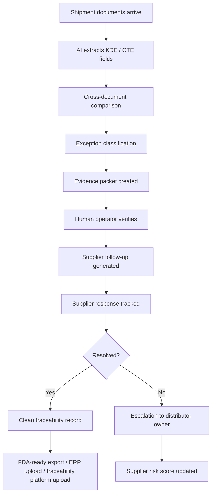
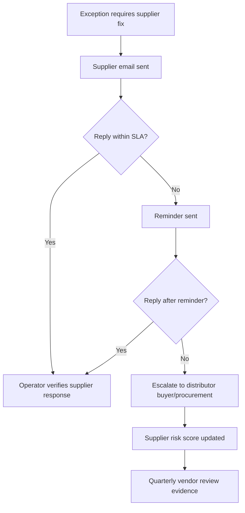
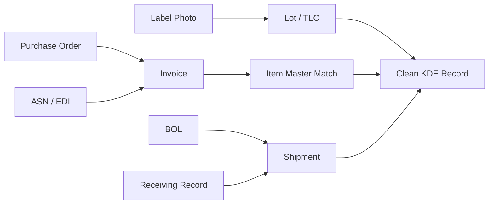

# Solution To The Critical Blindspots: AI Traceability Exception Desk

## Core Point

The critique is right to challenge the idea.

But the answer is not to retreat into a cautious compliance tool.

The stronger answer is:

**Build an AI-powered exception-resolution operation that actually closes traceability gaps, not just reports them.**

Your product should become the operating layer between:

- supplier documents
- distributor receiving teams
- QA / FSQA
- EDI / ERP / WMS
- traceability platforms
- FDA-ready export

The winning product is not:

**"AI reads your documents."**

The winning product is:

**"We find, prove, chase, repair, verify, and export traceability records before they break your operation."**

## Revised Thesis

Food distributors do not have a software problem first.

They have an exception-operations problem.

Their reality:

- supplier ASNs are incomplete
- labels and invoices disagree
- item codes do not map cleanly
- lot codes are missing, blurry, or inconsistent
- receiving teams are busy
- QA teams are overloaded
- ERP/WMS systems are rigid
- traceability platforms need clean data
- FDA timelines require fast retrieval

Your product should own the messy middle.

## The Better Positioning

### Weak Positioning

**AI compliance software for FSMA 204.**

This sounds like another dashboard.

### Better Positioning

**AI Traceability Exception Desk for food distributors.**

This sounds useful, but still maybe abstract.

### Strongest Positioning

**We resolve broken supplier traceability records before they break your ERP, ReposiTrak, customer audit, or FDA export.**

This is operational and urgent.

## The Main Critique

The critique asks:

**What happens when AI finds the problem, but the supplier ignores it?**

That is the correct question.

If the product only creates a list of exceptions, it is weak.

If the product manages the full resolution loop, it becomes valuable.

## Solution 1: Build The Exception Resolution Loop

Your MVP must include the full lifecycle of an exception.



The key is that your system does not stop at detection.

It drives the exception toward closure.

## Solution 2: Classify Exceptions By Fixability

Not all traceability errors are the same.

Your product must separate them.

| Exception Type | Example | Who Can Fix It | Product Action |
|---|---|---|---|
| Missing field | No TLC on invoice, ASN, or label | Supplier | Send supplier request and track SLA |
| Conflicting field | Invoice quantity differs from ASN | Distributor or supplier | Create evidence packet and ask owner to approve source of truth |
| Unreadable field | Blurry label photo | Receiving / warehouse | Request clearer photo or manual confirmation |
| Mapping error | Supplier SKU does not match distributor item master | Internal ops / purchasing | Suggest mapping and ask for approval |
| Format error | Date, location, or lot format not FDA-ready | System/operator | Normalize and verify |
| Duplicate record | Same lot appears across two POs | System/operator | Flag possible duplicate and merge after approval |
| Source ambiguity | Multiple possible growers/suppliers | Supplier / procurement | Escalate with specific missing source question |
| Late supplier response | Supplier does not reply | Supplier + distributor buyer | Escalate and update supplier scorecard |

This classification is critical.

It makes your system feel like operations software, not generic AI.

## Solution 3: Evidence Packet, Not AI Guess

The product should never say:

**"AI thinks this is the lot code."**

It should say:

**"This field was extracted from this document, on this line/region, with this confidence, and conflicts with this other document."**

Every exception should have an evidence packet:

- document source
- field extracted
- visual crop or text quote
- confidence level
- conflicting field if any
- recommended source of truth
- reason for recommendation
- operator approval state
- audit trail

This solves the hallucination problem without making the product timid.

## Solution 4: Human Verification As A Trust Layer

Do not hide human verification.

Make it part of the promise.

Position it like this:

**"AI speed with human-verified traceability records."**

For food safety, this is not a weakness.

It is a trust feature.

### MVP Verification Rule

During the pilot:

- AI can extract
- AI can compare
- AI can suggest
- AI can draft supplier emails
- AI can prepare export

But:

**No corrected KDE enters the final export until a human operator approves it.**

### Later Automation Rule

After enough customer-specific history:

- low-risk formatting fixes can auto-resolve
- repeated supplier SKU mappings can auto-resolve
- high-confidence duplicates can be suggested
- missing or conflicting safety-critical fields still require approval

## Solution 5: Supplier SLA Tracking

The supplier friction loop is not a side issue.

It is the product.

Your system should track:

- supplier response time
- missing fields by supplier
- repeated mismatch types
- number of follow-ups required
- unresolved exception count
- buyer escalation count
- percentage of clean records submitted

This creates a new value proposition:

**"We show you which suppliers are creating traceability risk."**

## Solution 6: Supplier Risk Scorecard

This is one of the strongest future features.

The scorecard should show:

| Supplier | Shipments Reviewed | Clean Records | Missing KDEs | Mismatches | Avg Response Time | Risk |
|---|---:|---:|---:|---:|---:|---|
| Supplier A | 42 | 91% | 3 | 1 | 8 hrs | Low |
| Supplier B | 37 | 54% | 18 | 9 | 4 days | High |
| Supplier C | 12 | 67% | 4 | 5 | No response | High |

This changes your customer conversation.

You are no longer selling compliance cleanup.

You are selling supplier performance intelligence.

## Solution 7: Buyer Escalation Workflow

When suppliers ignore requests, your system should not keep sending emails forever.

It should escalate.



The key insight:

Suppliers may ignore you.

But they cannot ignore the distributor’s buyer forever.

Your product gives the buyer structured evidence.

## Solution 8: Build A Traceability Evidence Graph

A normal compliance tool stores records.

Your product should build an evidence graph.

Example:



This is powerful because the buyer can see:

- where each field came from
- which documents agree
- which documents conflict
- what proof supports the final record

This becomes your defensibility.

## Solution 9: Do Not Replace ReposiTrak / TagOne / ERP

The bold move is not to attack incumbents.

The bold move is to become the dirty-data repair layer that makes incumbents work better.

Your positioning:

| Incumbent | What They Do | Your Role |
|---|---|---|
| ReposiTrak | Traceability network / compliance exchange | Fix dirty records before and around the network |
| TagOne | FSMA 204 compliance platform / supplier link / exception reports | Operate daily exception resolution and supplier chase |
| Starfish | Interoperability / data sharing | Repair non-standard data before exchange |
| ERP/WMS | System of record for inventory and operations | Clean source data before upload |
| EDI providers | Move structured transaction data | Resolve missing or conflicting transaction fields |

This lets you sell as:

**"We make your existing systems audit-ready."**

## Solution 10: Service-Led MVP That Learns

Your MVP should be service-heavy by design.

Not because you are afraid to build software.

Because the service teaches the software what exceptions actually look like.

### MVP Offer

**20-shipment Dirty Data Audit for produce distributors.**

Input:

- invoices
- BOLs
- packing slips
- ASN/EDI samples
- labels/photos
- receiving records
- item master sample

Output:

- clean KDE table
- exception list
- supplier issue report
- estimated manual cleanup hours
- FDA-style export
- supplier risk summary
- recommended operating procedure

## The MVP Should Have 5 Internal Tools

### 1. Document Intake

Collect files by customer, supplier, PO, shipment, and date.

Do not overbuild upload portals yet.

Use email, shared drive, or secure upload.

### 2. Field Extractor

Extract:

- traceability lot code
- lot/batch
- item name
- supplier item code
- distributor item code
- quantity
- unit of measure
- harvest/pack/ship/receive dates
- source location if available
- ship from / ship to
- supplier name
- PO / invoice / BOL / ASN numbers

### 3. Cross-Document Examiner

Compare:

- invoice vs ASN
- ASN vs label
- label vs receiving
- supplier SKU vs item master
- quantity vs received quantity
- PO vs invoice

### 4. Operator Review Queue

Human operator sees:

- exception type
- document evidence
- recommended fix
- confidence
- needed action
- approve / reject / escalate

### 5. Supplier Follow-Up Tracker

Track:

- email sent
- reminder sent
- supplier replied
- response verified
- buyer escalated
- final resolution

## The Hard Problem Becomes Your Moat

The critique says suppliers may not respond.

Good.

That is exactly why distributors need you.

If this were just OCR plus a spreadsheet, it would be a feature.

But supplier chase, evidence packets, escalation, and risk scorecards make it an operations company.

## What To Say To Customers

Use this:

```text
We do not just scan your documents.

We run a traceability exception desk.

You send us messy supplier shipment records. We compare invoices, ASNs, BOLs, labels, and receiving records; identify missing or conflicting FSMA 204 fields; verify the evidence; chase the supplier when needed; and return clean, audit-ready records plus a supplier risk report.

We work with your ERP, WMS, EDI, ReposiTrak, TagOne, or current spreadsheet process.
```

## What Not To Say

Do not say:

- "Fully automated FSMA 204 compliance"
- "No human needed"
- "AI guarantees clean records"
- "We replace your traceability platform"
- "We solve recalls automatically"

These sound risky and unbelievable.

## What To Say Instead

Say:

- "Human-verified records"
- "Evidence-backed corrections"
- "Supplier exception resolution"
- "Dirty-data repair before ERP/WMS/traceability systems"
- "FDA-ready export from messy shipment evidence"
- "Supplier risk scorecard"

## Revised Product Roadmap

### Phase 1: Service-Led Dirty Data Audit

Goal:

Prove the pain and produce a valuable artifact.

Build:

- document intake
- manual/AI extraction
- exception classification
- operator review
- FDA-style export
- supplier issue report

Do not build:

- full supplier portal
- deep ERP integration
- autonomous correction
- big dashboard

### Phase 2: Exception Desk

Goal:

Move from audit to recurring workflow.

Build:

- customer workspace
- recurring shipment review
- supplier follow-up tracker
- SLA reminders
- buyer escalation
- supplier risk scorecard
- CSV/API export

### Phase 3: Traceability Operations Network

Goal:

Become the trusted repair layer between suppliers and distributors.

Build:

- supplier history across customers
- reusable supplier mappings
- automated low-risk resolution
- ERP/WMS/EDI connectors
- ReposiTrak/TagOne/Starfish export adapters
- predictive supplier risk

## The Best First Customer Segment

Start with:

**Regional produce distributors.**

Why:

- perishable inventory
- many suppliers
- messy labels
- high lot-code pressure
- foodservice customer demands
- operationally fragmented
- often not fully enterprise-automated

Secondary segment:

**Seafood importers/distributors.**

Why:

- strong traceability burden
- lot/source complexity
- imported supply chains
- documentation-heavy workflows

Do not start with giant retailers.

They are attractive, but sales cycles are slow and procurement-heavy.

## The Sharp MVP Claim

Use this as the core product claim:

**Send us 20 messy shipment record sets. In 5 business days, we return a clean FDA-ready traceability export, exception evidence packets, and a supplier risk scorecard.**

That is much stronger than:

**"Can I ask about your FSMA 204 workflow?"**

## Why This Can Become Big

The initial wedge is traceability exceptions.

But the broader company can become:

**AI operations layer for supplier data quality in food distribution.**

Future workflows:

- FSMA 204 traceability
- supplier onboarding
- certificates of analysis
- allergen documentation
- SQF/GFSI audit evidence
- recall readiness
- customer compliance requests
- vendor performance scoring
- claims/deductions from supplier errors

The same pattern repeats:

messy supplier evidence → exception detection → human/operator verification → supplier chase → clean record → audit/customer/export readiness.

## Final Answer To The Critique

The critique is right:

If the product only flags errors, it is weak.

If the AI guesses, it is dangerous.

If suppliers ignore you, exceptions remain open.

But the solution is not to back away.

The solution is to own the full exception-resolution workflow:

1. detect the issue
2. classify the issue
3. show the evidence
4. verify with a human
5. chase the supplier
6. escalate to buyer/procurement
7. produce clean export
8. score supplier reliability

That is the company.

**Not AI compliance software.**

**AI-powered traceability operations.**

